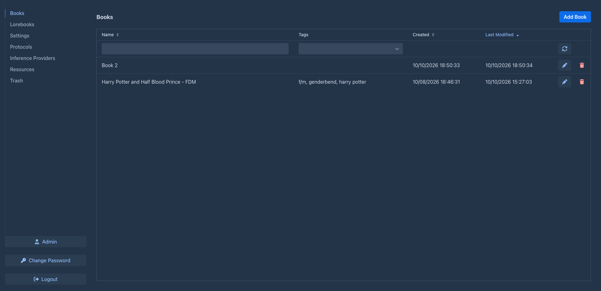
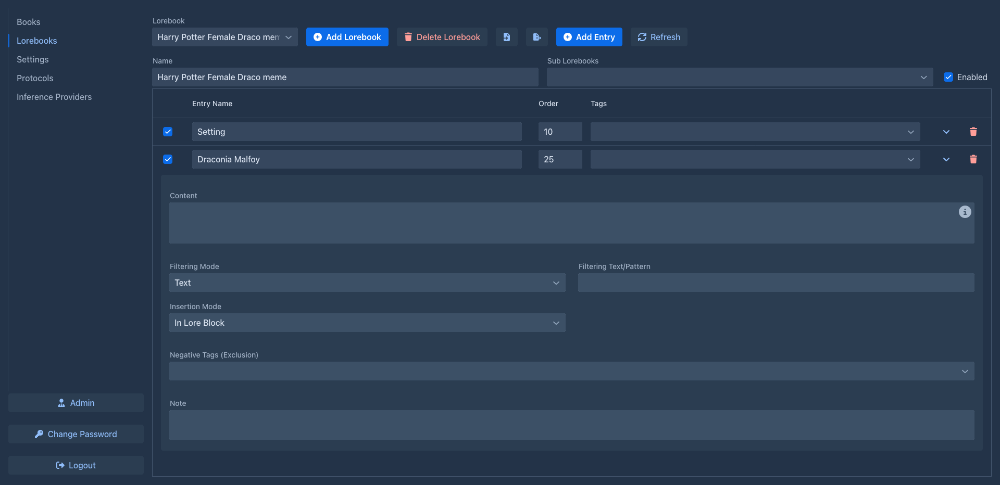
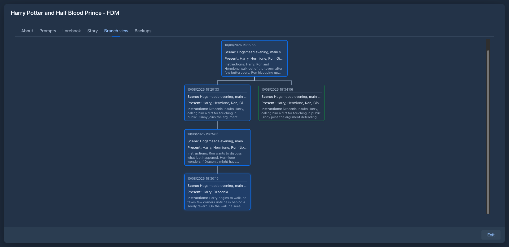
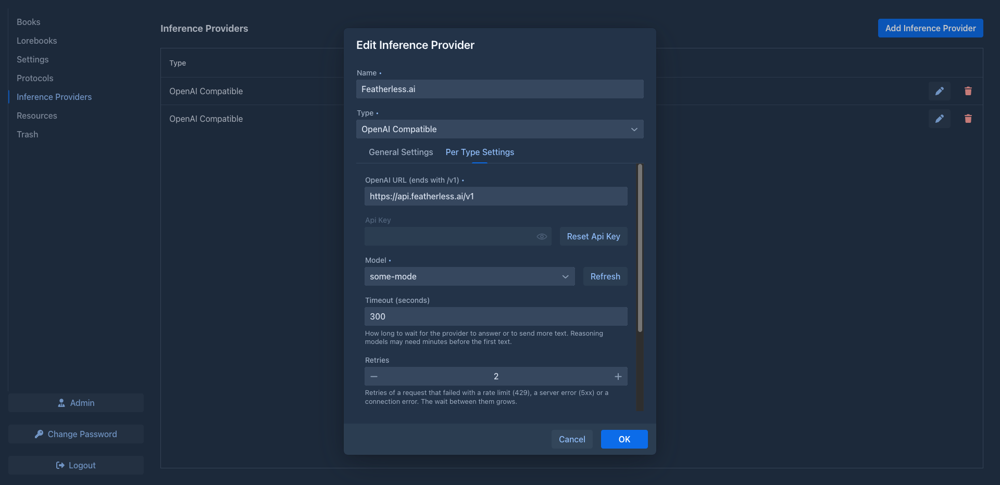

# Marginalia

Marginalia is a self-hosted writing tool for long-form fiction co-written with large language models. You write
the instructions for each part of the story, the model writes the prose, and Marginalia keeps everything around it in
order: the branching story, the world lore, the summaries that keep long books within the model's context, and the
prompt settings that shape the style.

It runs in your browser - either as a small server for you and your friends (Docker) or as a desktop app on your own
computer - and works with any OpenAI-compatible API: OpenAI, OpenRouter, LiteLLM, llama.cpp, LM Studio, Ollama, vLLM and
others.

The manual is at **[enerccio.github.io/Marginalia](https://enerccio.github.io/Marginalia)**.


## Features

- **Books with branching stories** - regenerate or swipe a part, branch from any point, navigate the story tree,
  edit the generated text, mark chapters.
- **Lorebooks** - world and character notes inserted into the prompt when they matter: activation by book tags,
  text or regex filters, insertion into the lore block or right before the instructions, lorebooks nested in
  lorebooks. SillyTavern world info can be imported.
- **Templates and macros** - prompts are Handlebars templates with SillyTavern-compatible macros (`{{user}}`,
  `{{getvar}}`, `{{random}}`, `{{if}}`...), so imported lore keeps working.
- **Summaries** - older parts of the story are condensed so long books fit in the context window.
- **Any OpenAI-compatible model** - including reasoning models, with per-model context and response limits and
  generation settings ("protocols") you can switch per book.
- **Backups** - per-book backups with restore and copy, plus full database backups on a cron schedule.
- **Multiple users** - each with their own books, lore and models; administrators manage users, backups and cleanup.
- **Published books** - share a read-only view of a book.
- **Extensions** - plugins add features at runtime (chapter markers, lorebook version history, AI reviews, side
  questions to the model).

| Books | Lorebook | Story tree |
|---|---|---|
|  |  |  |

## Installation

Marginalia stores everything (database, backups, extensions) in a `.marginalia` folder in the home directory of the
user that runs it. On first start it asks you to create the administrator account.


### Desktop app (Windows, macOS, Linux)

A self-contained version for one computer: no Java or server to install, it listens only on your computer
(`http://127.0.0.1:8765`) and opens in your browser.

1. Download the archive for your system from the
   [releases page](https://github.com/Enerccio/Marginalia/releases):
   `marginalia-<version>-<os>-<arch>-app` is the app, `marginalia-<version>-<os>-<arch>` a portable folder.
2. Extract it and start Marginalia:
   - **macOS** - move `Marginalia.app` to Applications and open it. The app is not signed yet: the first time,
     right-click it and choose *Open*, or run `xattr -dr com.apple.quarantine /Applications/Marginalia.app`.
   - **Windows** - run `Marginalia\Marginalia.exe`. SmartScreen may warn about an unknown publisher: *More info* →
     *Run anyway*.
   - **Linux** - run `Marginalia/bin/Marginalia`.
   - **Portable folder** - run `bin/marginalia` (or `bin\marginalia.bat` on Windows).
3. Marginalia appears as an **M** icon in the system tray (menu bar on macOS) with *Open* and *Quit*.

Data is kept in `~/.marginalia` (`%USERPROFILE%\.marginalia` on Windows), logs in `~/.marginalia/desktop/logs`. Starting
the app again while it runs just opens it in the browser. Options for the portable launcher:

```
marginalia --port 8765        # another port (a free one is picked automatically when 8765 is taken)
marginalia --home /path       # keep the .marginalia folder somewhere else
marginalia --no-browser --no-tray
```


### Server (Docker)

For several users or access from other devices.

```sh
git clone https://github.com/Enerccio/Marginalia.git
cd Marginalia
docker compose up -d
```

Marginalia is then available on port 8080 and keeps its data in `./data`. Memory and other JVM options are set in
`docker-compose.yml` (`JAVA_TOOL_OPTIONS`).

Marginalia uses login cookies, so **don't expose it to the internet over plain HTTP** - put it behind a reverse proxy
with HTTPS (Caddy, nginx, Traefik...) and forward to port 8080.

### Build from source

Requirements: JDK 25 or newer and Maven 3.9+. Node.js for the frontend is downloaded by the build.

```sh
cd marginalia
mvn package               # WAR in target/, runs the tests
mvn package -Pdesktop     # desktop app for the current OS in target/desktop/ (see the desktop profile in pom.xml)
```

The Docker image is built from source by `docker compose build`.

## Connecting a model

In *Inference Providers*, add the base URL of your OpenAI-compatible API (for example `https://api.openai.com/v1`,
`https://openrouter.ai/api/v1` or `http://localhost:8080/v1` for llama.cpp), an API key if it needs one, and pick the
model. Then create a book, choose the provider and a protocol, and start writing.



## Extensions

Extensions are OSGi bundles (JAR files). Administrators install them in *Admin → Extensions*; they are stored in
`~/.marginalia/extensions`. Four plugins are included in [`marginalia/plugins`](marginalia/plugins/README.md) and
built separately with Maven:

- [Chapter Marker](marginalia/plugins/chaptermarker/README.md) - chapters in the story sidebar,
- [Lorebook VCS](marginalia/plugins/lorebookvcs/README.md) - revision history for lorebook entries,
- [Reviewer](marginalia/plugins/reviewer/README.md) - AI reviews of story parts,
- [Side Query](marginalia/plugins/sidequery/README.md) - ask the model about your book without changing it.

## License

MIT, see [LICENSE](LICENSE).
