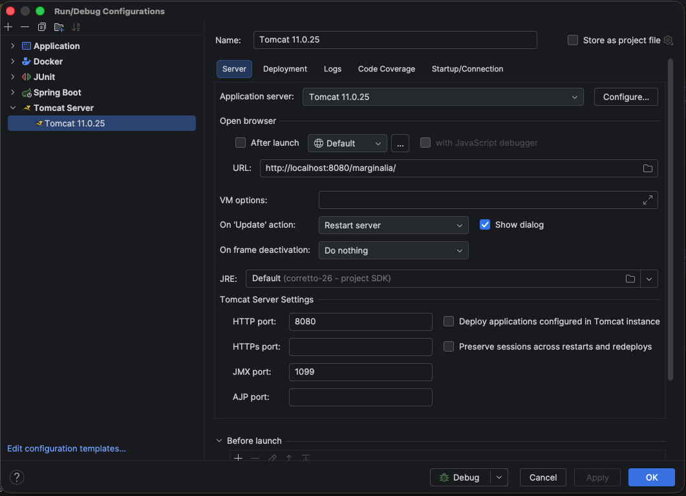

# Building from source

This page shows how to build Marginalia, run it on your machine while you work on it, and build the plugins and
this manual. Packaging for release (the Docker image, the desktop app, CI) is covered in
[Packaging & releases](packaging.md).

## Requirements

| Tool | Version | Notes |
|---|---|---|
| JDK | 25 or newer | A full JDK, not a JRE: the extension mechanism attaches a Java agent at runtime (`jdk.attach`), and the desktop build uses `jlink` / `jpackage`. |
| Maven | 3.9 or newer | |
| Git | any | The build reads the commit id and closest tag (`git-commit-id-plugin`), so build from a clone, not from a source archive. |
| Node.js | - | Not needed: the Vaadin Maven plugin downloads its own Node.js into `~/.vaadin` on the first build. |
| Servlet container | Tomcat 11 or Jetty 12 | Only for running the WAR outside Docker. Must support Servlet 6.1 (Jakarta EE 11). |
| Docker | optional | For `docker compose`. |
| Retype | optional | For building the manual. |

The first build downloads a lot (Maven dependencies, Node.js, npm packages) and takes several minutes. Later builds
are faster.

## Building the application

The application is the Maven project in `marginalia/`:

```sh
cd marginalia
mvn package                  # builds and tests, WAR in target/marginalia-1.0.0.war
mvn package -DskipTests      # the same without tests
mvn install -DskipTests      # also installs the WAR and the classes JAR into ~/.m2 (needed by plugins)
```

What a build does, in order:

1. `git-commit-id-plugin` writes `git.properties` (commit id, time, closest tag) into the classes.
2. `vaadin-maven-plugin` prepares the frontend (`prepare-frontend`): it generates `package.json`, `vite` config and
   the files in `src/main/frontend/generated/` (ignored by Git) and downloads Node.js if needed.
3. `maven-compiler-plugin` compiles the sources, then `aspectj-maven-plugin` compiles them again with the AspectJ
   compiler and weaves the Spring aspects in (see [AspectJ weaving](#aspectj-weaving) below). The woven classes in
   `target/classes` are the ones that get packaged.
4. Tests run (`maven-surefire-plugin`), see [Running the tests](#running-the-tests).
5. `vaadin-maven-plugin` builds the frontend bundle (`build-frontend`).
6. `maven-war-plugin` packages `target/marginalia-1.0.0.war` (about 200 MB) and, because of `attachClasses`, also
   `target/marginalia-1.0.0-classes.jar` - the application classes that plugins compile against.

Outputs in `marginalia/target/`:

| Path | |
|---|---|
| `marginalia-1.0.0.war` | The web application. |
| `marginalia-1.0.0/` | The same WAR, exploded (production mode). |
| `marginalia-1.0.0-classes.jar` | Application classes, the compile dependency of plugins. |
| `surefire-reports/` | Test reports. |
| `test-home/` | Data folders created by tests (safe to delete). |

### Development and production mode

Vaadin runs either in *development mode* (frontend served from a development bundle that Vaadin builds into
`src/main/bundles/`, ignored by Git; Vaadin's dev tools available, more checks) or in *production mode* (optimized frontend
bundle, no dev tools). The mode is decided by `META-INF/VAADIN/config/flow-build-info.json`, the build info that
`vaadin-maven-plugin` writes:

- `prepare-frontend` (every build, also `mvn compile` and `mvn jetty:run`) writes a **development** build info with
  the absolute paths of your checkout into `target/classes`;
- `build-frontend` (in `prepare-package`, so only `mvn package` / `install`) builds the optimized bundle, writes a
  **production** build info into the WAR and removes the development one from `target/classes`.

So `mvn package` always produces a **production** WAR - the one the Dockerfile, the `desktop` profile and CI use, and
the one to deploy. Nothing has to be copied around. A build info in `src/main/resources` is never packaged into the
WAR (`maven-war-plugin` excludes `META-INF/VAADIN/config/flow-build-info.json*`).

Development mode is for running from the IDE (see [IntelliJ IDEA](#intellij-idea)) or `mvn jetty:run`. Without a build
info Vaadin also starts in development mode and finds the project by the `vaadin.project.basedir` system property,
the classpath or the working directory.

To check a WAR:

```sh
unzip -p target/marginalia-1.0.0.war WEB-INF/classes/META-INF/VAADIN/config/flow-build-info.json   # "productionMode" : true
```

### AspectJ weaving

Marginalia relies on **compile-time** AspectJ weaving with the `spring-aspects` library: Vaadin components are
created with `new`, not by Spring, so classes annotated `@Configurable` (all routes, the workspace, dialogs, parts...)
get their `@Autowired` fields injected by the woven `AnnotationBeanConfigurerAspect`.

Transactions are *not* woven: `@CommonTx`, `@CommonTxReadOnly` and `@NoTx` are applied by Spring's class-based
proxies around the service beans (see [Services](services.md#transactions)).

If the classes are compiled by plain `javac`, nothing fails at build time, but at runtime every `@Autowired` field of a
UI class is `null` and the first screen fails with a `NullPointerException`. Maven always uses `ajc`; in your IDE,
make sure the AspectJ compiler is used too (see [IntelliJ IDEA](#intellij-idea)).

The compiler also keeps parameter names (`-parameters`) and all local variables (`preserveAllLocals`): extensions
read method arguments and local variables of `@Extendable` methods by name, so don't remove these options.

## Running locally

Marginalia is a plain WAR without an embedded server, so you run it in a servlet container: from the IDE, with
`mvn jetty:run`, in a local Jetty, or in Docker.

### Keep your development data separate

Marginalia keeps everything in `~/.marginalia` (`System.getProperty("user.home")` + `.marginalia`), the same folder
the desktop app uses. To keep test data away from your real books, start the container with another home folder:

```
-Duser.home=/path/to/dev-home
```

The folder `/path/to/dev-home/.marginalia` is created on the first start. Delete it to start over with an empty
installation (you'll be asked to create the administrator again).

### JVM options

The extension mechanism installs a ByteBuddy agent into the running JVM when the application starts. On a JDK this
works without options, but recent JDKs print a warning about dynamically loaded agents. To silence it and allow the
agent to attach to its own process, add:

```
-XX:+EnableDynamicAgentLoading -Djdk.attach.allowAttachSelf=true
```

These are the options the desktop app and the tests use.

### IntelliJ IDEA

1. Open the repository root; IntelliJ imports `marginalia/pom.xml` (and the plugin POMs, if you add them as Maven
   projects).
2. **Settings → Build, Execution, Deployment → Compiler → Java Compiler**: set *Use compiler* to **Ajc**, with the
   path to `aspectjtools-1.9.25.1.jar` from your Maven repository, and *Delegate to Javac* checked (javac is then
   used only for modules without aspects). `spring-aspects` must be on the aspect path of the `marginalia` module
   (its AspectJ facet). Add `-parameters` to the additional command line parameters of the module.
3. Add a **Tomcat Server → Local** run configuration (Tomcat 11), deploy the artifact `marginalia:war exploded`,
   and add the [JVM options](#jvm-options) and `-Duser.home=...` to *VM options*.
4. Run it and open the URL shown in the run configuration, e.g. `http://localhost:8080/marginalia/` when the
   application context is `/marginalia`.

IntelliJ builds the exploded WAR itself, without the Vaadin plugin, so the application runs in
[development mode](#development-and-production-mode). It needs to know where the project is - either:

- add `-Dvaadin.project.basedir=/path/to/Marginalia/marginalia` to *VM options* (simplest, survives *Rebuild Project*), or
- run `mvn vaadin:prepare-frontend` in `marginalia/` and copy the generated
  `target/classes/META-INF/VAADIN/config/flow-build-info.json` to the same path under `src/main/resources/`
  (ignored by Git and never packaged into the WAR, but IntelliJ copies it into the exploded WAR on every build).

Don't deploy `target/marginalia-1.0.0/` (the exploded WAR from `mvn package`) from the IDE - it is a production build.



!!!
Marginalia works under any context path. Login cookies are named after the context, so a login saved under
`/marginalia` is separate from one saved under `/`.
!!!

Java changes need a redeploy (*Update application → Restart server*).

### Local Jetty

To run the built WAR the way the Docker image does, download [Jetty 12](https://jetty.org/download.html)
(`jetty-home`), create a Jetty base with the same modules and drop the WAR in:

```sh
export JETTY_HOME=/path/to/jetty-home-12.1.10
mkdir -p ~/jetty-marginalia && cd ~/jetty-marginalia
java -jar $JETTY_HOME/start.jar --create-startd \
     --add-modules=server,http,ee11-deploy,ee11-websocket-jakarta,ee11-webapp,ee11-jsp
cp /path/to/Marginalia/marginalia/target/marginalia-1.0.0.war webapps/ROOT.war
java -XX:+EnableDynamicAgentLoading -Djdk.attach.allowAttachSelf=true -Duser.home=/path/to/dev-home \
     -jar $JETTY_HOME/start.jar jetty.http.port=8080
```

Marginalia is then at `http://localhost:8080/`. `ee11-websocket-jakarta` is required: the UI is updated through a
push WebSocket.

### `mvn jetty:run`

The quickest way to run from the sources, without an IDE or a server installation. The Jetty 12 Maven plugin
(`jetty-ee11-maven-plugin`) runs the application from `target/classes` and `src/main/webapp` inside the Maven JVM, so
the [JVM options](#jvm-options) go into `MAVEN_OPTS`:

```sh
cd marginalia
export MAVEN_OPTS="-XX:+EnableDynamicAgentLoading -Djdk.attach.allowAttachSelf=true"
mvn -DskipTests jetty:run                       # http://localhost:8080/
mvn -DskipTests -Djetty.http.port=9090 jetty:run   # another port
```

The application runs in [development mode](#development-and-production-mode) with the development logging (see
[Logs](#logs)). Stop it with `Ctrl+C`. Java changes need a restart.

!!!warning Development data
To [keep your development data separate](#keep-your-development-data-separate), add `-Duser.home=...` to
`MAVEN_OPTS` together with `-Dmaven.repo.local=$HOME/.m2/repository` - `user.home` also moves Maven's own local
repository, which would otherwise be downloaded again into the development home.
!!!

### Docker

From the repository root:

```sh
docker compose up --build
```

The image is built from the sources in `marginalia/` (tests skipped) and the data is kept in `./data` in the
repository. See [Server (Docker)](../user/getting-started/docker-server.md) for the configuration and
[Packaging & releases](packaging.md) for how the image is built.

### Logs

Marginalia logs to standard output with log4j 1.x (reload4j). There are two configurations:

- `src/main/resources/log4j.properties` - **development**, used from `target/classes` by IDE runs and
  `mvn jetty:run`. The `com.github.enerccio` loggers are at `DEBUG`, so a generation logs each pipeline step and the
  activated lore.
- `src/main/resources-release/log4j.properties` - **release**, everything at `INFO`. `mvn package` puts it into the
  WAR in place of the development one, so the Docker image, the desktop app and any other deployed WAR log no story
  content (see [Packaging & releases](packaging.md#the-war)).

In the desktop app the output goes to `~/.marginalia/desktop/logs/`.

## Running the tests

```sh
mvn test                                     # all tests
mvn test -Dtest=LorebookActivationTest       # one class
mvn test -Dtest='Backup*Test'                # a pattern
mvn test -Dtest='MacroRenderingTest#name'   # one method
```

The tests start the real Spring XML configuration (without OSGi and the instrumentation agent) against a SQLite
database in `target/test-home/ctx-*`, and talk to a fake OpenAI-compatible server, so no network, model or API key is
needed. `RuntimeInstrumentationTest` installs the ByteBuddy agent into the test JVM; Surefire passes the needed JVM
options. [Testing](testing.md) describes the test base and how to write tests.

## Building the plugins

The four bundled extensions in `marginalia/plugins/` are separate Maven projects. They compile against the classes
JAR of the application, so install the application first:

```sh
cd marginalia
mvn install -DskipTests

cd plugins/chaptermarker          # or lorebookvcs, reviewer, sidequery
mvn package                       # target/chaptermarker-1.0.0.jar
```

Load the JAR in *Admin → Extensions* of your running instance, or copy it into `.marginalia/extensions` of your
development home before starting. Rebuild the plugins whenever you change classes they use - they are built for one
exact version of the application. See [Plugin development](plugins/index.md).

## Database schema changes

The schema is created and upgraded by Flyway from `src/main/resources/migration/V<n>__<name>.sql`; Hibernate only
validates it (`hibernate.hbm2ddl.auto=validate`), so an entity change without a migration makes the application fail
on start.

`com.github.enerccio.tools.GenerateFlywayDiff` (in `src/main/java/com/github/enerccio/tools/`) helps write the
migration: it compares the entities listed in `persistence.xml` with an existing database and prints the SQL Hibernate
would run to update it. Run it from the repository root (it reads `marginalia/src/main/webapp/config/persistence.xml`)
with the same `-Duser.home` as your development instance - it uses the database in `<user.home>/.marginalia`. Review
the output before using it: Hibernate's SQLite updates are a starting point, not a finished migration.
[Database & migrations](database.md) explains the rules for migrations.

## Building the manual

The manual is a [Retype](https://retype.com) site. Sources are in `manual/`, the configuration is `retype.yml` in the
repository root, and the generated site is written to `docs/` and served by GitHub Pages from the `master` branch.

```sh
npm install --global retypeapp     # or: dotnet tool install retypeapp --global
retype start                       # live preview at http://localhost:5000
retype build                       # writes docs/
```

Commit `docs/` together with the changed sources. Images go into `manual/images/`; the screenshots still to be made
are listed in `TODO.IMAGES.md`.

## Troubleshooting

| Problem | Cause and fix |
|---|---|
| `NullPointerException` on an `@Autowired` field of a UI class | The classes were compiled without AspectJ weaving. Build with Maven or set up the Ajc compiler in the IDE ([AspectJ weaving](#aspectj-weaving)). |
| `couldn't find aspectjrt.jar on classpath` warning | Printed by the AspectJ plugin on every build; harmless. |
| `Schema-validation: missing column ...` on start | An entity was changed without a Flyway migration. Add one ([Database schema changes](#database-schema-changes)). |
| The frontend build fails downloading Node.js or npm packages | It needs internet access on the first build. Behind a proxy, configure it for Maven and npm, or delete `~/.vaadin` and `node_modules` and try again. |
| A plugin fails with `NoSuchMethodError` / `ClassNotFoundException` | It was built against another version of the application. Run `mvn install` in `marginalia/` and rebuild the plugin. |
| `WARNING: A Java agent has been loaded dynamically` | Add the [JVM options](#jvm-options). |
