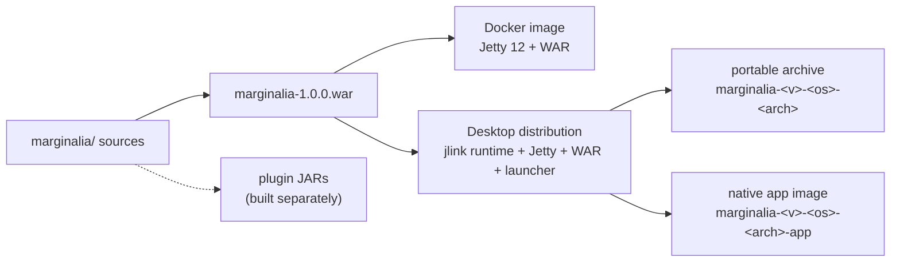
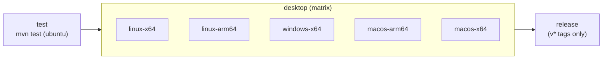
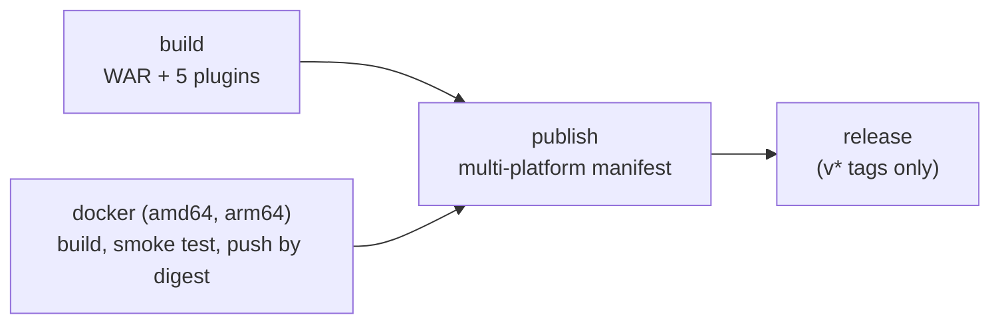

# Packaging & releases

Marginalia is built once as a WAR and then shipped in two forms: a **Docker image** for servers and a **desktop app**
with its own Java runtime and Jetty. This page describes how each is built, what CI does, and how a release is made.
For everyday builds see [Building from source](building.md).



| Artifact | Built by | Where it goes |
|---|---|---|
| WAR | `mvn package` | Input of the other two; can be deployed to any Servlet 6.1 container. Attached to GitHub releases for `v*` tags. |
| Docker image | `Dockerfile`, `docker compose build`, `.github/workflows/server.yml` | `ghcr.io/enerccio/marginalia` (amd64 + arm64) for `master` and `v*` tags; or built from source with compose. |
| Desktop archives | `mvn package -Pdesktop`, `.github/workflows/desktop.yml` | Attached to GitHub releases for `v*` tags. |
| Plugin JARs | `mvn package` in `marginalia/plugins/<plugin>`, `.github/workflows/server.yml` | Attached to GitHub releases for `v*` tags. |
| Manual | `retype build` | `docs/`, served by GitHub Pages. |

## The WAR

`mvn package` in `marginalia/` produces `target/marginalia-1.0.0.war` (see
[Building the application](building.md#building-the-application)). The WAR always runs in Vaadin production mode:
`build-frontend` writes the production `flow-build-info.json` into it, and a development one left in
`src/main/resources` is never packaged (see [Development and production mode](building.md#development-and-production-mode)).

One resource differs between a development build and a release build:

| File | Development | Release |
|---|---|---|
| `log4j.properties` | `src/main/resources/` - `com.github.enerccio` at `DEBUG` | `src/main/resources-release/` - everything at `INFO`, no story content in the log |

The build decides, not the packaging: IDE runs and `mvn jetty:run` use `target/classes`, which has the development
file. The WAR plugin adds `src/main/resources-release/` to `WEB-INF/classes` and leaves the development file out, so
every WAR from `mvn package` - the Docker image, the `desktop` profile, a WAR deployed by hand - logs at `INFO`.

The build also needs the Git history: `git-commit-id-plugin` writes the commit id and the closest tag into
`git.properties`, and the WAR filters them into its build info. Build from a clone, not from a source archive.

## Docker image

The `Dockerfile` in the repository root has two stages:

1. **builder** (`maven:3.9-eclipse-temurin-25`)
   - copies `marginalia/pom.xml` and runs `mvn dependency:go-offline`, so the dependency layer is cached while only
     the sources change;
   - copies `marginalia/src` and `.git` (for `git-commit-id-plugin`);
   - runs `mvn clean package -DskipTests`.
2. **runtime** (`jetty:12-jdk25-eclipse-temurin`)
   - creates a Jetty base with the modules `server, http, ee11-deploy, ee11-websocket-jakarta, ee11-webapp,
     ee11-jsp` (the WebSocket module is required for Vaadin push);
   - deploys the WAR as `webapps/ROOT.war`, so Marginalia is at `/`;
   - creates `/var/marginalia/.marginalia` for the data, owned by the `jetty` user;
   - declares a `HEALTHCHECK` (every 30 s, 120 s start period): the image has no `curl`, so `bash` opens a socket to
     `127.0.0.1:8080`, sends `GET /` and the container is healthy when the status line is 2xx or 3xx (the login
     redirect counts). Docker only reports the state, it does not restart the container;
   - starts with `docker-entrypoint.sh` (as `marginalia-entrypoint.sh`) as root: it creates the data folder if
     needed and, when it isn't owned by `jetty` - a `./data` bind mount that Docker created on a Linux host is owned
     by root - changes its owner to `jetty` (recursively, only then). It then runs the Jetty image's own
     `/docker-entrypoint.sh` and Jetty as `jetty` (`setpriv`), on port 8080. Started with another user
     (`--user`, compose `user:`), it changes nothing and the folder must already be writable for that user.

Tests are skipped in the image build - they run in CI. `.dockerignore` keeps `marginalia/target/`, `.idea/`, the
server's `data/` folder and the plugin folders out of the build context.

`docker-compose.yml` builds the image and sets the runtime configuration:

| Setting | |
|---|---|
| `volumes: ./data:/var/marginalia/.marginalia` | The data folder (database, backups, extensions) on the host. |
| `JAVA_TOOL_OPTIONS=-Duser.home=/var/marginalia ...` | Marginalia keeps its data in `${user.home}/.marginalia`, so this points it to the volume. Also the heap size and a heap dump on out-of-memory errors. |
| `ports: 8080:8080` | Jetty's HTTP port. |

`server.yml` publishes the image to the GitHub Container Registry (see [Continuous integration](#continuous-integration)),
users can also build it with `docker compose up -d --build` from a clone (see
[Server (Docker)](../user/getting-started/docker-server.md)). A published image is used with the same data volume and
`JAVA_TOOL_OPTIONS` as in `docker-compose.yml`.

To try a change in the image:

```sh
docker compose build
docker compose up        # foreground, logs in the terminal; Ctrl+C stops it
```

Use a different `./data` folder (edit the volume) when testing, so you don't touch a real installation's data.

## Desktop app

The `desktop` Maven profile turns the WAR into a self-contained application for the operating system and CPU it is
built on:

```sh
cd marginalia
mvn package -Pdesktop -DskipTests
```

It needs a full JDK 25 (with `jlink` and `jpackage`) and, on Windows, `tar.exe` from `System32` (present on Windows 10
and later).

### What the profile does

In `prepare-package`:

- downloads `jetty-home` (version `desktop.jetty.version`) into `target/desktop/download/`.

In `package` (after the WAR is built):

1. compiles `src/desktop/java` (`DesktopLauncher`, JDK only) into `app/marginalia-launcher.jar`;
2. copies the WAR to `server/marginalia.war` and unpacks `jetty-home` into `server/jetty-home/`;
3. builds a trimmed Java runtime with `jlink` (the modules in `desktop.modules`) into `runtime/`;
4. copies the launch scripts from `src/desktop/bin/` into `bin/`;
5. builds a native app image with `jpackage --type app-image` (no installer), with the runtime, the launcher JAR and
   the `server/` folder as app content;
6. packs both into archives.

Outputs in `target/desktop/`:

| Path | |
|---|---|
| `marginalia-1.0.0/` | The portable folder: `bin/marginalia`, `bin/marginalia.bat`, `app/`, `server/`, `runtime/`. |
| `package/` | The app image: `Marginalia.app` (macOS), `Marginalia/Marginalia.exe` (Windows), `Marginalia/bin/Marginalia` (Linux). |
| `marginalia-1.0.0-<os>-<arch>.tar.gz` / `.zip` | Archive of the portable folder (`.zip` on Windows). |
| `marginalia-1.0.0-<os>-<arch>-app.tar.gz` / `.zip` | Archive of the app image. |

`<os>` is `linux`, `macos` or `windows`, `<arch>` is Java's `os.arch` (`amd64`, `aarch64`...). Archives are made with
`tar` so the executable bits of the launchers survive.

### The launcher

`DesktopLauncher` is the main class of the app image and of the portable scripts. It depends on the JDK only and
starts Jetty in its own JVM by loading `start.jar` through a class loader, so it never needs Jetty on the classpath
and never ends up in the WAR. On start it:

1. resolves the data folder `<home>/.marginalia` (`--home` sets `user.home`) and redirects its output to
   `.marginalia/desktop/logs/`;
2. finds `server/` next to or above the launcher JAR (jpackage places app content differently per OS);
3. checks the port (default 8765): if Marginalia already runs there, it just opens the browser; if another program
   uses it, it picks a free port (unless `--port` was given);
4. writes a Jetty base into `.marginalia/desktop/jetty-base/` (modules `ee11-*`, `webapps/ROOT.xml` pointing to the
   WAR, a persistent work folder) - so the installation itself can stay read-only, e.g. inside a signed app bundle;
5. starts Jetty on `127.0.0.1`, waits up to three minutes for the start page, then shows the tray icon (or a small
   window where there is no system tray) and opens the browser.

The JVM options needed by the extension agent (`-Djdk.attach.allowAttachSelf=true -XX:+EnableDynamicAgentLoading`,
plus `--enable-native-access=ALL-UNNAMED` for SQLite) are passed by `jpackage --java-options` and by the scripts in
`bin/`. The scripts add `MARGINALIA_JAVA_OPTS`. Keep the three places in sync - the `desktop.javaOptions` property
and both scripts. On macOS, `-Dapple.awt.UIElement=true` keeps the app out of the Dock; it lives only in the tray.

Command-line options are described in [Desktop app](../user/getting-started/desktop-app.md#options).

### Cross-platform builds

`jlink` and `jpackage` only build for the platform they run on, so each operating system and CPU is built on its own
machine. CI does this with a build matrix (below). Locally you get only your own platform.

If you add a dependency that needs a JDK module not in `desktop.modules` (a `ClassNotFoundException` or
`NoClassDefFoundError` for a `java.*` / `javax.*` / `jdk.*` class in the desktop log only), add the module to the
list. `jdeps --print-module-deps` on the WAR's libraries helps to find it.

### Signing

The app images are not signed or notarized. macOS Gatekeeper and Windows SmartScreen warn on the first start; the
[Desktop app](../user/getting-started/desktop-app.md) page tells users how to get past it. Signing would be added to
the `jpackage` call (`--mac-sign`, `--mac-signing-key-user-name`...) and, for Windows, as a separate `signtool` step
in CI.

## Plugins

Each plugin in `marginalia/plugins/` is a Maven project with `bundle` packaging (Apache Felix
`maven-bundle-plugin`) that depends on the application's classes JAR with `provided` scope. They are built against
one exact version of the application:

```sh
cd marginalia && mvn install -DskipTests
cd plugins/reviewer && mvn package        # target/reviewer-1.0.0.jar
```

`server.yml` builds all five plugins against the freshly installed application and attaches the JARs to the release
of a `v*` tag; the Docker image doesn't contain them (server users put them into `<data folder>/extensions` or install
them in Admin → Extensions). When you change application classes that a plugin
uses (decorated `@Extendable` methods, UI classes, services), rebuild the plugin and test it against the new
application. See [Plugin development](plugins/index.md).

## Continuous integration

Two workflows, `desktop.yml` (tests and the desktop archives) and `server.yml` (WAR, plugins, Docker image). Both run
on pushes to `master`, on `v*` tags, on pull requests that change `marginalia/**` or the workflow, and by hand
(*workflow_dispatch*). A newer run on the same ref cancels the running one.

### desktop.yml



| Job | Runs on | Does |
|---|---|---|
| `test` | `ubuntu-latest` | For `v*` tags, checks that the tag matches the POM version; `mvn test`; uploads `surefire-reports/` when a test fails. |
| `desktop` | one runner per platform | `mvn -Pdesktop -DskipTests package`, a smoke test, uploads the archives (kept 14 days). |
| `release` | `ubuntu-latest`, `v*` tags only | Downloads all archives and attaches them to the GitHub release of the tag. |

All jobs use Temurin JDK 25 with the Maven cache and check out the full history (`fetch-depth: 0`) for
`git-commit-id-plugin`.

The **smoke test** starts the native app (and on Linux and macOS also the portable `bin/marginalia`) with a temporary
`--home`, a fixed port, `--no-browser --no-tray`, and waits up to three minutes until the start page contains
`<title>Marginalia</title>`. It fails and prints the launcher log otherwise. It catches broken packaging - a missing
JDK module, a launcher that can't find `server/`, a WAR that doesn't deploy - but doesn't test any feature.

### server.yml



| Job | Runs on | Does |
|---|---|---|
| `build` | `ubuntu-latest` | For `v*` tags, checks the tag against the POM version; `mvn -DskipTests install` (tests run in `desktop.yml`), then `mvn package` in every plugin; uploads the WAR and the plugin JARs (kept 14 days). |
| `docker` | one native runner per platform | Builds the image from the `Dockerfile` (natively, because the Maven stage is too slow under emulation), starts a container with a root-owned bind-mounted data folder and waits for the start page, then (not for pull requests) pushes the image by digest. |
| `publish` | `ubuntu-latest`, not for pull requests | Joins both digests into one multi-platform manifest and tags it: `edge` for `master`, `<version>`, `<major>.<minor>` and `latest` for `v*` tags. |
| `release` | `ubuntu-latest`, `v*` tags only | Attaches the WAR and the plugin JARs to the GitHub release of the tag. |

The image is `ghcr.io/<owner>/marginalia` and is pushed with the workflow's `GITHUB_TOKEN`. The package is private
the first time it is pushed; make it public in the package settings on GitHub so that users can pull it without logging in.

## Making a release

1. **Version.** Set the new version in `marginalia/pom.xml` (`<version>`) and in the plugin POMs (the plugin
   version and the version of the `marginalia` dependency). The archive names and the app version shown by the OS
   come from the POM, not from the tag, so the two must match: for a `v*` tag the `test` job first checks that the
   tag is `v` + the POM version and fails otherwise, so no archives are built or attached. `jpackage` on macOS
   requires a version of the form `x.y.z` with `x` ≥ 1.
2. **Database.** If the release changes the schema, check that the migrations upgrade a database of the previous
   release (keep a copy of one around) - `FlywayMigrationTest` covers only the migrations themselves.
3. **Manual.** Update the manual for user-visible changes, run `retype build`, commit `docs/`.
4. **Test.** `mvn test`, and `mvn package -Pdesktop` on at least your own platform; start the app and generate a part
   against a real model.
5. **Tag.** Commit, then create and push the tag:

   ```sh
   git tag v1.1.0
   git push origin master v1.1.0
   ```

6. **Release.** Create the GitHub release for the tag (by hand or `gh release create v1.1.0`) with the release
   notes. `desktop.yml` attaches the ten desktop archives when its matrix finishes, `server.yml` the WAR and the
   plugin JARs and pushes the Docker image - whichever finishes first creates the release if it doesn't exist yet
   (`softprops/action-gh-release`).
7. **Plugins.** The plugin versions must match the application version (point 1); the JARs are attached
   automatically.
8. **Announce upgrades.** Docker users update with `docker compose pull && docker compose up -d` (published image) or
   `git pull && docker compose up -d --build` (built from source), desktop users replace the app. Remind them to make a [database backup](../user/administration/database-backups.md) first when the
   schema changed.

## Publishing the manual

The manual is part of the repository: Retype reads `manual/` and writes the static site to `docs/` (configured in
`retype.yml`). GitHub Pages serves `docs/` from the `master` branch, so the published manual changes when a commit
with a new `docs/` reaches `master`. Rebuild and commit `docs/` in the same change as the sources - see
[Building the manual](building.md#building-the-manual).
