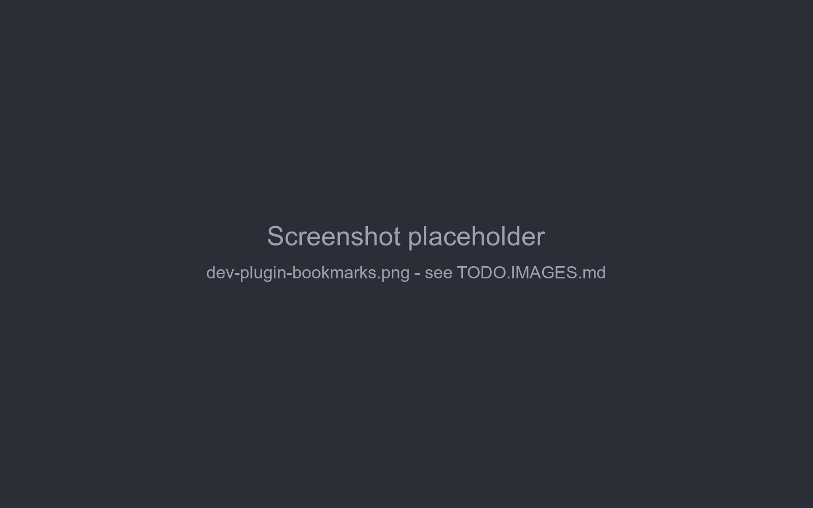

# Example plugin

This page builds a small plugin from scratch - *Bookmarks*, which lets you bookmark story parts - and then walks
through the smallest bundled plugin, Chapter Marker. Together they use everything from the previous pages: a
bundle, decorators reading arguments, locals and fields, data in attributes, and cleanup on unload.

## Bookmarks

What it does:

- every story part's menu gets a *Toggle bookmark* item,
- bookmarked parts are marked with ★ in the story sidebar,
- the bookmark is stored on the part, so it's kept in backups and copied by *Branch Story*.



### 1. Install the application

The plugin compiles against the application's classes, installed in the local Maven repository:

```sh
cd marginalia
mvn install -DskipTests
```

### 2. Create the project

```
bookmarks/
├── pom.xml
└── src/main/java/com/example/marginalia/bookmarks/
    ├── BookmarksActivator.java
    └── BookmarksExtension.java
```

Copy `marginalia/plugins/chaptermarker/pom.xml` and change:

- `groupId` to `com.example.marginalia`, `artifactId` to `bookmarks`,
- `Bundle-Activator` to `com.example.marginalia.bookmarks.BookmarksActivator`,
- `Import-Package` to `!com.example.marginalia.bookmarks.*` and `Export-Package` to
  `com.example.marginalia.bookmarks.*`.

Keep the rest - the `provided` dependencies, the AspectJ plugin (for `@Configurable`) and the bundle plugin. See
[Plugin basics → pom.xml](overview.md#pomxml) for what each part does.

### 3. The activator

It only registers the extension:

```java
package com.example.marginalia.bookmarks;

import com.github.enerccio.marginalia.extensions.MarginaliaExtension;
import org.osgi.framework.BundleActivator;
import org.osgi.framework.BundleContext;
import org.osgi.framework.ServiceRegistration;

public class BookmarksActivator implements BundleActivator {

    private ServiceRegistration<MarginaliaExtension> registration;

    @Override
    public void start(BundleContext context) {
        registration = context.registerService(MarginaliaExtension.class, new BookmarksExtension(), null);
    }

    @Override
    public void stop(BundleContext context) {
        if (registration != null) {
            registration.unregister();
            registration = null;
        }
    }
}
```

### 4. The extension

```java
package com.example.marginalia.bookmarks;

import com.github.enerccio.marginalia.domain.model.impl.ChatMessage;
import com.github.enerccio.marginalia.domain.service.ChatMessageService;
import com.github.enerccio.marginalia.domain.service.ExtensionService;
import com.github.enerccio.marginalia.domain.service.ExtensionService.ExtendableMethodContext;
import com.github.enerccio.marginalia.domain.service.ExtensionService.ExtensionDecorator;
import com.github.enerccio.marginalia.domain.service.OsgiService;
import com.github.enerccio.marginalia.domain.service.impl.OsgiServiceImpl;
import com.github.enerccio.marginalia.extensions.MarginaliaExtension;
import com.github.enerccio.marginalia.ui.dialogs.manuscript.ManuscriptStoryPart;
import com.google.gson.JsonObject;
import com.vaadin.flow.component.ComponentUtil;
import com.vaadin.flow.component.button.Button;
import com.vaadin.flow.component.contextmenu.ContextMenu;
import com.vaadin.flow.component.contextmenu.MenuItem;
import com.vaadin.flow.component.notification.Notification;
import org.osgi.framework.Bundle;
import org.slf4j.Logger;
import org.slf4j.LoggerFactory;
import org.springframework.beans.factory.annotation.Autowired;
import org.springframework.beans.factory.annotation.Configurable;

import java.util.Collections;
import java.util.List;
import java.util.Set;
import java.util.WeakHashMap;

@Configurable
public class BookmarksExtension implements MarginaliaExtension {
    private static final Logger log = LoggerFactory.getLogger(BookmarksExtension.class);

    private static final String KEY = "com.example.marginalia.bookmarks";
    private static final String MENU_ITEM_KEY = KEY + ".menuItem";

    private static final String STORY_PART = "com.github.enerccio.marginalia.ui.dialogs.manuscript.ManuscriptStoryPart";
    private static final String MESSAGE_CARD = STORY_PART + "$ChatMessageCard";

    @Autowired
    private ChatMessageService chatMessageService;

    private final Set<ContextMenu> menus = Collections.synchronizedSet(Collections.newSetFromMap(new WeakHashMap<>()));
    private List<ExtensionDecorator> decorators = List.of();

    @Override
    public void onExtensionLoad(Bundle bundle, OsgiService osgiService, ExtensionService extensionService) {
        ExtensionDecorator menuDecorator = new ExtensionDecorator() {
            @Override
            public void onMethodEnter(Object instrumented, ExtendableMethodContext context) {
            }

            @Override
            public void onMethodLeave(Object card, ExtendableMethodContext context, Throwable throwing) {
                if (throwing != null) {
                    return;
                }
                ContextMenu menu = context.getReflectiveFieldValue(card, "hamburgerMenu", ContextMenu.class);
                if (menu == null || ComponentUtil.getData(menu, MENU_ITEM_KEY) != null) {
                    return;
                }
                MenuItem item = menu.addItem("Toggle bookmark", event -> {
                    try {
                        // read the field when clicked - the card replaces its message on every save
                        ChatMessage shown = context.getReflectiveFieldValue(card, "message", ChatMessage.class);
                        ChatMessage fresh = chatMessageService.find(shown.getId());
                        setBookmarked(fresh, !isBookmarked(fresh));
                        chatMessageService.save(fresh);

                        // redraw the story so the sidebar shows the change
                        ManuscriptStoryPart storyPart = context.getReflectiveFieldValue(card, "this$0", ManuscriptStoryPart.class);
                        context.callReflectiveMethod(storyPart, "renderStoryContent", new Class<?>[0], new Object[0], void.class);
                    } catch (Exception e) {
                        log.error("Cannot toggle bookmark", e);
                        Notification.show("Cannot toggle bookmark: " + e.getMessage());
                    }
                });
                ComponentUtil.setData(menu, MENU_ITEM_KEY, item);
                menus.add(menu);
            }
        };

        ExtensionDecorator sidebarDecorator = new ExtensionDecorator() {
            @Override
            public void onMethodEnter(Object instrumented, ExtendableMethodContext context) {
            }

            @Override
            public void onMethodLeave(Object storyPart, ExtendableMethodContext context, Throwable throwing) throws Exception {
                if (throwing != null) {
                    return;
                }
                ChatMessage msg = context.getMethodArgument("msg", ChatMessage.class);
                if (isBookmarked(msg) && context.hasLocalVariable("sidebarBtn", Button.class)) {
                    Button sidebarBtn = context.getLocalVariable("sidebarBtn", Button.class);
                    sidebarBtn.setText("★ " + sidebarBtn.getText());
                }
            }
        };

        try {
            extensionService.registerDecorator(menuDecorator, MESSAGE_CARD, "createMenuItems");
            extensionService.registerDecorator(sidebarDecorator, STORY_PART, "createSidebarButton");
            decorators = List.of(menuDecorator, sidebarDecorator);
        } catch (Exception e) {
            log.error("Bookmarks extension failed to load", e);
        }
    }

    @Override
    public void onExtensionUnload(Bundle bundle, OsgiServiceImpl osgiService, ExtensionService extensionService) {
        decorators.forEach(extensionService::unregisterDecorator);
        decorators = List.of();

        synchronized (menus) {
            for (ContextMenu menu : menus) {
                // menus belong to other sessions - change them under their own lock
                menu.getUI().ifPresent(ui -> ui.access(() -> {
                    MenuItem item = (MenuItem) ComponentUtil.getData(menu, MENU_ITEM_KEY);
                    if (item != null) {
                        menu.remove(item);
                        ComponentUtil.setData(menu, MENU_ITEM_KEY, null);
                    }
                }));
            }
            menus.clear();
        }
    }

    static boolean isBookmarked(ChatMessage message) {
        JsonObject attributes = message != null ? message.getAttributes() : null;
        return attributes != null && attributes.has(KEY) && attributes.get(KEY).getAsBoolean();
    }

    static void setBookmarked(ChatMessage message, boolean bookmarked) {
        if (message.getAttributes() == null) {
            message.setAttributes(new JsonObject());
        }
        if (bookmarked) {
            message.getAttributes().addProperty(KEY, true);
        } else {
            message.getAttributes().remove(KEY);
        }
    }
}
```

How it works:

- **Two decorators.** `menuDecorator` runs after `ChatMessageCard.createMenuItems()` - the card's constructor calls
  it, so every card gets the item. `sidebarDecorator` runs after `ManuscriptStoryPart.createSidebarButton(msg,
  orderId, dbId)`, which `renderStoryContent()` calls for each part of the branch.
- **Reaching the components.** The menu is the card's field `hamburgerMenu`; the sidebar button is the local
  variable `sidebarBtn` of `createSidebarButton`, the part is its argument `msg`. Both names are checked before use
  (`hasLocalVariable`) or fail with a logged warning if the application changes.
- **Adding once.** `ComponentUtil.setData(menu, MENU_ITEM_KEY, item)` marks the menu; a second call for the same menu
  does nothing.
- **Data.** The bookmark is one boolean under the plugin's key in the part's `attributes`. The click listener reads
  the card's `message` field at click time and reloads the part (`chatMessageService.find(id)`) before changing it,
  because the card's copy may be stale ([Extended attributes](extended-attributes.md#storing-and-reading-data)).
- **Redrawing.** After saving it calls the story part's private `renderStoryContent()` through
  `callReflectiveMethod`, reaching the outer `ManuscriptStoryPart` through the inner class's `this$0` field. The
  redraw runs `createSidebarButton` again, so the sidebar decorator adds the ★.
- **Unloading.** Decorators are unregistered; menu items are removed from the tracked menus inside each menu's own
  `ui.access(...)`, because they belong to other users' sessions
  ([Extending the UI → Unloading](ui-extensions.md#unloading)). Sidebar buttons lose their ★ on the next redraw.
- **Errors.** `onExtensionLoad` runs without a UI, so it logs instead of opening an error dialog.

!!!
With Chapter Marker installed too, both plugins decorate `createSidebarButton`, and decorators run in the order the
plugins were loaded. Bookmarks prefixes the text, so it works after Chapter Marker; Chapter Marker replaces the text
of chapter parts, so the ★ of a bookmarked chapter is lost when Chapter Marker runs second (and when the part is
edited).
!!!

### 5. Build and load

```sh
cd bookmarks
mvn package                     # target/bookmarks-1.0.0.jar
```

Load `target/bookmarks-1.0.0.jar` in *Admin → Extensions* and open a book (books that were already open need to be
closed and opened again). Open a part's menu, choose *Toggle bookmark* - the part's sidebar entry gets the ★.

If nothing appears, look in the log for `Mod 'com.example.marginalia.bookmarks.BookmarksExtension$...' skipped on
...` (a name that doesn't exist) or `Unhandled exception in extension ...`.

### Where to go from here

- Show the bookmarks in a tab of their own: decorate `renderStoryContent()` and add a tab to `leftBar`, like Side
  Query ([A tab next to the story](ui-extensions.md#a-tab-next-to-the-story)).
- Put bookmarked parts into the prompt: register a listener for `AFTER_MANUSCRIPT_CONCATENATION`
  ([Generation pipeline](../generation-pipeline.md#events-for-extensions)).

## Walkthrough: Chapter Marker

`marginalia/plugins/chaptermarker` turns the story sidebar into a table of contents: a part whose text contains a
Markdown heading is shown as `5. Chapter 3: The Harbour`, highlighted. It has two classes and no data of its own -
the heading is part of the story text.

`ChapterMarkingActivator` is the same as the Bookmarks activator. `ChapterMarkingExtension` registers two decorators
in `onExtensionLoad`.

**Labelling the sidebar** - after `ManuscriptStoryPart.createSidebarButton(msg, orderId, dbId)`:

```java
ChatMessage msg = context.getMethodArgument("msg", ChatMessage.class);
Integer orderId = context.getMethodArgument("orderId", int.class);      // primitive argument: ask for int.class

VerticalLayout sidebarList = context.getReflectiveFieldValue(instrumented, "sidebarList", VerticalLayout.class);

Button sidebarBtn = null;
if (context.hasLocalVariable("sidebarBtn", Button.class)) {
    sidebarBtn = context.getLocalVariable("sidebarBtn", Button.class);
} else if (sidebarList.getComponentAt(sidebarList.getComponentCount() - 1) instanceof Button lastBtn) {
    sidebarBtn = lastBtn;                                                // fallback if the local is renamed
}
```

It remembers the button's original text, the order and the part's uuid on the button
(`ComponentUtil.setData(...)`), then sets the chapter title and style if the part has a heading.

**Following edits** - after `ManuscriptStoryPart$ChatMessageCard.autosaveAndSwapToMarkdown()`, which saves an edited
part:

```java
ChatMessage chatMessage = context.getReflectiveFieldValue(instrumented, "message", ChatMessage.class);
ManuscriptStoryPart parentPart = context.getReflectiveFieldValue(instrumented, "this$0", ManuscriptStoryPart.class);
VerticalLayout sidebarList = context.getReflectiveFieldValue(parentPart, "sidebarList", VerticalLayout.class);
```

It finds the sidebar button whose stored uuid matches the edited part and relabels it - or restores the original
text when the heading was removed. The data stored on the button in the first decorator is what makes this possible
without rebuilding the sidebar.

**Unloading** unregisters both decorators. Labels already changed stay until the story is redrawn, which is
acceptable here: they're just text.

What to take from it:

- arguments, locals and fields are all used, each with the right accessor;
- primitive arguments are read with the primitive type;
- a fallback for the local variable keeps the plugin working if the variable is renamed;
- component data (`ComponentUtil`) carries state from one hook to another.

The other bundled plugins build on the same pieces: Reviewer and Side Query add menu items, tabs, settings panels and
call the model ([Extending the UI](ui-extensions.md)); Lorebook VCS stores larger data in a lorebook's attributes
([Extended attributes](extended-attributes.md)).
