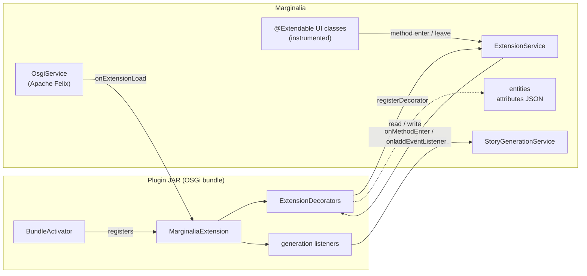

# Plugin development

A Marginalia plugin (the user interface calls them *extensions*) is an OSGi bundle - a JAR with a few extra manifest
headers - that Marginalia loads at runtime, without a restart. A plugin can add menu items, tabs, panels and settings
to the user interface, keep its own data on books, story parts, lorebooks and user settings, call the model, and take
part in generation.

This part of the developer guide explains how plugins work and how to write one. It assumes you can build Marginalia
from source ([Building from source](../building.md)) and know a little Vaadin Flow ([User interface](../ui.md)).

## How a plugin plugs in

There is no plugin API in the usual sense - no list of extension points with stable signatures. Instead, a plugin
gets three general mechanisms and the whole application to use them on:

| Mechanism | What it gives you | Page |
|---|---|---|
| **Bundles** | Loading, unloading, the `MarginaliaExtension` lifecycle, access to every Spring service through `@Configurable`. | [Plugin basics](overview.md) |
| **`@Extendable` hooks** | Code that runs before and after *any* method of an instrumented UI class, with access to its arguments, local variables and fields. | [@Extendable hooks](extendable.md) |
| **Extended attributes** | A JSON object on every data entity where a plugin keeps its data - saved with the entity, included in backups, no schema change. | [Extended attributes](extended-attributes.md) |
| **Generation events** | Listeners that read and change the prompt, the lore, the summaries and the streamed answer while a story part is generated. | [Generation pipeline](../generation-pipeline.md#events-for-extensions) |

[Extending the UI](ui-extensions.md) puts the first three together: adding components, settings panels, threads and
cleaning up on unload. [Example plugin](example.md) builds a small plugin from scratch and walks through the bundled
Chapter Marker.

!!!warning Plugins are tied to one version of Marginalia
Hooks are attached by class and method *name* and read local variables and fields by name. Renaming a method or a
variable in the application silently disables the part of a plugin that used it (a warning is logged). Build plugins
from the same source tree as the application they run in, and test them after every update.
!!!

## The bundled plugins

The four plugins in `marginalia/plugins/` are complete, working examples. Each is a separate Maven project.

| Plugin | What it adds | Shows how to |
|---|---|---|
| [Chapter Marker](https://github.com/Enerccio/Marginalia/tree/master/marginalia/plugins/chaptermarker) | Story parts that start with a Markdown heading are shown as chapters in the story sidebar. | Read method arguments and locals, change a component the method built. The smallest one - start here. |
| [Lorebook VCS](https://github.com/Enerccio/Marginalia/tree/master/marginalia/plugins/lorebookvcs) | Revision history of lorebook entries, export and import of the history. | Insert panels into a view, store data in a lorebook's attributes, replace a field of the view. |
| [Reviewer](https://github.com/Enerccio/Marginalia/tree/master/marginalia/plugins/reviewer) | AI reviews of a story part with configurable reviewer profiles. | Add a sub-menu to every part, add a settings panel, stream an answer from the model. |
| [Side Query](https://github.com/Enerccio/Marginalia/tree/master/marginalia/plugins/sidequery) | A chat panel next to the story for questions about the book. | Add a tab to the story editor, keep per-book sessions, build a prompt from lore and parts. |

Users install them as described in [Managing extensions](../../user/administration/extensions.md).

## Reading order

1. [Plugin basics](overview.md) - project layout, the activator and the extension, building and loading.
2. [Example plugin](example.md) - build one, load it, see it work.
3. [@Extendable hooks](extendable.md) - the decorator API in detail and its limits.
4. [Extended attributes](extended-attributes.md) - storing data.
5. [Extending the UI](ui-extensions.md) - patterns for menus, tabs and settings, threads and unloading.
