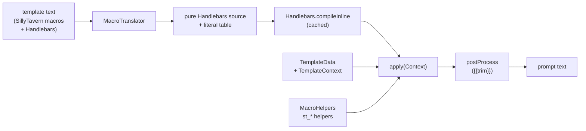

# Templating & macros

Every prompt Marginalia sends is rendered from a template: the master template, the user prompt, lorebook entries
and the summary prompt. Templates are [Handlebars](https://github.com/jknack/handlebars.java) with
SillyTavern-compatible macros on top. This page explains how that is implemented and how to add variables and macros.
What users can write is documented in the user guide: [Prompt templates](../user/templates/templates.md) and the
[Macro reference](../user/templates/macros.md).

The code is in `domain/templates/` (data objects, context, variables), `domain/templates/macros/` (translator,
helpers, macro registry) and `domain/service/impl/TemplateServiceImpl.java`.

## Rendering in one picture



`TemplateService.processTemplate(template, name, data)`:

1. **Translate** the SillyTavern syntax into plain Handlebars (`MacroTranslator.translate`).
2. **Compile** the result with Handlebars. Compiled templates are cached by template text (Caffeine, 500 entries,
   24 h after last access), so a lorebook entry is parsed once, not on every generation.
3. **Render** it against a Handlebars `Context` built from the `TemplateData` (`MacroHelpers.createContext`).
4. **Post-process** the output: `{{trim}}` markers are removed together with the newlines around them.

Handlebars runs with `EscapingStrategy.NOOP` - the output is a prompt, not HTML, so quotes, `&` and `<` stay as
they are.

`isValidTemplate(template, name)` only does steps 1-2, so it catches syntax errors. `isValidTemplate(template, name,
dataClass)` also walks the compiled template (`Template.collect` of variables and sections, in all branches) and
reports names that would end in *helperMissing* (see [Template data](#template-data)) in
`ValidationResult.unknownNames()`. They are warnings, `isValid()` stays true; the UI shows them as the field's helper
text (`TemplateHints.showWarnings`). Names relative to the current context (`this`, `.`, `../x`, `@index`) and
parameters (`{{#if name}}`) are not checked.

## Where templates are rendered

| Template | Rendered in | Data class | Its own variables |
|---|---|---|---|
| User prompt | `PrepareConstantsStep` | `UserPromptData` | `povCharacter`, `sceneSetting`, `presentCharacters`, `instructions` |
| Lorebook entry payload | `ProcessLorebookStep` (one data object for all active entries) | `LorebookTemplateData` | the four above + `narrativePov`, `narrativeTense`, `style` |
| Master template | `PrepareContentStep` (twice: token estimate on a fork, then for real) | `MasterTemplateData` | `backgroundLore`, `narrativePov`, `narrativeTense`, `style`, `summaries` |
| Summary prompt | `SummaryServiceImpl.createSummaryPayload` | `SummaryTemplateData` | `backgroundLore`, `text` (the parts to summarize) |

The order of the [generation pipeline](generation-pipeline.md) matters: the user prompt is rendered first, then the
lorebook entries, then the master template - a variable set in the user prompt is visible in lore, and lore can set
variables the master template reads.

POV, tense and style are *values*, not templates: they are passed into the templates as variables but not rendered
themselves.

## Template data

Each template gets an instance of a `TemplateData` subclass. Its **bean properties** (getters declared in the
subclass - `TemplateData`'s own methods are excluded) are the template's variables. A field annotated
`@LocalizedTemplateDescription(loc = L.DESC_TEMPLATE_...)` is listed, with that description, in the hints popover of
the prompt fields (`TemplateHints`), followed by the shared context properties the class doesn't declare.

Names are resolved by `MacroHelpers.TemplateDataValueResolver`, in this order:

1. a property of the data object - `null` renders as an empty string,
2. a property of the shared `TemplateContext` (`povCharacter`, `presentCharacters`, `sceneSetting`, `instructions`,
   `narrativePov`, `narrativeTense`, `style`, `manuscriptName`, `manuscriptDescription`) - that is why these work in
   every template,
3. an argument-less macro used as a value, so `{{#if user}}` works like `{{if user}}`,
4. otherwise the name is missing and Handlebars' *helperMissing* hook renders the word `Error`, so typos are visible
   in the prompt (`MacroHelpers.resolves` is the same check, used by validation).

Reflection into anything else is blocked: the resolver returns nothing for other names instead of letting the default
resolvers call methods of `TemplateData` (there is deliberately no `getTemplateContext()` getter).

## The template context

`TemplateContext` is the environment macros read: the turn fields, POV / tense / style, book name and description,
model name and token limits, the generation type, the story so far (`storyMessages`), the last instructions and time,
the latest summary, the variables, a clock, a random generator and the seed for `{{pick}}`.

One context is created per generation (`GenerationStepBase.getTemplateContext`, stored as
`GenerationProperties.TEMPLATE_CONTEXT`) and set into every data object of that generation, so all templates see
the same variables. `fork()` makes a copy with copied variables for renders whose side effects must not count - the
token estimate of the master template uses one.

Summaries build their own context (`SummaryServiceImpl.createTemplateContext`) from the part being summarized; the
variable changes made by a summary prompt are not stored.

## How macros are translated

`MacroTranslator` scans the template, recognizes SillyTavern constructs, and rewrites only those into calls of
helpers named `st_*`. Everything else - `{{variable}}`, `{{#section}}...{{/section}}`, `{{#if}}`, `{{#each}}`,
`{{.}}`, `{{!-- comments --}}`, triple mustaches - is left for Handlebars untouched.

Real translator output:

| Template | Handlebars source | Literal table |
|---|---|---|
| `Hello {{user}}` | `Hello {{st_user 0}}` | |
| `{{getvar::{{char}}_mood}}` | `{{st_getvar 1 (st_concat 3 (st_char 2) (st_lit 0))}}` | `_mood` |
| `{{#sceneSetting}}Scene: {{.}}{{/sceneSetting}}` | unchanged | |
| `{{if .mood == sad}}cry{{else}}smile{{/if}}` | `{{#st_if 0 (st_var 1 "local" "mood" "==" (st_lit 0)) false}}cry{{else}}smile{{/st_if}}` | `sad` |
| `{{.turn++}}` | `{{st_var 0 "local" "turn" "++"}}` | |
| `{{$count += 2}}` | `{{#st_var 1 "global" "count" "+="}}2{{/st_var}}` | |
| `{{random::a::b::c}}` | `{{st_random 2 (st_lit 0) (st_lit 1) (st_lit 2)}}` | `a`, `b`, `c` |
| `{{setvar name}}Bob{{/setvar}}` | `{{#st_setvar 0 (st_lit 0)}}Bob{{/st_setvar}}` | `name` |
| `{{// note}}` | removed | |
| `\{\{x\}\}` | `{{st_lit 1}}x{{st_lit 2}}` | `{{`, `}}` |
| `<USER>` | `{{st_user 1}}` | |
| `{{unknownmacro::x}}` | `{{st_lit 3}}` | `{{unknownmacro::x}}` |

What the translator handles:

- **Names** are case-insensitive (`{{User}}`, `{{USER}}`); template *variables* are not.
- **Arguments** in all SillyTavern forms: `{{macro arg}}`, `{{macro::a::b}}`, legacy `{{macro:arg}}`.
- **Nesting**: macros inside arguments are evaluated first and joined with `st_concat`.
- **Scoped macros**: a macro that gets fewer arguments than it needs becomes a block - `{{setvar name}}...{{/setvar}}`
  - and the block content is its last argument. `#` (`{{#setvar ...}}`) keeps the block's whitespace.
- **Conditionals** `{{if cond}}...{{else}}...{{/if}}` and `{{if !cond}}`; the condition can be a macro, a variable
  shorthand or a template variable (`st_cond` decides which).
- **Variable shorthands** `{{.local}}`, `{{$global}}` with the operators `=`, `++`, `--`, `+=`, `-=`, `||`, `??`,
  `||=`, `??=`, `==`, `!=`, `>`, `>=`, `<`, `<=` (`st_var`).
- **Comments** `{{// ...}}` and blocks `{{//}}...{{///}}` are removed.
- **Escapes** `\{\{...\}\}` produce literal braces; Handlebars' own `\{{` still works.
- **Legacy markers** `<USER>`, `<BOT>`, `<CHAR>`, `<GROUP>`, `<CHARIFNOTGROUP>`.
- **Unknown macros with `::` arguments** are output literally, as SillyTavern does; other unknown names are passed to
  Handlebars as variables.

**User text never becomes Handlebars source.** Every argument and literal goes into the literal table and is
referenced by index through `st_lit`, so a lorebook entry containing `}}` or `{{#each}}` in an argument can't break
or inject into the generated template.

The first parameter of every `st_*` call is the **site** - the index of the call in the template. `{{pick}}` uses it
to make each position pick independently but stably.

## Helpers

`MacroHelpers.register` registers on the Handlebars instance:

| Helper | Does |
|---|---|
| `st_<macro>` | One per macro in `Macros`; unpacks the arguments (plus the block content for block calls) into a `MacroCall` and calls the macro's function on the `TemplateData`. |
| `st_lit` | Returns a literal from the table. |
| `st_concat` | Joins its arguments (nested macros in arguments). |
| `st_prop` | Resolves a template property by name. |
| `st_cond` | Evaluates an `if` condition: argument-less macro, template property, or the text itself (non-empty text is true). |
| `st_if` | The conditional itself, block or inline. |
| `st_var` | Variable shorthands. |
| *helperMissing* | Renders `Error` for unknown names. |

Truthiness (`TemplateData.isTruthy`): `null`, empty collections and the strings `""`, `false`, `0`, `off`, `no`
(case-insensitive) are false; everything else is true.

## The macro registry

`Macros` (in `domain/templates/macros/`) is a static registry of `MacroDefinition`s - name, signature for the UI,
minimum and maximum number of arguments, description key and the function:

```java
define("{{roll::1d20}}", 1, 1, L.DESC_MACRO_ROLL, (d, c) -> d.roll(c.arg(0)), "roll");
```

- The first name is canonical; further names are aliases (`char`, `charIfNotGroup`).
- Definitions with a description appear in the hints popover (*Available Macros*).
- `ignored(...)` registers SillyTavern macros that have no meaning in Marginalia (instruct sequences, swipes, author's
  notes, character card fields...): they render as an empty string (or `false`), so imported world info doesn't leak
  raw macros into prompts.

The macro logic lives in `TemplateData` (`user()`, `lastMessage()`, `time(offset)`, `setVar(...)`, `pick(...)`...),
using the `TemplateContext`. A few mappings worth knowing, since Marginalia has no chat:

| SillyTavern | In Marginalia |
|---|---|
| `{{user}}`, `{{char}}` | the POV character |
| `{{group}}` | the present characters (or the POV character) |
| `{{notChar}}` | present characters except the POV character |
| `{{description}}` | the book's description |
| `{{scenario}}` | the scene setting |
| `{{input}}` | the instructions of this turn |
| `{{lastMessage}}` | the text of the last part of the branch |
| `{{lastUserMessage}}` | the instructions of the last part |
| `{{summary}}` | the latest summary on the branch |

## Variables

`TemplateVariables` stores the variables of `getvar` / `setvar` and the shorthands, as strings:

| Scope | Macros | Stored in | Loaded from |
|---|---|---|---|
| local | `{{getvar}}`, `{{setvar}}`... `{{.name}}` | the generated part's `attributes` | the last part of the branch the new part continues |
| global | `{{getglobalvar}}`... `{{$name}}` | the book's `attributes` | the book |

Both are kept under the attribute key `templateVariables` and saved by `GenerateNewMessageStep` after the prompt is
rendered (see [Domain model](domain-model.md#chatmessage-part-and-the-story-tree)). Because local variables are
read from the part being continued, regenerating or branching doesn't apply a turn's changes twice. Numbers are
handled with `BigDecimal` (`addVar`, `++`, `+=`); non-numeric `add` concatenates.

## Randomness and time

- `{{random}}` and `{{roll}}` use the context's `Random` - a new result on every render.
- `{{pick}}` is stable: the choice is derived from SHA-256 of the book id (`pickSeed`), the template key (a hash of
  the template text), the call site and the options. The same template in the same book picks the same option
  every time; editing the template or moving the macro can change the pick.
- Time macros (`{{time}}`, `{{date}}`, `{{weekday}}`, `{{datetimeformat}}`...) use the context's clock, which is the
  **server's** default time zone - UTC in the Docker image - unless an offset is given (`{{time::UTC+2}}`).
  `MomentFormat` converts moment.js patterns (SillyTavern's) for `{{datetimeformat}}`.
- `{{trim}}` outputs a marker - the word `trim` wrapped in the private-use character U+E000, so normal text can't
  contain it - which `postProcess` removes together with the surrounding newlines.

## Adding a template variable

1. Add a field with getter and setter to the data class (e.g. `MasterTemplateData`) and annotate the field with
   `@LocalizedTemplateDescription(loc = L.DESC_TEMPLATE_X)`.
2. Add the key to `L` and the text to `LocalizationEN` - it is shown in the hints.
3. Set the value where the data object is filled (the generation step or `SummaryServiceImpl`).
4. If it should be available in *every* template, add it to `TemplateContext` (field, `fork()`, `property(name)`)
   and fill it in `GenerationStepBase.createTemplateContext` instead.
5. Check that the name isn't also a macro name - the translator turns known macro names into macro calls, which would
   hide the variable.

## Adding a macro

1. Implement the logic as a public method of `TemplateData` using `templateContext()` and `variables()`.
2. Register it in the static block of `Macros` with `define(signature, minArgs, maxArgs, L.DESC_MACRO_X, function,
   names...)`. `maxArgs` -1 means unlimited; a macro with `minArgs > 0` called with fewer arguments becomes a block
   whose content is the last argument.
3. Add the description to `L` / `LocalizationEN`.
4. Document it in the user guide's [Macro reference](../user/templates/macros.md).
5. Add rendering tests to `templates/MacroRenderingTest`.

No changes to the translator or the helpers are needed - helpers are registered for every definition.

## Tests

| Test | Covers |
|---|---|
| `templates/MacroRenderingTest` | Macros, shorthands, conditionals, escaping, nesting - rendered end to end. |
| `templates/TemplateServiceTest` | Property resolution, no HTML escaping, `Error` for unknown names, sections, validation, macro arguments can't inject Handlebars, variables shared through the data / context, forks. |
| `templates/DefaultTemplatesTest` | The built-in templates from `Defaults` render. |
| `templates/MacroLorebookFixtureTest` | A SillyTavern-style lorebook full of macros (`src/test/resources/macro-test.json`). |
| `domain/templates/TemplateHelpersTest` | Helper-level details. |

`TemplateTestBase` provides a template service and a `LorebookTemplateData` with a fresh context whose clock is fixed (`2026-03-15T14:30:45Z`, UTC) and whose random generator is seeded. Run them with
`mvn test -Dtest='Macro*Test,Template*Test'`.
