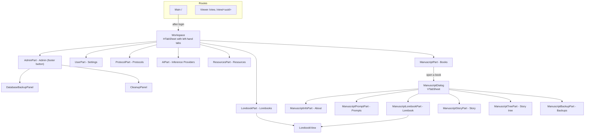
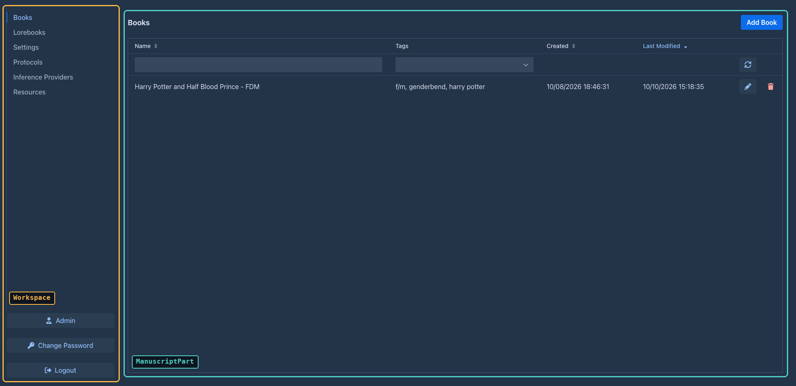
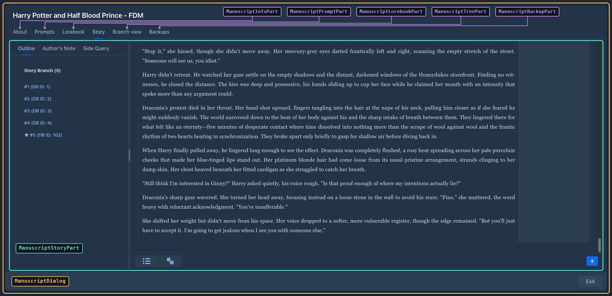

# User interface

Marginalia's UI is written in Java with [Vaadin Flow](https://vaadin.com/docs/latest/flow) 25: the component tree
lives on the server, the browser renders it with Vaadin's web components (Lumo theme, dark color scheme) and sends
events back over HTTP and a push WebSocket. There is no hand-written frontend code apart from one CSS file and a small
connector for the story tree. This page explains how the UI code is organized and the conventions to follow when you
change it. The code is in `ui/`.

## Structure







| Package | Contains |
|---|---|
| `ui.main` | Servlet, app shell, routes, login (`LoginCheckRoute`). |
| `ui.workspace` | `Workspace` and the `WorkspaceComponent` interface. |
| `ui.workspace.parts`, `.admin` | The workspace tabs and the admin panels. |
| `ui.dialogs` | Entity dialogs, the book window and generic dialogs. |
| `ui.dialogs.manuscript` | The tabs of the book window (`ManuscriptDialogPart`). |
| `ui.components` | Larger reusable components: `LorebookView`, `TreantTree`, `ThreadCopyRequestAttributes`. |
| `ui.widgets` | Small reusable widgets. |

## The shell, routes and login

- `AppShellConfig` (`AppShellConfigurator`) sets up the page once: `@Push`, Lumo stylesheet, `@ColorScheme(DARK)`,
  full-viewport body, `shared-styles.css`, page title, PWA metadata.
- `MarginaliaServlet` is the `VaadinServlet` mapped to `/*` (with `asyncSupported` for push).
- There are two routes, both extending `LoginCheckRoute`:

  | Route | Class | Shows |
  |---|---|---|
  | `/` | `Main` | The workspace. |
  | `/view`, `/view/<uuid>` | `Viewer` | The reader: a list of the user's own books, and a book's active branch as text (own or published books, by link). |

`LoginCheckRoute` runs in the route's constructor (`showLogin()`):

1. On an empty installation it opens `UserDialog` in *first time* mode (create the administrator) and reloads.
2. Otherwise it tries the *Save login* cookies (`authenticateFromCookie`, rotating the secret on success).
3. Otherwise it shows a `LoginOverlay` (`PermissiveLoginOverlay` - allows empty passwords to reach the server-side
   check) with the *Save login* checkbox.
4. After a successful login it calls `VaadinService.reinitializeSession` (new session id) and the subclass's
   `proceedWithLogin(login)`, which fills the session-scoped `user` bean, registers the login with
   `SessionManager.userLoggedIn` (see [Sessions](architecture.md#sessions)) and builds the content.

Logout deletes the cookies, closes the Vaadin session, invalidates the HTTP session and redirects to the context
root. Cookie names include the context path and the route class (`root_Main_llllm_rememberMe_login`...), so the workspace
and the viewer keep separate saved logins.

## Building blocks

### Classes that build components

Most UI classes are **not** Vaadin components themselves. They are plain classes with a `create()` method that builds
and returns the component tree, and keep references to the fields they need later:

```java
@Configurable
@Extendable
public class ProtocolPart implements WorkspaceComponent {

    @Autowired
    private Localization loc;

    @Autowired
    private ProtocolService protocolService;

    private Grid<Protocol> grid;

    @Override
    public Component create() throws Exception {
        VerticalLayout layout = new VerticalLayout();
        grid = new Grid<>();
        ...
        return layout;
    }

    @Override
    public void refresh() throws Exception { ... }
}
```

This shape is deliberate:

- **`@Configurable`** - the class is created with `new`, and the AspectJ-woven configurer injects its `@Autowired`
  fields (services, `Localization`, the session `User`). See [AspectJ weaving](building.md#aspectj-weaving).
- **`@Extendable`** - the class is instrumented at startup so extensions can run code before and after any of its
  methods and read its local variables (see [Extensions](#extension-points)). Small methods with descriptive local
  variable names (`menu`, `toolbar`, `detailLayout`) are what make a class easy to extend.

Dialogs (`AIDialog`, `ProtocolDialog`, `UserDialog`, `LorebookDialog`, `ManuscriptDialog`...) extend Vaadin's `Dialog`
but follow the same pattern: construct with the entity, call `create()`, then `open()`.

### The workspace

`Workspace` builds an `HTabSheet` (tabs on the left, a footer with *Admin*, *Change Password*, *Logout*) and creates
all tab components up front. Each tab is a `WorkspaceComponent`:

| Method | Called |
|---|---|
| `create()` | Once, when the workspace is built. |
| `refresh()` | To reload data (after login, after changes elsewhere). |
| `onTabSwitched()` | When the tab becomes active - parts reload their lists here. |
| `onTabClosed()` | When another tab is selected. |

`Workspace.setNavigationLocked(true)` disables the other tabs and the *Admin* and *Logout* buttons, so the user can't
leave the active tab. `UserPart` locks it while the settings have unsaved changes: it listens to every `HasValue`
in its layout (extension settings panels included) and unlocks on *Save*, *Discard Changes* or `refresh()`.

The *Admin* button is only added for administrators; `AdminPart` shows the users grid and the
`DatabaseBackupPanel`, `CleanupPanel` and extensions tab. Note that the admin UI being hidden is not a permission
check - services must check `isAdmin()` themselves (TODO.md, item 14).

### The book window

Opening a book creates a `ManuscriptDialog` - a full-screen, strictly modal dialog with a `VTabSheet` of
`ManuscriptDialogPart`s:

| Method | Purpose |
|---|---|
| `create(VTabSheet)` | Build the tab content and add the tab. |
| `load(Manuscript)` | (Re)load the part from the book; called for all parts when the dialog opens. |
| `onTabEnter()` / `onTabLeave()` | Tab switching - parts save pending edits on leave. |
| `setFrozen(boolean)` | Disable editing while a generation runs. |

The dialog holds the book (`getManuscript()`, `refreshManuscript()` reloads it, `save()` saves it) and
`freeze()` / `unfreeze()`, which disable the tabs, the exit button and every part during generation.

`ManuscriptStoryPart` is the story editor and the largest UI class: the sidebar with one button per part, a
`ChatMessageCard` per part (Markdown view, edit mode, menu with Edit / Regenerate / Swipe / Branch / View prompt /
Summary / Delete), the *New Turn Instructions* popover, starting generations and applying the result, the automatic
book backups, and the menu bar of the bottom bar (see [The story menu bar](#the-story-menu-bar)).

### The story menu bar

The bottom bar of the story editor has a `MenuBar` with two items, built by small methods so that extensions can add
to it (see [Extending the UI](plugins/ui-extensions.md#the-story-menu-bar)):

| Method | Builds |
|---|---|
| `createMenuBar()` | The bar: calls the three methods below. Stored in the field `menuBar`. |
| `createSummariesMenuItem(bar)` | The **Summaries** item (field `summariesMenuItem`), which opens `SummariesDialog`. Its tooltip shows the tokens of the summaries in use (`refreshSummariesMenuItem()`, run when the story is loaded, after a summary is deleted and when a summary dialog is closed). |
| `createCogsMenuItem(bar)` | The settings item (field `cogsMenuItem`, local `cogs`) and its sub menu: `createChangeStylesMenuItem(cogs)`, `createExportMenuItem(cogs)`. |
| `populateMenuBar(bar)` | Empty, runs last: the hook for new items of the bar. |

### The summaries overview

`SummariesDialog` shows the summaries of the active branch (`SummaryService.collectTree`) in a `TreeGrid<SummaryNode>`:
the summaries generation uses are the top level, the summaries a meta summary stands in for are its children
(including the summary it replaced, read from `replacedSummary`, which has no id). Columns: database id (the
hierarchy column), message id, order in the branch, content, tokens, a checkbox and a delete button. Checkboxes,
delete buttons and the edit pencil exist only on the top level - the text of the merged summaries is part of the hash
of their meta summary, so editing them would invalidate it.

- **Content** (`SummaryContent`): reasoning (a `Details` with `Markdown`, reasoning is mostly markdown), badges (*Meta summary*, *Replaced*) and the text as
  plain text (`white-space: pre-wrap`, summaries are not markdown and the model's single line breaks must show), in a scrolling `Div` of a fixed height, so all rows have the same height. The pencil is in a gutter next
  to the scroll area (not over the text); it swaps the text for a `TextArea` of the same size and the buttons for a
  green check (`SummaryService.updateSummaryText`) and a red trash icon (back to the Markdown).
- **Delete** goes through `SummaryRemoval.confirmAndRemove`, shared with the part menu of the story editor: a normal
  summary is confirmed with yes/no, a meta summary asks *Unwind* / *Delete* / *Cancel* (`ConfirmDialog` with custom
  button labels).
- **Create meta summary** takes the ticked summaries, uses the newest as `from` and the oldest as `to` and opens
  `SummaryDialog` with a meta request (`createMetaSummary`); it needs at least two.
- The grid is reloaded after every change (`refresh()`): editing, deleting, and closing the dialog of a meta summary.

`SummaryDialog` is the dialog of one summary: it generates it (`startGeneration`, streaming into a read-only text area,
with a *Stop* button), or shows the existing one. It is created with the part, and with the oldest part of the range
for a meta summary. It was an inner class of `ManuscriptStoryPart`; both the story editor and the overview open it now.
Both dialogs are `@Configurable(preConstruction = true)` (they use injected services in their constructors) and
`@Extendable`; the overview's menu bar above the grid is empty, `populateMenuBar(bar)` is where extensions add tools.

### Grids

Lists of entities use Vaadin `Grid` with a lazy data provider. `BackendTableProviderBase` (in `ui.widgets`) is the
common base: the owning part searches for the ids to show (`ManuscriptService.searchManuscripts(...)` returns ids,
already filtered and sorted), passes them with `setIds(ids)`, and the provider loads only the entities of the visible
page (`service.find(id)`) and wraps them in a `BackendTableItem` subclass. It also tracks checked rows.

### Widgets

| Widget | Used for |
|---|---|
| `HTabSheet` | The workspace's left-hand tab sheet with a footer area. |
| `TagMultiComboBox` | Tag selection with lazy search (`TagService.searchTagsForUser`) and creation of new tags. |
| `TextAreaPopoverComponent`, `TextFieldPopOverComponent` | Prompt fields with a hints popover. |
| `TemplateHints` | Content of the hints popover: *Insert Default Template*, the template's variables (from `@LocalizedTemplateDescription`) and the macros (from `Macros.hints()`). |
| `ScrollPanel`, `HtmlText` | Scrollable container; text with HTML. |
| `Notification` | `Notification.success(...)` / `error(...)` with Marginalia's durations and variants. |

Generic dialogs: `ConfirmDialog.show(message, onYes)`, `TextInputDialog.Builder`, `ListSelectDialog`,
`ErrorDialog` (message and expandable stack trace), `ProgressBarDialog`.

## Conventions

### Text

Never hard-code user-visible text. Add a key to `loc/L.java` and the English text to `LocalizationEN`, and use
`loc.getValue(L.KEY)` (`Localization` is injected into every UI class). Date formats come from the same bean
(`loc.getDateFormat()`...).

### Errors

Wrap event handlers in `try`/`catch` and report unexpected exceptions with
`UIUtils.internalServerError(loc, e)` - it logs the exception and opens an `ErrorDialog` with the stack trace.
Expected problems (validation, missing configuration) are shown with `Notification.error(...)` or a message next to
the field; `UIUtils.showValidationErrors(loc, e)` formats a binder's `ValidationException`.

### Saving

Most forms save automatically: value change listeners call an `autosave()` method of the part (guarded so that
loading values into the fields doesn't trigger a save). The story editor saves an edited part when the edit is
closed (`autosaveAndSwapToMarkdown`) and before a generation starts (`autosaveAndSwapAllToMarkdown`). Entities held
by the UI are detached copies - reload them through the service before changing them, and keep the object returned
by `save`.

### Background work and push

Vaadin component state may only be touched on a thread holding the session lock. The rules:

- Long work (generation, summaries, backups, imports) runs on another thread; the UI thread returns immediately.
- Updates from that thread go through `ui.access(() -> ...)`, with the `UI` captured on the UI thread
  (`UI.getCurrent()` is `null` elsewhere). `UIPushGuard.push(ui)` sends them right away.
- Service calls on that thread need the user's request scope - capture `ThreadCopyRequestAttributes.create()` on the
  UI thread and wrap the work in `InRequestScope` (see [The current user](services.md#the-current-user)).
- `ThreadAccessDialog` packages all of this for dialogs: `run()` starts `runInThread()` on a new thread in the
  request scope, and `vaadinLocked(...)` / `vaadinLockedSync(...)` run UI updates with `ui.access` /
  `ui.accessSynchronously` and push. `ProgressBarDialog` builds on it.

The story editor is the main example: `startGeneration` freezes the book window, calls
`StoryGenerationService.generateNextTurn` with a `GenerationListener`, and every callback (`onNodeCreated`,
`onResponseChunk`, `onComplete`...) updates the cards inside `ui.access(...)` and pushes.

### Browser-side code

Prefer Java components. When the browser has to do something (scroll positions, element sizes), use
`element.executeJs(...)` and read the result with `.then(...)` - see `UIUtils.getPositionAndSizeOfElement` and the
scroll handling in `ManuscriptStoryPart`.

The only JavaScript module is `src/main/frontend/treant-connector.js`, loaded by `TreantTree` (`@JsModule`) together
with the npm packages `treant-js` and `raphael` (`@NpmPackage`) and treant's CSS (`@CssImport`). It draws the story
tree; `TreantTree` sends the tree as JSON and receives clicks back.

### Styles

Global styles are in `src/main/frontend/styles/shared-styles.css` (imported by `AppShellConfig`): spacing helpers,
the loading indicator, the story text (`.chat-message`, and `.manuscript-styles .chat-message-markdown` for the book
style of the reader and editor) and the story tree (`.Treant`). Class names used from Java are constants in
`SharedStyles`; column widths and offsets in `UIConstants`. Use Lumo's CSS custom properties (`--lumo-space-m`,
`--lumo-contrast-10pct`...) instead of fixed colors, so the dark theme stays consistent.

## Extension points

Every class annotated `@Extendable` can be extended by plugins: a decorator registered for a class and method name
runs before and after that method and can read its arguments and local variables. The UI classes that are
`@Extendable`:

| Area | Classes |
|---|---|
| Workspace | `Workspace`, `ManuscriptPart`, `LorebookPart`, `UserPart`, `ProtocolPart`, `AIPart`, `ResourcesPart`, `AdminPart`, `DatabaseBackupPanel`, `CleanupPanel` |
| Book window | `ManuscriptDialog`, `ManuscriptStoryPart` (and its `ChatMessageCard`), `ManuscriptInfoPart`, `ManuscriptPromptPart`, `ManuscriptLorebookPart`, `ManuscriptTreePart`, `ManuscriptBackupPart`, `SummariesDialog`, `SummaryDialog` |
| Dialogs and components | `AIDialog`, `ProtocolDialog`, `UserDialog`, `LorebookDialog`, `LorebookImportDialog`, `PromptDialog`, `LorebookView`, `TreantTree` |

The bundled plugins hook into these methods:

| Plugin | Class | Methods |
|---|---|---|
| Author's Note | `ManuscriptStoryPart` | `renderStoryContent` |
| Chapter Marker | `ManuscriptStoryPart`, `ManuscriptStoryPart$ChatMessageCard` | `createSidebarButton`; `autosaveAndSwapToMarkdown` |
| Lorebook VCS | `LorebookView` | `create`, `createEntryDetailLayout` |
| Reviewer | `ManuscriptStoryPart$ChatMessageCard`, `UserPart` | `createMenuItems`, `refreshSummaryMenuItems`; `refresh`, `save` |
| Side Query | `ManuscriptStoryPart`, `UserPart` | `renderStoryContent`; `refresh`, `save` |

Because plugins depend on method names and local variable names, **renaming or restructuring these methods breaks
plugins**. When you change an `@Extendable` class, check the plugins in `marginalia/plugins/` and mention the change
in the release notes. New UI that should be extensible: put it in an `@Extendable` class, build it in small,
well-named methods, and keep the components extensions will want (menus, toolbars, layouts) in local variables or
fields with clear names. See [Extending the UI](plugins/ui-extensions.md).

## Viewer

`Viewer` (`/view`) is a separate, reader-only route. It requires a login like the workspace (with its own saved-login
cookies). Without a parameter it lists the user's own books, with name and tag filters and sorting by last opened or
name; other users' published books are opened by their link; with `/view/<uuid>` it shows the book's active branch as Markdown in
the book's reading style. Books are resolved only through `ManuscriptService.findViewable(uuid)` (owner or
published, never deleted). The layout is made for phones.
