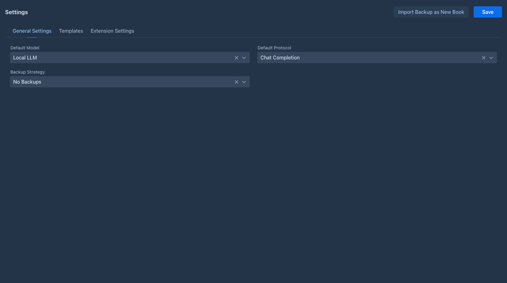

# Account & settings

Everything you create in Marginalia belongs to your account: books, lorebooks, tags, inference providers, protocols
and settings. Other users don't see them (except books you [publish](books/publishing.md)), and you don't see theirs.

## Your account

The buttons at the bottom of the workspace:

| Button | |
|---|---|
| **Change Password** | Changes your password, user name and full name, see below. |
| **Logout** | Logs you out on this device. |
| **Admin** | Only for administrators, see [Administration](administration/index.md). |

### Changing the password

**Change Password** opens a dialog with your **Username**, **Full Name**, **Current Password**, **Password** and
**Repeat password**:

- enter your **current password** for every change (leave it empty if your account has no password);
- to change the password, enter the new one in both password fields;
- leave both password fields empty to change only the name and keep the password;
- the user name must not be used by another account.

Click **OK** to save. With a wrong current password nothing is saved.

Changing the password ends all saved logins (*Save login*), on every device including this one: they have to log in
again with the new password. If a device was lost or your password leaked, changing the password logs that device
out. Sessions that are open right now (a browser tab still showing the workspace) stay logged in until they log out
or their session expires.

### Logging in

**Save login** on the login screen keeps you logged in on this device for 30 days (it needs HTTPS on a server, see
[Server (Docker)](getting-started/docker-server.md#https-and-reverse-proxy)). **Logout** ends it.

An account can have an empty password; you then log in with the user name only. If an administrator cleared your
forgotten password, log in this way and set a new password with **Change Password** right away. That is handy for the desktop app on
your own computer, but never do it on a server others can reach.

## Settings

The **Settings** tab holds your defaults for all your books.

At the top are three buttons:

- **Import Backup as New Book** - creates a book from a backup file, see
  [Book backups](books/backups.md#importing-a-backup-as-a-new-book);
- **Discard Changes** - throws away the unsaved changes and loads the saved settings again;
- **Save** - saves the settings.

!!!info Unsaved changes
Settings are not saved automatically. As soon as you change a field (extension settings included), *Unsaved changes*
appears at the top and the other tabs, **Admin** and **Logout** are locked. Click **Save** or **Discard Changes** to
unlock them.
!!!

### General Settings

| Field | |
|---|---|
| **Default Model** | The [inference provider](inference-providers.md) new books start with. |
| **Default Protocol** | The [protocol](protocols.md) new books start with. |
| **Backup Strategy** | Automatic [book backups](books/backups.md#automatic-backups) for books without their own strategy: *No Backups*, *After N Messages* or *After N Minutes*, with the number next to it. |

*Default Model* and *Default Protocol* are used only when a book is created; changing them doesn't change existing
books. The backup strategy applies to all books without a *Per manuscript override*, from their next generated part.

### Templates

The defaults for the [book prompts](books/prompts.md):

| Field | |
|---|---|
| **Master Template** | The frame of the prompt, see [Master template](books/prompts.md#master-template). |
| **Point of View (POV)**, **Tense** | The narrative voice and tense. |
| **Style** | Style and tone guidelines. |
| **Default User Prompt** | The request for each part, see [User prompt](books/prompts.md#user-prompt). |
| **Default Summary Prompt** | The request for a [summary](books/summaries.md#the-summary-prompt). |

Each field shows the built-in default in grey while it is empty, and has the hints popover with
**Insert Default Template** and the available [variables and macros](templates/index.md).

These defaults apply to **every book whose own field is empty**, immediately - not only to new books. A book that
sets its own value on its *Prompts* tab keeps it. So:

- set what all your books share here;
- set what is special to one book on its *Prompts* tab;
- clear a book's field to bring it back to the default from *Settings*.

!!!warning Default Summary Prompt
In the current version the *Default Summary Prompt* in Settings is not saved. Summaries use the built-in summary
prompt, or the book's own one.
!!!

### Extension Settings

Settings of the installed [extensions](extensions/index.md), one section per extension (for example *Reviewer Settings*
and *SideQuery Settings*). They are saved with the same **Save** button. The tab is empty when no extension with
settings is installed.
