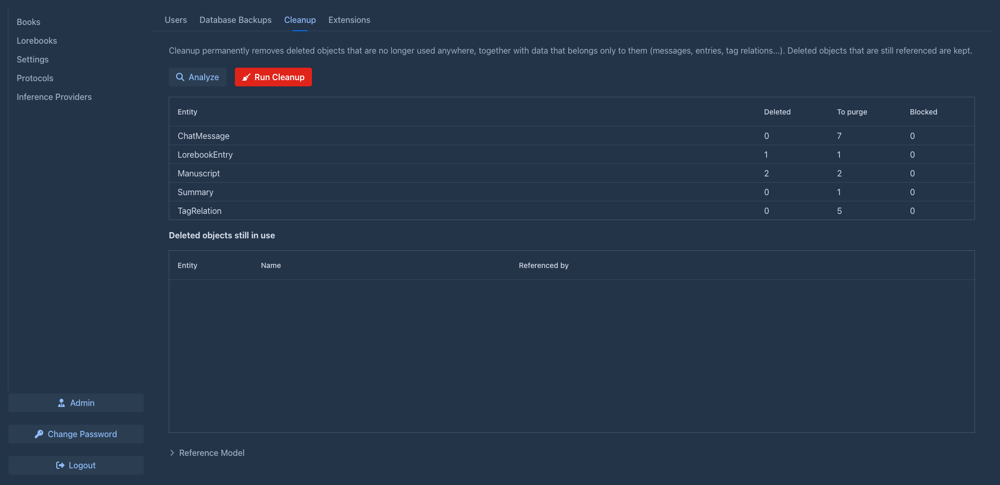

# Cleanup

When users delete something in Marginalia - a book, a story part, a lorebook, an inference provider - it disappears
from their lists, but stays in the database. That makes deleting safe and keeps references working (a book still
knows the provider that wrote its parts). **Cleanup** removes such deleted data for good, to keep the database small.

## Running a cleanup

!!!warning
Cleanup can't be undone. [Create a database backup](database-backups.md) first.
!!!

1. Open the **Cleanup** tab of the admin page and click **Analyze**. Nothing is changed yet.
2. Check the result (see below).
3. Click **Run Cleanup** and confirm *n objects will be permanently removed*.

Cleanup covers the data of all users.

## Reading the analysis

The first table has one row per kind of data:

| Column | |
|---|---|
| **Entity** | The kind of data: `Manuscript` (books), `ChatMessage` (story parts), `Lorebook`, `LorebookEntry`, `AI` (inference providers), `Protocol`, `Summary`, `Tag`, `TagRelation`, `User`... |
| **Deleted** | How many are deleted. |
| **To purge** | How many will be removed by *Run Cleanup*, including data that belongs to deleted objects. |
| **Blocked** | Deleted, but still in use, so they are kept. |

**Deleted objects still in use** lists the blocked objects with the name and **Referenced by** - what still uses them.

## What is removed

Cleanup removes deleted objects that nothing alive uses any more, together with the data that belongs only to them:

| Deleted | Removed with it |
|---|---|
| a book | all its story parts, summaries and tag links |
| a lorebook | its entries and tag links; other lorebooks no longer include it as a sub lorebook |
| a story part | the part (its children were already moved to its parent) and its summary |
| an inference provider or protocol | cleared from the users' defaults in *Settings* |
| a tag | its links to books and entries |
| a user | everything they owned: books (with their story parts and summaries), lorebooks, inference providers, protocols, tags and settings |

## What is kept

A deleted object is **blocked** - kept - while something alive still uses it:

| Blocked | Because | To unblock |
|---|---|---|
| a deleted inference provider or protocol | a book still uses it as its model or protocol | select another one in the book's *About* tab, or delete the book |
| a deleted lorebook (with its entries) | a book still uses it | select another lorebook in the book, or clear it |
| a deleted story part | it is the last part of a book's active branch | switch the book to another branch, or delete the book |
| a deleted user | something of another user still uses their data (a book using their inference provider or lorebook) | change or delete the other user's book |

Run *Analyze* again after unblocking.

## Reference model

**Reference Model** at the bottom lists every reference between the kinds of data and its policy - useful when you
want to understand why something is blocked:

| Policy | Meaning |
|---|---|
| **Blocks purge** | A deleted target is kept while a live object refers to it. |
| **Purged with target** | The referring object belongs to the target and is removed with it (entries with their lorebook). |
| **Owns target** | The target belongs to the referring object (a summary to its part). |
| **Cleared on purge** | The reference is removed when the target is purged (sub lorebooks, default model). |

Extensions can take part in cleanup with their own rules.
