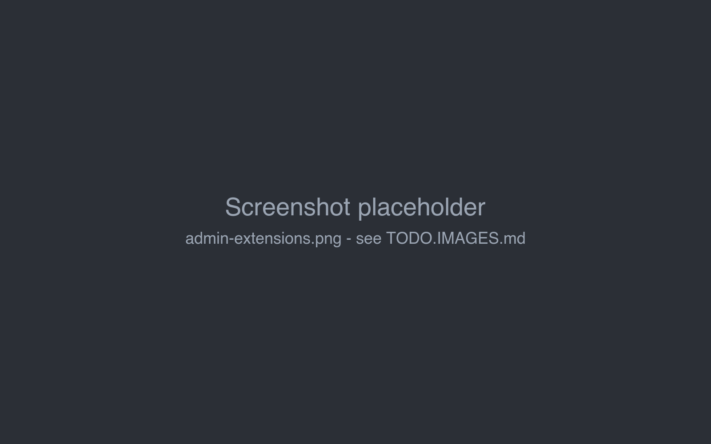

# Managing extensions

The **Extensions** tab of the admin page installs and removes [extensions](../extensions/index.md) for the whole
installation.

## Installing

Click **Load Extension (.jar)** (or drop the file on it) and choose the extension's JAR file. It is copied to the
`extensions` folder of the [data folder](index.md#the-data-folder) and started right away; *Extension loaded
successfully.* confirms it. The extension appears in the list:

| Column | |
|---|---|
| **ID** | The internal number of the extension in this run. |
| **Extension Name** | Its name. |
| **Version** | Its version. |
| **State** | `ACTIVE` when it is running. |
| **Actions** | **Unload** removes it. |

Users see the extension in windows they open from then on - a book that was already open has to be closed and opened
again, or the page reloaded.

JAR files can also be copied into the `extensions` folder directly, for example on a server without access to the
UI; they are loaded on the next start. This is also how the Docker setup can be prepared: put the JARs into
`./data/extensions`.

!!!warning Use extensions built for this version
Extensions change parts of the user interface of one Marginalia version. Use the extensions built from the same source
as the application (see the [plugins README](https://github.com/Enerccio/Marginalia/blob/master/marginalia/plugins/README.md)).
An incompatible extension may fail to load or break parts of the application.
!!!

## Removing

**Unload** stops the extension immediately and deletes its JAR from the `extensions` folder - there is no confirmation.
Its data stays (see [Where extension data is kept](../extensions/index.md#where-extension-data-is-kept)); loading it
again brings the data back.

## Updating

To install a newer version of an extension:

1. **Unload** the old version.
2. **Load Extension (.jar)** with the new file.

!!!warning
Uploading a new version without unloading the old one doesn't work as expected: with the same file name the old version
keeps running until Marginalia is restarted, with a different file name both versions run side by side.
!!!

## When an extension fails

If an extension can't be loaded, the upload shows *Failed to load extension: ...* and the extension is **not** listed -
so it can't be unloaded here. Stop Marginalia, delete its JAR from the `extensions` folder and start Marginalia again.
The log (`docker compose logs`, or `desktop/logs/marginalia.log` for the desktop app) has the details of the error.
