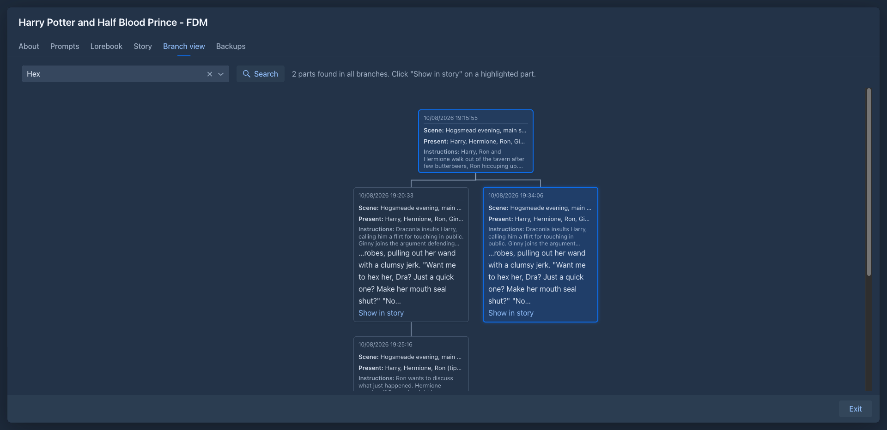

# Branches & story tree

Marginalia never makes you throw a version away. Every alternative you try is kept as a **branch** of the story, and
you can go back to any of them.

## How the story tree works

Each part continues the part before it. When a part has more than one continuation, the story splits: each path from
the first part to an end is a branch.

```
#1 ─ #2 ─ #3 ─ #4 ─ #5          ← branch A
           └─ #4' ─ #5' ─ #6'   ← branch B (active)
```

The **active branch** is the one the [story editor](story-editor.md) shows and continues. Only its parts are sent to
the model; the other branches don't influence the story.

There are three ways to get a new branch:

| | What happens | The old version |
|---|---|---|
| **Swipe** (last part) | The model writes another version of the last part. | Stays as a separate branch. |
| **Branch Story** (any part) | The story continues from this part on a new branch. | The parts after it stay on the old branch. |
| **Regenerate** (last part) | The model writes the last part again, in place. | Replaced - no branch is created. |

*Swipe* and *Regenerate* are in the menu of the last part only; *Branch Story* is in the menu of every part.

## Trying another version of the last part

When you don't like the last part, choose **Swipe** in its menu. The model writes the part again from the same
[turn details](story-editor.md#turn-details), and the new version becomes the end of the active branch. The previous
version is kept as its own branch; you can switch back to it in the [Branch view](#the-branch-view).

To change what should happen before trying again, open **Turn Details** of the last part and edit the instructions.

Use **Regenerate** alone when you don't need the old version: it overwrites the part.

## Branching from an earlier part

To take the story in a different direction from an earlier point, open the menu of that part and choose
**Branch Story**. Marginalia copies the part to a new branch and makes it the end of the active branch, so the
story editor now ends with that part. Continue with **+** as usual.

The parts that came after it are not lost: they stay on the old branch.

[Summaries](summaries.md) of the copied part are copied with it.

## The Branch view

The **Branch view** tab shows the whole story tree. Each part is a card with its date, scene setting, characters
present and instructions; hover over a card to see all its details.


- The parts of the **active branch** are highlighted, and its last part is marked.
- **Click the last part of another branch** to make that branch active. The book switches to the *Story* tab and
  shows it. Only the ends of branches can be clicked; to continue from a part in the middle, use
  [Branch Story](#branching-from-an-earlier-part).
- Long stretches without any branching (more than 20 parts) are collapsed into a block showing the first ten and the
  last ten parts. Click the block to show all parts.

### Searching all branches

The box above the tree searches the text of **all branches** of the book, not only the active one. Type what you are
looking for and press **Enter** or click **Search**; the box remembers your last searches, pick one from the list to
repeat it. The **x** in the box clears the search.

- A part matches when its text contains **every word** you typed, in any order: `lighthouse key` finds the parts that
  have both words. Put words in double quotes to look for a phrase: `"lighthouse key"`.
- Use `*` for any characters: `light*` finds *lighthouse* and *lightning*. Other characters, including `%`, `_` and
  `\`, are searched as they are.
- Upper and lower case do not matter. For accented letters, a word typed in lower case also finds the same word in
  UPPER CASE or Capitalized (`žluťoučký` finds *Žluťoučký* and *ŽLUŤOUČKÝ*).
- Only the text of the parts is searched, not the instructions, scene setting or the lorebook. Parts that you deleted
  are not searched.



Every part that matches is **highlighted** in orange and shows the text around the match; the line above the tree says
how many parts were found. Long stretches that would be collapsed are opened when they contain a match. The search
stays until you clear it or close the book window, and the highlighting is updated when you come back to the tab.

Click **Show in story** in a highlighted part to read it:

- When the part is on the active branch, the book switches to the *Story* tab and scrolls to it.
- When it is on another branch, that branch becomes the active branch first. It ends at the nearest end of a branch
  below the found part (the newer one when there are two), so the story editor shows the story up to the found part and
  what followed it. The book then switches to the *Story* tab and scrolls to the part, which flashes briefly.

Switching the branch is the same as clicking the end of a branch in the tree: nothing is lost, the previous branch stays
as it was and you can go back to it from the tree.

## Deleting parts and branches

**Delete** in the menu of a part removes just that part. The parts after it move up and continue from the part before
it. To remove a whole branch, delete its parts from the end.

The word and token counts on the *About* tab show both the whole book (all branches) and the active branch.
