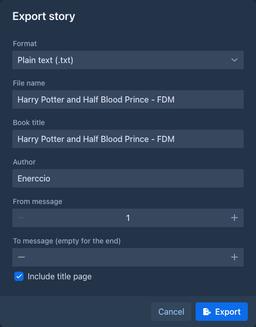

# Exporting a book

Export turns the story into a file you can read, print, send or publish elsewhere. Unlike a
[backup](backups.md) it contains only the text, as a finished book.

Only the [active branch](branches-and-story-tree.md) is exported - the same parts the story editor shows. To export
another version of the story, switch to that branch first.

## Exporting

1. Open the book and go to the **Story** tab.
2. Open the settings menu (⚙) in the bottom bar and choose **Export story**.
3. Fill in the dialog and choose **Export**.
4. Marginalia collects the parts of the branch and writes the file, which takes a moment for a long book. A progress
   bar shows how far it is.
5. When the file is ready, a dialog offers it for download. Choose the **Download** button to save it.

| Field | |
|---|---|
| **Format** | The file type, see below. |
| **File name** | Name of the downloaded file without the extension, which Marginalia adds. Starts as the name of the book. |
| **Book title** | The title in the file (title page and file properties). Starts as the name of the book; changing it doesn't rename the book. |
| **Author** | Starts as your full name from your [account](../account.md). Empty means no author. |
| **From message**, **To message** | Which parts to export. Parts are counted from 1 in the order of the story, parts without text are not counted. Leave **To message** empty to export to the end. |
| **Include title page** | Starts the file with a first page holding the title and the author. |

## Formats

| Format | |
|---|---|
| **Plain text** (`.txt`) | Just the text in UTF-8. Formatting such as *italics* is dropped, paragraphs are separated by an empty line. |
| **HTML** (`.html`) | One page with a book-like style included, so it looks the same in every browser. It can be printed and has no external files. |
| **Word document** (`.docx`) | Opens in Word, LibreOffice and similar programs. Justified text, with the title and author set in the file properties. |
| **PDF** (`.pdf`) | A5 pages with embedded fonts that cover Latin, Greek and Cyrillic text. |
| **EPUB** (`.epub`) | An e-book for e-readers and reading apps. Long books are split into several files inside the EPUB so readers stay fast. |

The text of the parts is Markdown. Emphasis, headings, quotes, lists, code blocks and scene breaks (`---`) are kept in
every format that can show them. Raw HTML in the text is shown as text, never run.

## The title page

With **Include title page**, the file starts with the book title and the author on a page of their own. The page is
made from a built-in template (`DEFAULT_EXPORT_HEADER_TEMPLATE`), which isn't editable in the application yet.

## Good to know

- The export is a snapshot of the branch when you choose **Export**. Parts generated or edited afterwards are not in
  the file.
- The exported file is kept only until you close the download dialog. Export again if you need it later.
- Summaries, lorebooks, instructions and the model's reasoning are not exported, only the text of the parts. To save
  all of it, make a [backup](backups.md).
