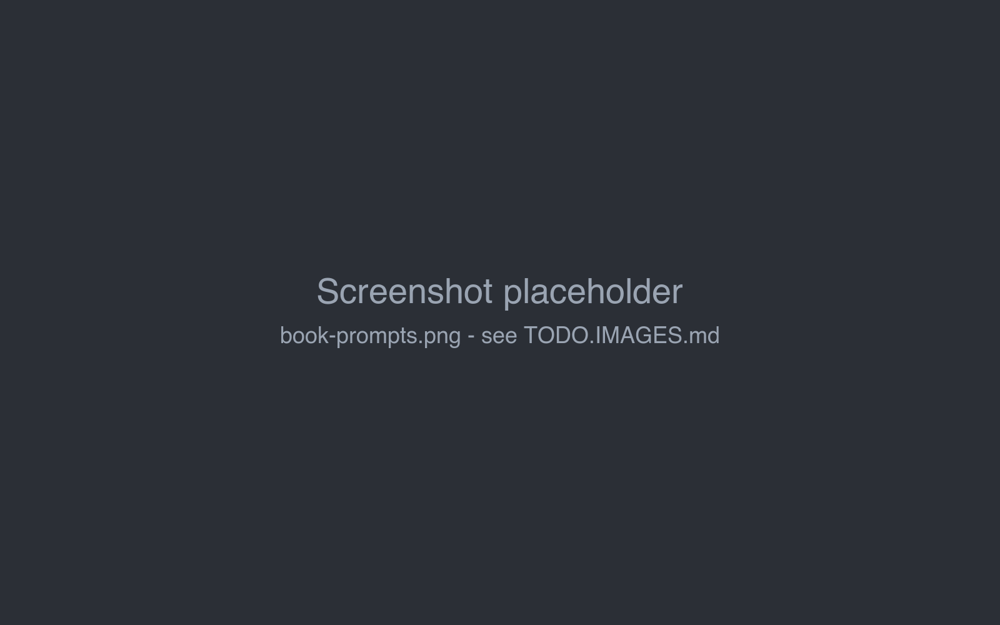
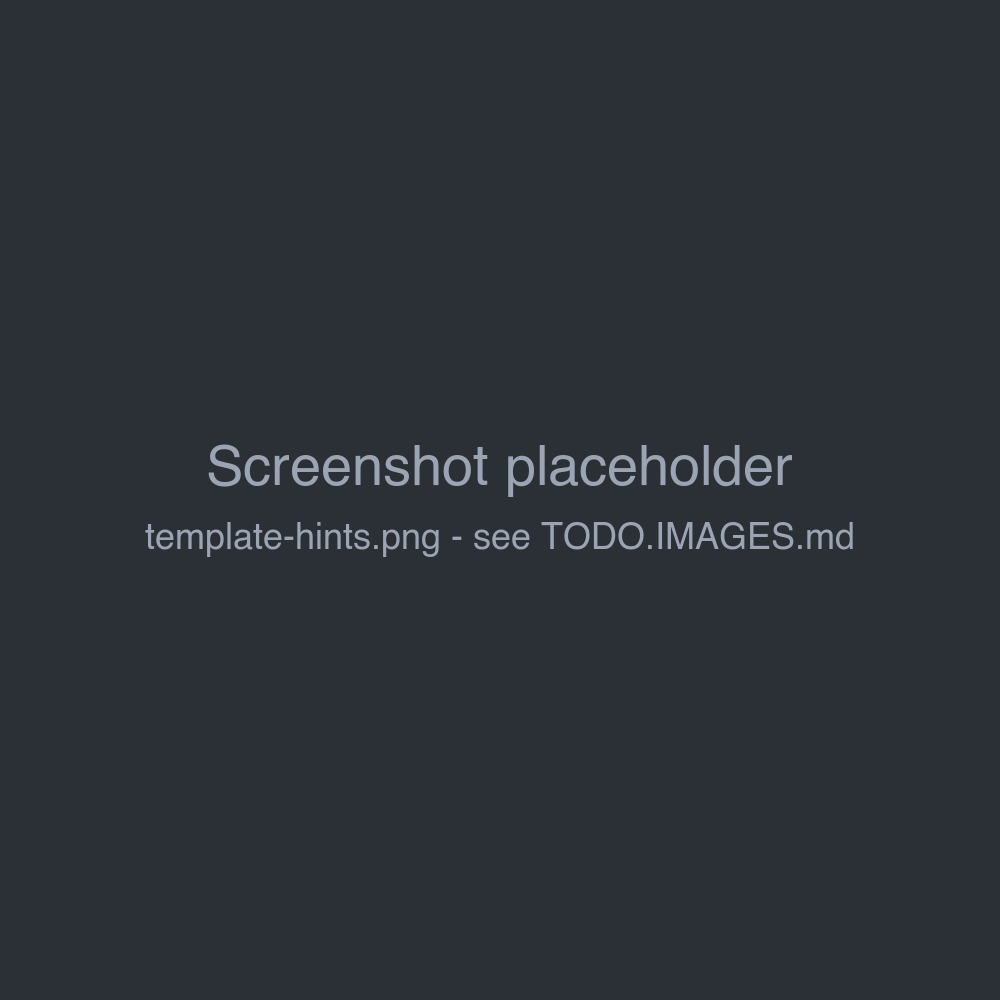

# Book prompts

The **Prompts** tab of a book holds the texts Marginalia builds the prompt from: two templates, the narrative settings
and the summary prompt. They decide the voice of the book far more than the model settings do.



## Defaults and book values

Every field is optional. An empty field uses the default from **Settings → Templates** (see
[Account & settings](../account.md)), and when that is empty too, the built-in default. The default is shown in grey in
the empty field.

So set what all your books share in *Settings*, and only what is special to a book on its *Prompts* tab. Changes are
saved as you type.

Each field has a hints popover with **Insert Default Template**, which copies the default into the field as a starting
point for your own version. The template fields also list the **Available Template Variables** and the
**Available Macros**.



## The fields

| Field | Used in | |
|---|---|---|
| **Master Template** | system message | The frame of the prompt: the model's role, and where the lore, narrative settings and summaries go. A template. |
| **Point of View (POV)** | master template | The narrative voice, e.g. *First person*, *Third-Person Limited*. Plain text. |
| **Tense** | master template | e.g. *Past Tense*, *Present Tense*. Plain text. |
| **Style** | master template | Style and tone guidelines for the prose. Plain text. |
| **Default User Prompt** | last message | The request for the next part, built from the [turn instructions](story-editor.md#writing-the-next-part). A template. |
| **Default Summary Prompt** | summaries | The request for a [summary](summaries.md). A template. |

*Point of View*, *Tense* and *Style* are inserted into the master template as they are; macros don't work in them.

A template with a syntax error is not saved; a warning shows the error.

## Templates

Templates are text with placeholders in double curly braces. Each template gets its own variables:

| Template | Variables |
|---|---|
| Master Template | `{{backgroundLore}}` (activated lorebook entries), `{{narrativePov}}`, `{{narrativeTense}}`, `{{style}}`, `{{summaries}}` |
| User Prompt | `{{sceneSetting}}`, `{{povCharacter}}`, `{{presentCharacters}}`, `{{instructions}}` |
| Summary Prompt | `{{backgroundLore}}`, `{{text}}` (the parts to summarize) |

A section prints its content only when the variable is not empty, so the prompt has no empty headings:

```handlebars
{{#sceneSetting}}Current Location & Time: {{.}}{{/sceneSetting}}
```

`{{.}}` inside a section is the variable's value. With an empty *Scene Setting* the whole line is left out.

All templates can also use the SillyTavern-compatible **macros**, such as `{{user}}` (the point of view
character), `{{description}}` (the book's description), `{{random::a::b}}`, `{{getvar::name}}` and
`{{setvar::name::value}}`. See [Templates & macros](../templates/index.md) for the full syntax and the macro
reference.

## Master template

The master template becomes the **system message**, the first message of the prompt. The built-in default has these
blocks:

1. **System role** - the model is an author continuing the story.
2. **World & lore context** - the activated [lorebook](../lorebooks/index.md) entries (`backgroundLore`).
3. **Writing style & mechanics** - point of view, tense, style, and general prose rules.
4. **Summary of story so far** - the [summaries](summaries.md).

If the [inference provider](../inference-providers.md#general-settings) has a jailbreak prompt enabled, it is put
before the master template.

## User prompt

The user prompt is the **last message** of the prompt: the request for the part to write. It is filled from the
*New Turn Instructions* (or the *Turn Details* for *Regenerate* and *Swipe*). The built-in default asks for the next
section with the point of view character, location, characters present and the plot instructions, followed by rules:
no new characters unless requested, follow the instructions, keep the continuity, and output only the story text.

Lorebook entries with the insertion mode *Before User Prompt* are put right before it; see
[Entries & activation](../lorebooks/entries.md).

## How the prompt is put together

```
system     jailbreak (if enabled) + master template
user       [ Generate story. ]
assistant  part #1
user       [ Generate more story. ]
assistant  part #2
...        (as many earlier parts as fit)
user       lore "Before User Prompt" + user prompt
```

Earlier parts are sent as the model's own answers, so it continues them in the same voice. When the story is longer
than the [context limit](../protocols.md#limits), the oldest parts are left out first; [summaries](summaries.md)
keep them in the story in condensed form.

**Show Prompt** in the menu of any part shows the exact prompt that part was written from.

## Tips

- Put rules that apply to every part (no new characters, length, formatting) into the user prompt: being the last
  message, it has the strongest effect.
- Put lasting facts about the world and characters into the [lorebook](../lorebooks/index.md), not into *Style*.
- Ask for a length in the instructions ("about 800 words") rather than relying on the response limit, which cuts the
  text off.
- After changing a template, generate a part and check it with **Show Prompt**.
