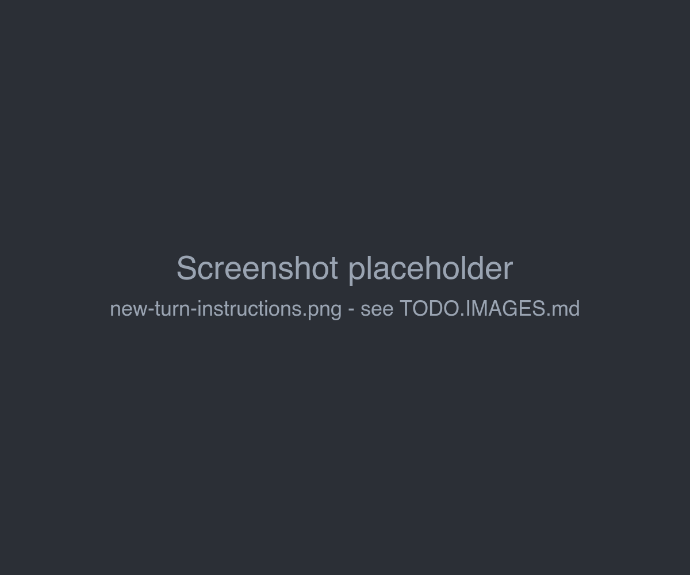
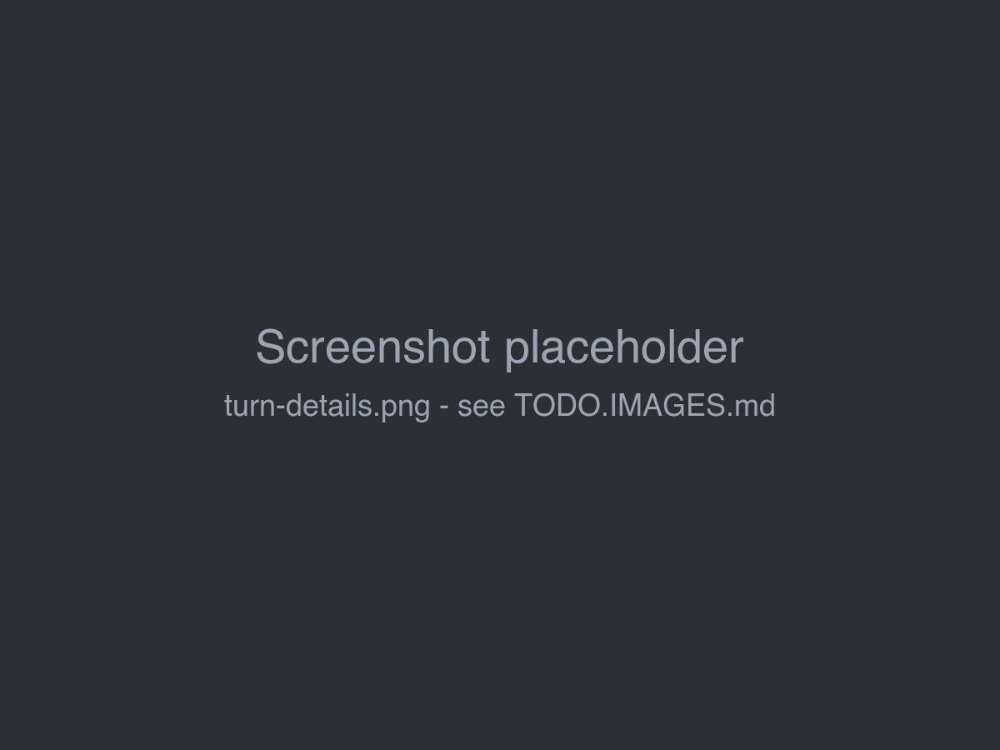

# Story editor

The **Story** tab of a book is where you write. It shows the parts of the [active branch](branches-and-story-tree.md)
from the beginning to the end.

| Area | |
|---|---|
| **Outline** (left) | One entry per part, `#1`, `#2`... with the part's database ID. Click an entry to scroll to the part. The header shows how many parts the branch has. The [Chapter Marker](../extensions/chapter-marker.md) extension shows chapter titles here. |
| **Parts** (center) | The text of each part, with its menu (☰) and its metadata on the right. |
| **Bottom bar** | The settings menu (⚙) on the left and the **+** button on the right. |

The divider between the outline and the parts can be dragged. Marginalia remembers the scroll position of each branch
and returns to it when you open the book again.

## Writing the next part

1. Click **+** in the bottom right corner. The *New Turn Instructions* panel opens.
2. Fill in the fields. All of them are optional, but the model needs at least some direction:

   | Field | |
   |---|---|
   | **Scene Setting** | Where and when the part takes place, e.g. *The lighthouse, a stormy night in late autumn*. |
   | **POV Character** | Whose point of view the part is written from. |
   | **Present Characters** | Who is in the scene, and in what state. |
   | **Instructions** | What should happen in this part. |

   *Scene Setting*, *POV Character* and *Present Characters* are filled in from the last part, so you only change
   what is different. *Instructions* starts empty each time.
3. Click **Generate**.

The new part appears at the end and fills in as the model writes it. For [reasoning models](../inference-providers.md#reasoning-models)
the reasoning appears first under **View Reasoning**.

While a part is being generated, the **+** button turns into a red **Stop** button. Stopping keeps the text written so
far as the part. The rest of the book window is disabled until the generation finishes or is stopped.

When the model returns an error (server not reachable, wrong API key, context too long...), the error is shown.
The part stays as far as it was written - often empty. Delete it, fix the problem and generate again.

!!!warning Regenerate and errors
*Regenerate* clears the last part before sending the request. If the request fails, the part stays empty and its
previous text is lost. When you are not sure the model is reachable, keep the old version: use
[Branch Story and Regenerate](branches-and-story-tree.md#trying-another-version-of-the-last-part) instead.
!!!

How the fields get into the prompt is set by the book's [User Prompt](prompts.md#user-prompt). With the default user
prompt, the model gets them as *Current Location & Time*, *Point of View Character*,
*Characters Currently Present / State* and *Plot Specifications for the Next Part*.

!!!
The text is written in Markdown: `*italics*`, `**bold**`, `# Heading` and so on are shown formatted. A part with a
`#` heading is a chapter for the [Chapter Marker](../extensions/chapter-marker.md) extension.
!!!

## The part menu

Every part has a menu (☰) in its top right corner:

| Item | |
|---|---|
| **Edit** | Turns the text into an editable field. **Save** (the same menu item) saves it. Starting a generation or leaving the tab saves open edits too. |
| **Regenerate** | Writes the last part again, replacing its text. Only on the last part. |
| **Swipe** | Meant to write another version of the last part and keep the old one as a separate branch. Only on the last part. **Currently it adds a new part after the last one instead**, see [Branches & story tree](branches-and-story-tree.md#trying-another-version-of-the-last-part). |
| **Branch Story** | Starts a new branch from this part, see [Branches & story tree](branches-and-story-tree.md#branching-from-an-earlier-part). |
| **Show Prompt** | Shows the exact prompt that was sent to the model for this part. |
| **Generate summary** / **View summary** | Summarizes the story up to this part, or shows the summary, see [Summaries](summaries.md). |
| **Delete summary** | Removes the summary of this part. |
| **Delete** | Deletes the part, see [below](#deleting-a-part). |

*Regenerate* and *Swipe* use the turn details of the last part (see [below](#turn-details)). To change what should
happen, edit them first.

## Part metadata

Next to each part:

| | |
|---|---|
| **Order #n \| DB ID: m** | The position of the part in the branch, and its ID in the database. |
| **Model** | The inference provider that wrote the part. |
| **Tokens: x (y)** | `x` tokens of text in the part, `y` tokens in the prompt that produced it. |
| **Words** | Words in the part. |
| **Turn Details** | The instructions the part was written from. |

### Turn details

**Turn Details** opens the *Scene Setting*, *POV Character*, *Present Characters* and *Instructions* the part was
written from. For the last part they can be changed (changes are saved right away) and are used by *Regenerate* and
*Swipe*. For earlier parts they are read-only.

## Editing the text

Generated text is yours to change. Choose **Edit** in the part menu, change the text, and choose **Save**. Edited
parts are sent to the model as you edited them.

Editing a part that a [summary](summaries.md) covers makes that summary outdated; Marginalia notices it at the next
generation and drops the summary.

## Deleting a part

**Delete** removes the part from the story. The parts that followed it stay and continue from the part before it, so
deleting a part in the middle of the story just takes it out. Deleting the last part makes the part before it the new
end of the branch.

## Book styles

The settings menu (⚙) in the bottom bar has **Change Styles For Text**. It switches the text of the parts between the
normal look of the application and a book-like reading style (the one the [viewer](publishing.md) uses). The setting
is saved per book.

## What the model gets

For each new part Marginalia sends:

1. The **master template** as the system message: role, [lorebook](../lorebooks/index.md) entries, point of view,
   tense, style and [summaries](summaries.md). The jailbreak prompt of the
   [inference provider](../inference-providers.md#general-settings), if enabled, comes first.
2. The previous parts of the active branch as the model's own earlier answers - as many as fit into the
   [context limit](../protocols.md#limits), newest first. Older parts that don't fit are left out (unless a
   [summary](summaries.md) covers them).
3. The **user prompt** with the instructions for the new part.

*Show Prompt* on any part shows exactly what was sent. See [Book prompts](prompts.md) for the templates.
