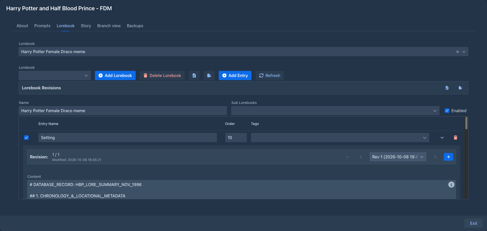

# Lorebook VCS

Revision history for [lorebook entries](../lorebooks/entries.md): keep earlier versions of your lore and switch
between them - for example the state of the world before and after a war, or a character at different points of the
story.

A revision is a snapshot of the whole entry: name, content, note, enabled, order, filter and filtering mode, insertion
mode, tags and negative tags.



## Entry revisions

With the extension installed, the details (⌄) of every lorebook entry start with a revision bar:

```
Revision: 2 / 3            [−]  [‹]  [Rev 2 (2026-10-08 14:30:12) ▾]  [›]  [+]
Modified: 2026-10-08 14:30:12
```

Revisions work like slots. The entry always shows one of them - the **current revision** - and what you change in the
entry belongs to that revision. Generation always uses the entry as it is, so the current revision is the one the
model sees.

| Control | |
|---|---|
| **+** | Saves the entry as it is now as a new revision and makes it current. |
| **‹** / **›**, or the list | Switch to the previous / next / chosen revision. Your edits stay in the revision you leave; the other one is loaded into the entry. |
| **−** | Deletes the current revision and switches to the previous one. The last remaining revision can't be deleted. |
| *n / total*, *Modified* | Which revision is current, and when it was last changed. |

The first time an entry's details are opened, its current state becomes revision 1.

A typical use:

1. Open the entry of a character and click **+** - revision 2 is a copy of revision 1.
2. Change revision 2 to the character after the events of chapter 10.
3. Write. When you go back to edit chapter 5, switch to revision 1 with **‹**; switch back with **›** later.

!!!warning Work on one entry at a time
Close the details of other entries before creating or switching revisions. With the details of several entries open,
one entry's changes to the history can overwrite another's.
!!!

## Lorebook revisions

The lorebook editor gets a **Lorebook Revisions** row with two buttons:

| Button | |
|---|---|
| export | Downloads the history of all entries of the lorebook as `<lorebook>_vcs_history.json`. |
| import | **Import Marginalia VCS JSON** - a history exported by this extension; **Import SillyTavern VCS Extension JSON** - history from SillyTavern's lorebook version history extension. |

An import **replaces** the history of the lorebook. A Marginalia history made for a different lorebook asks for
confirmation first. SillyTavern history is matched to the entries by their position in the lorebook, so import it into
a lorebook [imported from the same world info](../lorebooks/import-export.md#importing-sillytavern-world-info), before
you add or delete entries.

!!!warning
- The *Lorebook Revisions* row belongs to the lorebook that was selected when the editor opened. After switching to
  another lorebook, reload the page before exporting or importing.
- Revisions imported from SillyTavern turn the entry's trigger keys into **tags**. Check the tags and filter of an entry
  after switching to such a revision.
!!!

## Storage

The history is stored in the database with the lorebook, so [database backups](../administration/database-backups.md)
include it. It is **not** part of [lorebook exports](../lorebooks/import-export.md#exporting) or of the lorebooks in
[book backups](../books/backups.md).

The history refers to the entries themselves, not to their names. Importing a lorebook creates new entries, so a
history export can be imported back into the **same** lorebook (for example after a mistake), but it doesn't attach to
an imported copy of the lorebook.
