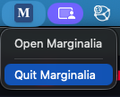

# Desktop app

The desktop app is a self-contained version of Marginalia for one computer. It brings its own Java runtime and
server, listens only on your computer and opens in your default browser.

## Download

Download the archive for your system from the
[releases page](https://github.com/Enerccio/Marginalia/releases). Two variants are published for every system:

| Archive | Contents |
|---|---|
| `marginalia-<version>-<os>-<arch>-app` | The app: `Marginalia.app` on macOS, `Marginalia.exe` on Windows, `bin/Marginalia` on Linux |
| `marginalia-<version>-<os>-<arch>` | A portable folder started with a script, with command line [options](#options) |

Builds are available for Windows x64, macOS (Apple Silicon and Intel) and Linux (x64 and arm64).

## Install and start

+++ macOS
1. Extract the archive and move `Marginalia.app` to *Applications*.
2. Open it. The app is not signed yet, so the first time macOS refuses to open it. Right-click the app and choose
   *Open*, or run:

   ```sh
   xattr -dr com.apple.quarantine /Applications/Marginalia.app
   ```
+++ Windows
1. Extract the archive.
2. Run `Marginalia\Marginalia.exe`.
3. SmartScreen may warn about an unknown publisher. Click *More info* → *Run anyway*.
+++ Linux
1. Extract the archive.
2. Run `Marginalia/bin/Marginalia`.
+++ Portable folder
1. Extract the archive.
2. Run `bin/marginalia` (`bin\marginalia.bat` on Windows).
+++

Starting takes a few seconds. Marginalia then opens in your browser at `http://127.0.0.1:8765` and shows the
[first start](first-start.md) dialog.

## Tray icon

While it runs, Marginalia shows an **M** icon in the system tray (in the menu bar on macOS). Its menu has two
items:

- **Open Marginalia** - opens Marginalia in the browser again, for example after you closed the tab.
- **Quit Marginalia** - stops the server. Closing the browser tab does not stop Marginalia.

Starting the app a second time while it already runs only opens it in the browser.



## Where your data is

| What | Where |
|---|---|
| Database, backups, extensions | `~/.marginalia` (`%USERPROFILE%\.marginalia` on Windows) |
| Logs | `~/.marginalia/desktop/logs/marginalia.log` (the previous run is kept as `marginalia.log.1`) |

To move Marginalia to another computer, quit it and copy the `.marginalia` folder (with `secret.key`, which
decrypts the saved API keys). Before larger changes, make a
[database backup](../administration/database-backups.md).

## Options

The portable launcher accepts these options:

```
marginalia --port 8765        # port to listen on; a free one is picked when 8765 is taken
marginalia --host 127.0.0.1   # address to listen on
marginalia --home /path       # directory that holds the .marginalia folder (default: your home directory)
marginalia --no-browser       # don't open the browser
marginalia --no-tray          # no tray icon; stop with Ctrl+C
marginalia --help
```

!!!warning Other addresses
With `--host 0.0.0.0` (or another address) Marginalia is reachable from your network over plain HTTP. For access from
other devices use the [server](docker-server.md) behind HTTPS instead.
!!!

## Updating

Quit Marginalia, replace the app (or the portable folder) with the new version and start it again. Your data stays in
`.marginalia` and is upgraded automatically on the first start; before the structure of the database changes,
Marginalia saves a [copy of it](../administration/database-backups.md#copy-before-an-upgrade) in `db-backups`. Extensions are built for one Marginalia version, so
update them at the same time (see [Managing extensions](../administration/extensions.md)).

## Uninstalling

Delete the app or the folder. To remove your data as well, delete the `.marginalia` folder.
