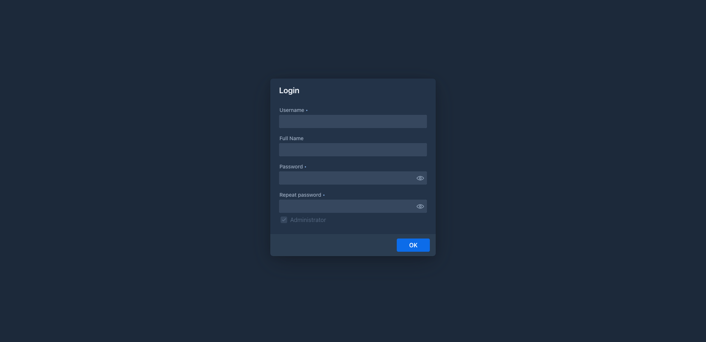
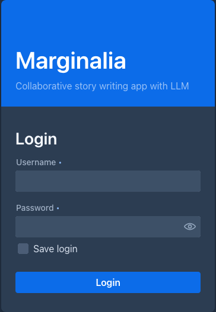

# First start

## Create the administrator

When Marginalia starts with an empty database, it asks for the first account instead of showing the login screen.
This account is the **administrator**: it can manage users, database backups, cleanup and extensions.

Fill in:

| Field | |
|---|---|
| **Username** | The login name. |
| **Full Name** | The name shown in the application. |
| **Password**, **Repeat password** | Both must match. Marginalia also accepts an empty password - never leave it empty on a server, anyone could then log in as administrator with just the user name. |

*Administrator* is checked and cannot be changed for the first account. Click **OK**. The page reloads and shows the
login screen.

!!!
Remember the password. There is no password reset by e-mail. Other administrators can set a new password for a
user in *Admin → Users*.
!!!

## Log in

Log in with the new account. With **Save login** checked, the browser stays logged in for 30 days. This works only
over HTTPS or on `127.0.0.1` with the desktop app (see [Server](docker-server.md#https-and-reverse-proxy)).

## The workspace

After logging in you see the workspace. The tabs on the left are:

| Tab | |
|---|---|
| **Books** | Your books. Opening one shows its story editor. See [Books](../books/index.md). |
| **Lorebooks** | World and character notes for the prompt. See [Lorebooks](../lorebooks/index.md). |
| **Settings** | Your personal settings: default model and protocol for new books, prompt templates, backups. See [Account & settings](../account.md). |
| **Protocols** | Generation settings. See [Protocols](../protocols.md). |
| **Inference Providers** | The models Marginalia connects to. See [Inference providers](../inference-providers.md). |
| **Resources** | The files you uploaded. See [Resources](../resources.md). |
| **Trash** | What you deleted, until an administrator cleans up. See [Trash](../trash.md). |

At the bottom are **Admin** (administrators only), **Change Password** and **Logout**
(see [Administration](../administration/index.md) for the *Admin* pages).

Continue with the [quick start](quick-start.md).
