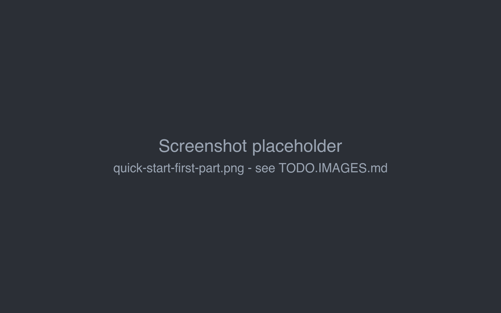

# Quick start

From a fresh installation to the first generated part of a story. It assumes Marginalia is
[installed](index.md) and you are logged in as the [administrator](first-start.md).

## 1. Connect a model

1. Open the **Inference Providers** tab and click **Add Inference Provider**.
2. Enter a **Name**, for example `OpenRouter - Claude`.
3. In **General Settings**, set **Max Context Size** to the context size of the model, for example `32000`, and
   **Max Response Tokens** to the longest part you want, for example `2000`.
4. In **Per Type Settings**, enter the **OpenAI URL** (it ends with `/v1`) and the **Api Key**, click **Refresh** and
   pick the **Model**.
5. Click **OK**.

The fields are described in [Inference providers](../inference-providers.md), with URLs for common services.

## 2. Create a protocol

1. Open the **Protocols** tab and click **Add Protocol**.
2. Enter a **Name**, for example `Default`.
3. Leave **Max Context Tokens** and **Max Reply Tokens** empty - the limits of the inference provider are used.
4. Click **OK**.

See [Protocols](../protocols.md).

## 3. Set the defaults

Open the **Settings** tab and pick the new provider as **Default Model** and the new protocol as
**Default Protocol**. Click **Save**. New books then start with both, so you don't have to select them every time.

## 4. Create a book

1. Open the **Books** tab and click **Add Book**.
2. Enter the name of the book. The book opens.
3. On the **About** tab, check that **Model** and **Protocols** are set (they come from your defaults), and add a
   **Description** of the story if you want to.

## 5. Write the first part

1. Open the **Story** tab.
2. Click **+** in the bottom right corner. The *New Turn Instructions* panel opens.
3. Describe what should happen in **Instructions**, for example:
   > A lighthouse keeper on a remote island finds a message in a bottle addressed to her, dated fifty years in the
   > future. Introduce her and the island. About 800 words.

   *Scene Setting*, *POV Character* and *Present Characters* are optional; fill them in to give the model more
   direction.
4. Click **Generate**. The text appears while the model writes it. The red **Stop** button (in place of **+**)
   interrupts the generation.

Click **+** again for the next part. Each part can be edited, regenerated or swiped for an alternative version from
its menu (☰); see [Story editor](../books/story-editor.md) and
[Branches & story tree](../books/branches-and-story-tree.md).

## Next steps

- Describe your world and characters in a [lorebook](../lorebooks/index.md).
- Adjust the style, point of view and tense in the book's [prompts](../books/prompts.md).
- [Summarize](../books/summaries.md) older parts as the book grows.
- Set up [book backups](../books/backups.md).
