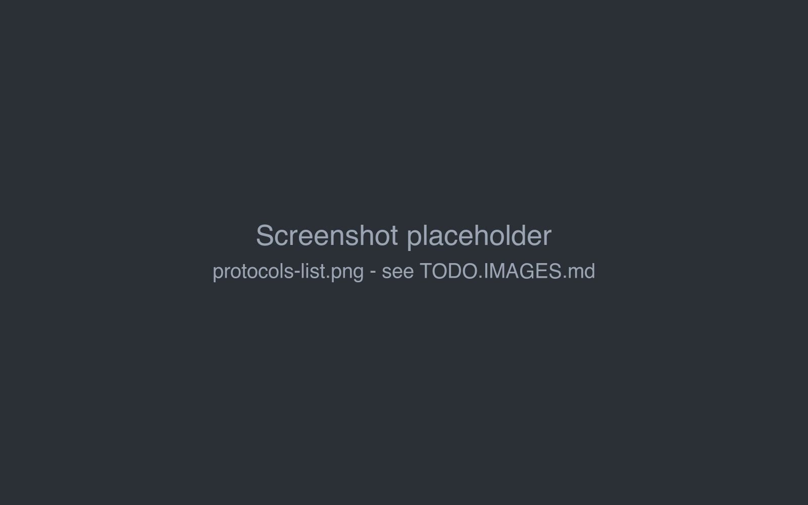
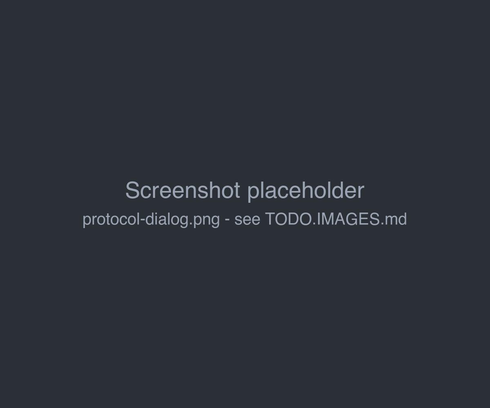

# Protocols

A protocol is a set of generation settings: the sampling parameters (temperature, top P and penalties) and,
optionally, its own context and reply limits. The [inference provider](inference-providers.md) says *which* model writes; the protocol says *how*.

Protocols are separate from providers, so you can keep a few of them, such as a cautious one and a creative one, and
switch a book between them without touching the connection. Like providers, protocols belong to your account.

## Creating a protocol

Open the **Protocols** tab and click **Add Protocol**. Existing protocols are edited with the pen button and deleted
with the trash button.

| Field | |
|---|---|
| **Name** | Your name for the protocol, e.g. `Creative` or `Long context`. |
| **Type** | The request format. Currently only **Chat Completion**. |
| **Max Context Tokens** | Optional. Total tokens for prompt and response of books using this protocol. Empty uses the provider's **Max Context Size**. |
| **Max Reply Tokens** | Optional. The longest response. Empty uses the provider's **Max Response Tokens**. |
| **Temperature** | Randomness of the text. Lower (around `0.7`) is more focused and predictable, higher (`1.0` and more) is more varied and surprising. |
| **Top P** | Nucleus sampling: the model picks only from the most likely words whose probabilities add up to this value (`0`-`1`). `0.9`-`0.95` is a common choice. |
| **Frequency Penalty** | Penalizes words by how often they already appeared, which reduces repetition. Usually `0`-`1`. |
| **Presence Penalty** | Penalizes words that already appeared at all, which pushes the model to new topics. Usually `0`-`1`. |

Every sampling parameter has an **Enable** checkbox. A parameter that is not enabled is not set by Marginalia, and the
model uses its own default. Enable only what you want to change.

## Limits

The limits of the [inference provider](inference-providers.md#general-settings) always apply. A protocol can override
them, each one separately:

| | Protocol value set | Protocol value empty |
|---|---|---|
| Context | **Max Context Tokens** | provider's **Max Context Size** |
| Response | **Max Reply Tokens** | provider's **Max Response Tokens** |

Marginalia keeps room for the response free and fills the rest of the context with the prompt: templates, lorebook
entries, summaries and as much of the story as fits. With a context of 32 000 tokens and responses of up to 2 000
tokens, the prompt gets 30 000 tokens. The response limit is also sent to the API (`max_completion_tokens`).

Use the protocol limits to keep prompts shorter than the model allows, for example to make long books cheaper and
faster with a large-context cloud model, or to allow longer responses for some books. The protocol limits are also
used for [summaries](books/summaries.md) of books with this protocol.

Leave both empty unless you need them: the provider's values then apply, and when you change the provider of a
book, its limits come along.

## Using a protocol in a book

Each book has its protocol in the **Protocols** field of its **About** tab. To use a protocol for all new books,
select it as **Default Protocol** in the **Settings** tab. A book without a protocol can't generate and shows
*Book is missing protocol.*

## Suggested settings

Starting points, tune them for your model:

| Use | Temperature | Top P | Frequency Penalty | Presence Penalty |
|---|---|---|---|---|
| Balanced prose | `0.8` | `0.95` | off | off |
| Creative, varied | `1.0` | `0.95` | `0.3` | `0.3` |
| Consistent, close to instructions | `0.6` | `0.9` | off | off |

Reasoning models often ignore or reject sampling parameters; leave them disabled for those.
