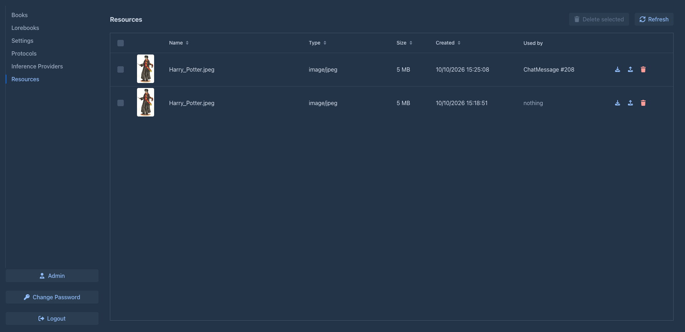
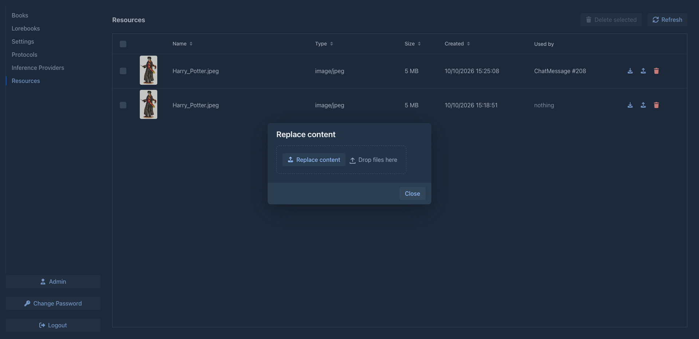

# Resources

The **Resources** tab lists the files you have uploaded to Marginalia. For now these are the
[pictures of the parts](books/story-editor.md#images) of your books. The tab is the place to find a picture again, to
download it, to swap it for a better one without touching the books that use it, and to throw away what you no
longer need.

The table loads as you scroll, so it stays fast with thousands of files. Click a column header to sort by it; the
newest files are first by default.

| Column | |
|---|---|
| (picture) | A small preview of images. |
| **Name** | The name of the file as it was uploaded. |
| **Type** | The type of the file, e.g. `image/png`. |
| **Size** | The size of the file. |
| **Created** | When the file was uploaded. |
| **Used by** | The part or other object the file was added to, e.g. `ChatMessage #123`. *nothing* means that the file is not used by anything. *(gone)* behind the name means that the object was deleted or no longer exists, the file is probably not needed any more. |

This is only a note kept for you. Marginalia does not enforce it: a picture still works after the part it was added
to is gone, and the same picture can be used by more parts (for example after you [branch](books/branches-and-story-tree.md)
the story, the branch has the same pictures as the part it was made from).

## Download

The download button (arrow down) in the row saves the file to your computer.

## Replace the content

The upload button in the row opens a dialog where you choose a new file. The new content is saved as a new file and
the entry now points to it, so **everything that uses the entry shows the new content**; you don't have to change
the parts. Use it to swap a picture for a better version or to fix a wrong upload.

- A picture can be replaced only by a picture (PNG, JPEG, GIF or WebP, up to 10 MB, as when
  [adding images](books/story-editor.md#images)).
- The name of the entry becomes the name of the new file.
- The previous file is not deleted from the data folder, see [below](#what-delete-does).

## Deleting

The trash button in the row deletes one file. To delete several, tick them in the first column and choose
**Delete selected** above the table. The tick box in the header selects all files. Marginalia asks before it deletes.

### What delete does

- The file disappears from the table and from the parts that use it: a part simply shows no picture any more. Text,
  summaries and exports of the part are not changed.
- The entry is only **marked as deleted**. The [cleanup](administration/cleanup.md) in the administration removes it
  from the database for good.
- **The file stays in the data folder** (`data/<your login>/images`) for now, also after cleanup. Deleting a resource
  does not free disk space yet.
- A deleted file can't be brought back from the application. A [backup of the whole database](administration/database-backups.md)
  made before contains the entry; the file itself is still in the folder.
