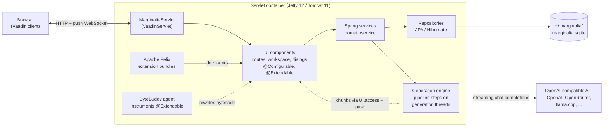
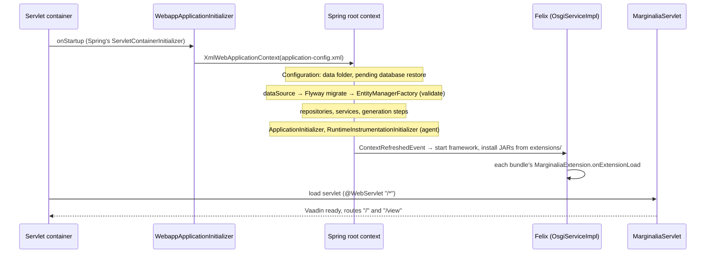
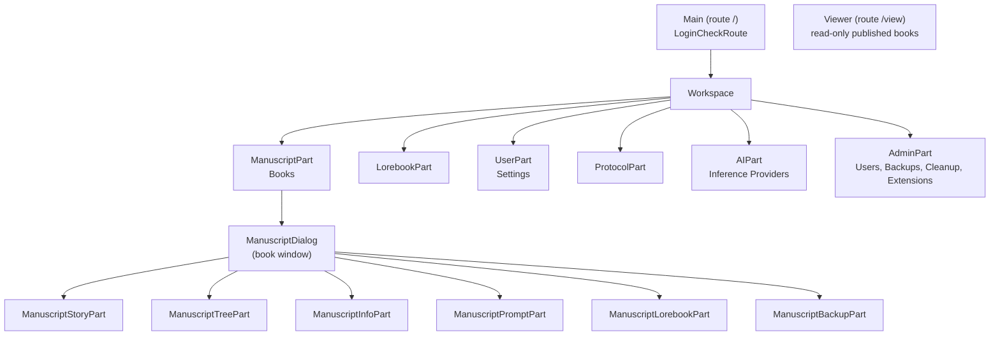
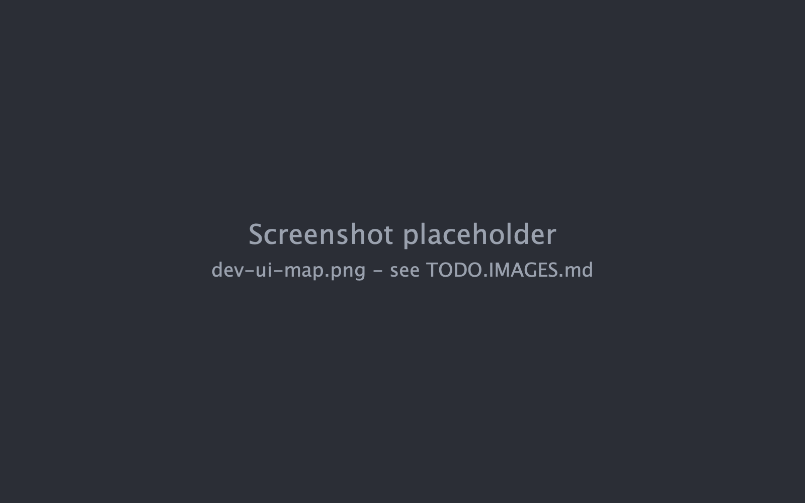
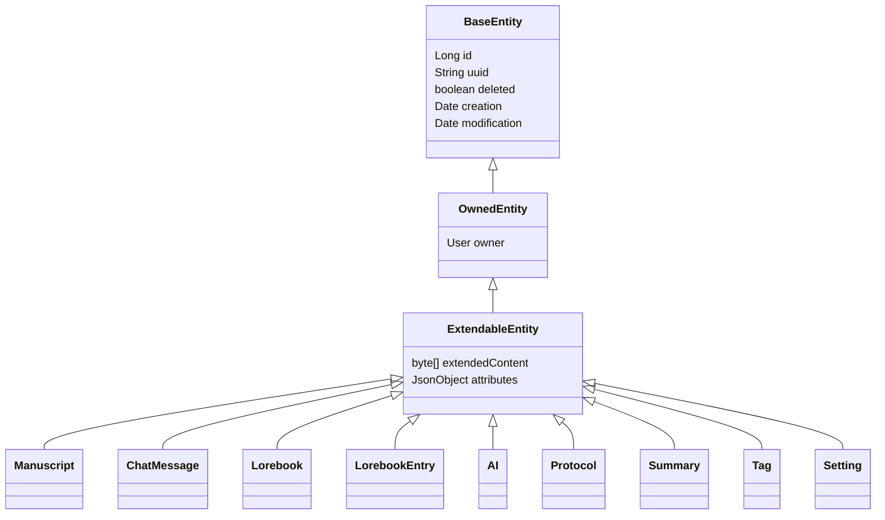
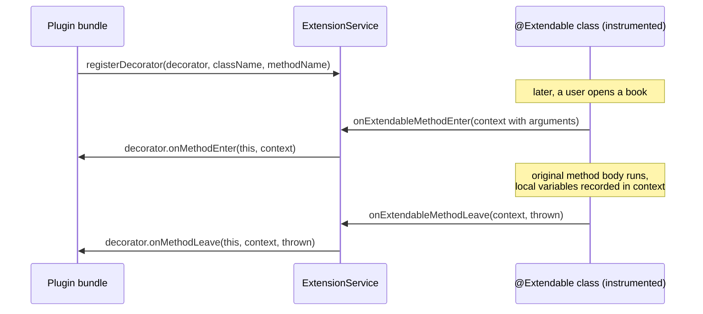

# Architecture

Marginalia is one Java web application running in one JVM. There is no separate frontend project, no REST API and no
external database: the browser shows Vaadin components that live on the server, the components call Spring services,
and the services store everything in a single SQLite file. Story generation runs on background threads that talk to
an OpenAI-compatible HTTP API and push the text to the browser as it arrives. Extensions are OSGi bundles loaded into
the same JVM; they change the UI by hooking into methods of instrumented classes.



## Design in brief

- **Server-side UI.** Vaadin Flow keeps the component tree on the server; the browser renders it and sends events
  back. UI code is ordinary Java that calls services directly - there is no API layer to keep in sync.
- **Spring without Spring Boot.** The application context is built from XML files; services and repositories are
  explicit beans. Vaadin components are created with `new` and get their dependencies through AspectJ-woven
  `@Configurable`.
- **One file of data.** SQLite in WAL mode, schema managed by Flyway, mapped by Hibernate. Backing up an installation
  means copying one folder.
- **Multi-user, single process.** Every entity belongs to a user; services filter by the user of the current HTTP
  session. All users share one JVM and one database.
- **Pipeline generation.** A story part is generated by a fixed sequence of steps with events between them, so
  extensions can inspect or change the prompt, the lore and the result.
- **Runtime extensions.** OSGi bundles can be loaded and unloaded without a restart. The UI classes they extend are
  instrumented at startup so that any of their methods can be decorated.

## Runtime and deployment

The build produces one WAR. It is deployed in a different container depending on how Marginalia is run, but the code
is the same everywhere:

| Mode | Container | Data folder | Notes |
|---|---|---|---|
| Docker | Jetty 12 (`jetty:12-jdk25` image), WAR as `ROOT.war` | `/var/marginalia/.marginalia` (volume `./data`) | Built by the [Dockerfile](packaging.md). Listens on 8080. |
| Desktop app | `jetty-home` 12 started in-process by `DesktopLauncher` | `~/.marginalia` | Bundled jlink runtime, listens on `127.0.0.1:8765`, tray icon. |
| Development | Tomcat 11 / Jetty 12 from the IDE | `<user.home>/.marginalia` | See [Running locally](building.md#running-locally). |

`DesktopLauncher` (`marginalia/src/desktop/java`) depends on the JDK only: it prepares a Jetty base in
`~/.marginalia/desktop/`, starts Jetty's `start.jar` by reflection in the same JVM, opens the browser and shows the tray
icon. It is compiled separately and never ends up in the WAR. See [Packaging & releases](packaging.md).

## Startup



1. The container finds Spring's `SpringServletContainerInitializer`, which calls
   `ui/main/WebappApplicationInitializer`. It creates an `XmlWebApplicationContext` from
   `META-INF/spring/application-config.xml` and registers the `ContextLoaderListener` and `RequestContextListener`
   (the latter makes request and session scoped beans work).
2. `application-config.xml` loads `config/configuration.properties`, the build info and `git.properties`, enables
   annotation config, `@Configurable` (`context:spring-configured`), `@Async`/`@Scheduled`
   (`task:annotation-driven`) and AspectJ auto-proxies, scans `com.github.enerccio` for components, and imports three
   files:

   | File | Defines |
   |---|---|
   | `container-config.xml` | `localization`, `configuration`, the session-scoped `user` and `sessionPoint`, `ApplicationInitializer` |
   | `datasources-config.xml` | SQLite data source (commons-dbcp), Flyway, the `EntityManagerFactory`, the `common` transaction manager |
   | `services-config.xml` | Every repository and service, the generation steps, OSGi, extensions, backups, cleanup, the instrumentation initializer |

3. `Configuration` resolves the data folder (`<user.home>/.marginalia`) and creates its subfolders. When the data
   source asks for the database URL (`configuration.resolveDb(...)`), a staged database restore
   (`marginalia.sqlite.restore`) is swapped in first - a restore can't replace a database that is open.
4. Flyway migrates the schema (`classpath:migration`), then Hibernate builds the `EntityManagerFactory` with
   `hbm2ddl.auto=validate`. A mismatch between entities and schema stops the startup here.
5. `RuntimeInstrumentationInitializer` installs the ByteBuddy agent and registers a transformer for all classes
   annotated `@Extendable` (see [Extensions](#extensions)). Classes already loaded are retransformed.
6. When the root context is refreshed, `OsgiServiceImpl` starts Apache Felix with `~/.marginalia/extensions` as its
   storage, installs and starts every JAR in that folder and calls `onExtensionLoad` on each registered
   `MarginaliaExtension`.
7. `MarginaliaServlet` (`@WebServlet("/*")`, a `VaadinServlet`) serves the UI. `AppShellConfig` configures the page:
   push enabled, dark Lumo theme, `shared-styles.css`.

## Layers and packages

All application code is in `com.github.enerccio.marginalia` (`marginalia/src/main/java/...`):

| Package | Layer | Contents |
|---|---|---|
| `ui.main` | UI | Servlet, app shell, the two routes: `Main` (`/`) and `Viewer` (`/view`), login handling (`LoginCheckRoute`). |
| `ui.workspace`, `ui.workspace.parts` | UI | The workspace after login and its tabs: books, lorebooks, settings, protocols, inference providers, admin. |
| `ui.dialogs`, `ui.dialogs.manuscript` | UI | Dialogs; the book window (`ManuscriptDialog`) and its tabs: story, tree, about, prompts, lorebook, backups. |
| `ui.components`, `ui.widgets` | UI | Reusable components (lorebook editor, story tree) and small widgets. |
| `domain.service` (+ `impl`) | Services | Business logic, one service per entity plus generation, templates, backups, cleanup, extensions. |
| `domain.service.impl.generation` | Services | The generation engine's steps, events and DTOs. |
| `domain.service.impl.inference` | Services | The OpenAI-compatible client and the tokenizer strategies. |
| `domain.templates` | Services | Template data objects and the macro system. |
| `domain.repository` (+ `impl`) | Data | JPA repositories. |
| `domain.model` (+ `impl`) | Data | Entities and their base classes. |
| `domain.security` | Data / services | `User`, its repository and service, saved logins. |
| `domain.traits`, `domain.collections`, `domain.listener` | Shared | Annotations (`@CommonTx`, `@Extendable`, `@CleanupReference`...), enums, the entity listener for extended attributes. |
| `extensions`, `instruct` | Extensions | The `MarginaliaExtension` interface, the bytecode instrumentation. |
| `bound` | Startup | Application initializer and migrations hook. |
| `loc` | Shared | Localization: the `L` keys and the English texts. |
| `concurrent`, `utils` | Shared | Helpers. |

The UI depends on services, services on repositories, repositories on the entities - not the other way round. UI
classes may read entities directly (they are detached JPA objects), but all changes go through services.
[Project structure](project-structure.md) lists the files in detail.

## Spring wiring

**Services and repositories** are declared in `services-config.xml`, one repository bean per entity injected into its
service:

```xml
<bean id="manuscriptRepository" class="...repository.impl.JpaManuscriptRepository">
    <property name="entityManager" ref="em"/>
</bean>

<bean class="...service.impl.ManuscriptServiceImpl">
    <property name="repository" ref="manuscriptRepository" />
</bean>
```

Inside the services, other beans are `@Autowired` by interface. A new service needs a bean definition here - the
component scan doesn't pick up the service implementations.

**UI classes** are not Spring beans. They are created with `new` (`new ManuscriptDialog(...)`) and annotated
`@Configurable` (most with `preConstruction = true`, so fields are injected before the constructor body runs). The
AspectJ compiler weaves `AnnotationBeanConfigurerAspect` into them, which autowires their fields from the root
context. This only works for classes compiled by `ajc` - see [AspectJ weaving](building.md#aspectj-weaving).

**Transactions** use the `common` transaction manager (`JpaTransactionManager`) and are applied by Spring's CGLIB
proxies around the service beans (`tx:annotation-driven`, `proxy-target-class="true"`) - so only calls that come
through a bean reference are transactional, not calls of a service to its own methods (see
[Services](services.md#transactions)). Service methods are annotated with the meta-annotations from `domain.traits`:

| Annotation | Meaning |
|---|---|
| `@CommonTx` | `@Transactional("common")` - read/write transaction. |
| `@CommonTxReadOnly` | Read-only transaction. |
| `@NoTx` | Runs outside a transaction (`NOT_SUPPORTED`), e.g. `generateNextTurn`, which only starts background work. |

**The current user** is the session-scoped bean `user` (`User` behind a scoped proxy). After login, `Main` copies the
logged-in user's id, login and name into it; services inject `User` and use it to set and check ownership
(`OwnedService.findAllForUser()`, `findForUser(uuid)`). Code running outside a request (generation threads) needs the
request attributes copied over - see [Threads and push](#threads-and-push).

**Configuration** comes from `src/main/webapp/config/configuration.properties`:

| Key | Default | |
|---|---|---|
| `localization` | `com.github.enerccio.marginalia.loc.LocalizationEN` | Class of the `Localization` bean - the language of the UI. |
| `allowPersistentLogin` | `true` | Whether *Save login* is offered. |
| `persistentLoginTTL` | `2592000` | Lifetime of saved logins in seconds (30 days). |

## User interface



- `Main` shows the login (or the *create administrator* dialog on an empty installation), restores a saved login
  from cookies, and after login replaces its content with the `Workspace`.
- `Workspace` holds the left-hand tabs. Each tab is a `WorkspaceComponent` (`create`, `refresh`, `onTabSwitched`,
  `onTabClosed`).
- Opening a book opens `ManuscriptDialog`, whose tabs are `ManuscriptDialogPart`s. The story editor
  (`ManuscriptStoryPart`) is the largest UI class: the parts sidebar, the text, the instruction panel, generation.
- `Viewer` is a separate route for reading published books without the workspace.



Most of these classes are `@Extendable`, which is what makes them extension points. See
[User interface](ui.md) for details.

## Data



All data entities extend `ExtendableEntity`. `User` extends `BaseEntity` directly and `Resource` is an `OwnedEntity`.

- Every entity has a numeric `id` (database key) and a `uuid` (stable identity used in URLs, backups and exports).
- Deleting is **soft** by default (`deleted = true`); the admin *Cleanup* page purges deleted rows that nothing
  references any more, following the `@CleanupReference` annotations.
- `OwnedEntity.owner` ties data to a user. `ExtendableEntity.attributes` is a JSON object, stored serialized in
  `extendedContent` by `ExtendableEntityListener`, where extensions keep their own data (and where `@ExtendedAttribute`
  fields of the entity are stored) - so that data travels with backups and exports without schema changes.
- The story is a tree of `ChatMessage`s (parts): regenerate, swipe and branch create siblings; the book remembers the
  active leaf.

The database is SQLite in WAL mode (`busy_timeout=10000`), through a commons-dbcp pool and a
`TransactionAwareDataSourceProxy`. Flyway migrations in `src/main/resources/migration/` create and upgrade the schema,
and every entity is listed in `src/main/webapp/config/persistence.xml` (`exclude-unlisted-classes`).
`SaneSQLiteDialect` adapts Hibernate's community SQLite dialect. See [Domain model](domain-model.md) and
[Database & migrations](database.md).

## Generation

`StoryGenerationService.generateNextTurn(manuscript, input, request, listener)` starts generating a part and returns a
`CancellationToken` right away. The work is done by a `GenerationEngine` that runs the installed steps one after
another on a cached thread pool (`Generation thread NNN`):

| Step (`GenerationStepType`) | Class | Does |
|---|---|---|
| `PREPARE_GENERATION` | `PrepareForGenerationStep` | Loads the book's inference provider and protocol and checks that both are set and that an inference service exists for the provider. |
| `PREPARE_CONSTANTS` | `PrepareConstantsStep` | Collects the book's prompts (master template, POV, tense, style, user prompt) and the provider's jailbreak, renders the user prompt from the turn instructions and counts its tokens. |
| `PROCESS_LOREBOOK` | `ProcessLorebookStep` | Activates lorebook entries (tags, filters, sub-lorebooks) and renders them. |
| `PREPARE_CONTENT` | `PrepareContentStep` | Fits the story into the context: summaries and as many earlier parts of the branch as the token limits allow. |
| `PREPARE_PAYLOAD` | `PreparePayloadStep` | Assembles the chat messages: the system prompt (after the jailbreak), earlier parts as assistant messages, the rendered user prompt last. |
| `GENERATE_NEW_MESSAGE` | `GenerateNewMessageStep` | Creates the `ChatMessage` node that receives the text (a new part, a swipe sibling, or the regenerated part) and stores the template variables. |
| `INFERENCE` | `InferenceStep` | Streams the completion from the inference provider into the part. |
| `CLEANUP` | `CleanupStep` | Always runs last. After a failure or cancellation it removes the unfinished part (or switches back to the previous swipe) and tells the UI. |

Between and inside the steps the engine emits `Events` (`BEFORE_PROCESS_LOREBOOK`, `AFTER_PREPARE_PAYLOAD`,
`CHUNK_RECEIVED`...). Listeners registered with `addEventListener` run in a chain and can change the engine's data or
stop the chain; this is how extensions take part in generation. The UI follows progress through the
`GenerationListener` it passed in (`onNodeCreated`, `onResponseChunk`, `onComplete`, `onError`...). Cancelling, an
error or an interrupted thread jump straight to `CLEANUP`.

Prompts are [Handlebars](https://github.com/jknack/handlebars.java) templates rendered by `TemplateService`;
SillyTavern macros (...) are translated to Handlebars helpers by
`MacroTranslator` first. Inference goes through `InferenceServices`, which picks the implementation for the provider
type - today only `OpenAICompatibleInferenceService` (openai-java). Token counts come from `TokenizerService`, which tries the
`TokenizerStrategy` implementations in turn (OpenAI SDK, llama.cpp and LiteLLM tokenize endpoints, JTokkit as the local
fallback) and remembers the first one that works for each provider.

See [Generation pipeline](generation-pipeline.md) and [Templating & macros](templating.md).

## Threads and push

Vaadin UI state may only be changed while holding the session lock. Code on other threads - generation, backups,
summaries - updates the UI with `ui.access(...)`, and the change reaches the browser through server push
(`@Push` on `AppShellConfig`, WebSocket with long-polling fallback). Two helpers make this safe:

- `UIPushGuard.push(ui)` pushes explicitly but never re-entrantly from the same thread.
- `ThreadAccessDialog` (and `ProgressBarDialog`) run a task on a worker thread and route its UI updates through
  `ui.access`.

Background threads have no HTTP request, so session-scoped beans (the current `user`) would not resolve.
`generateNextTurn` therefore captures the request attributes in a `ThreadCopyRequestAttributes` and the engine wraps
its work in `ThreadCopyRequestAttributes.InRequestScope`, which makes the session of the user who started the
generation current on the worker thread.

## Extensions



- **Loading.** Extensions are OSGi bundles run by an embedded Apache Felix framework (`OsgiServiceImpl`). Boot
  delegation is open for all packages (`org.osgi.framework.bootdelegation=*`, parent = the framework's class loader,
  which is the web application's), so bundles see the application's classes and libraries directly without importing
  them. A bundle registers a `MarginaliaExtension` service;
  Marginalia calls `onExtensionLoad` / `onExtensionUnload` and passes the `ExtensionService`.
- **Instrumentation.** At startup a ByteBuddy agent rewrites every non-static, non-constructor method of each class
  annotated `@Extendable`: `ExtendableMethodVisitor` adds a call to `ExtensionService.onExtendableMethodEnter` at the
  start, records each local variable as it is stored, and calls `onExtendableMethodLeave` on every return and throw.
  This happens on every call, with or without decorators, so `@Extendable` belongs on UI classes, not on hot code.
- **Decorators.** `ExtensionService.registerDecorator(decorator, className, methodName)` attaches code before and
  after a method. Through the `ExtendableMethodContext` it can read the method's arguments, read local variables by
  name (for example the menu the method just built, to add an item to it) and access fields and methods reflectively.
  On enter it can replace arguments; it can't change the return value or skip the method.
- **Data.** Extensions keep their data in the `attributes` of existing entities, so no schema changes are needed and
  the data is part of backups. They can also listen to generation events and take part in cleanup
  (`CleanupService.registerContributor`).
- **UI lifetime.** An extension registers the components it adds with `OsgiService.bindAttachableComponent` together
  with a callback that removes them; the callbacks of components still attached run when the extension is unloaded.

Because hooks are attached by class and method *name* and read local variables by name, extensions are tied to one
version of the application. See [Plugin development](plugins/index.md).

## Files on disk

Everything is in `<user.home>/.marginalia/` (see also [The data folder](../user/administration/index.md#the-data-folder)):

| Path | Written by |
|---|---|
| `marginalia.sqlite`, `-wal`, `-shm` | The database. |
| `marginalia.sqlite.restore` | A database restore staged by `DatabaseBackupService`, applied on the next start. |
| `db-backups/` | Database backups (manual, scheduled, `pre-restore-*`). |
| `data/<login>/backups/manuscripts/<book id>/` | Book backups (`BackupService`), one JSON file each. |
| `data/<login>/images/`, `data/<login>/resources/` | Per-user folders for files (created on demand). |
| `extensions/` | Extension JARs, plus Felix's bundle cache in `org.eclipse.osgi/` (deleted and rebuilt on every start). |
| `desktop/` | Desktop app only: the Jetty base and `logs/`. |

## Localization

All UI texts are looked up through the `Localization` bean by an `L` key (`loc.getValue(L.LABEL_SAVE)`).
`LocalizationEN` holds the English texts and is selected by the `localization` property; another language is a new
`Localization` implementation and a changed property. Texts of template variables and macros (the hints shown next
to prompt fields) are localized the same way.
