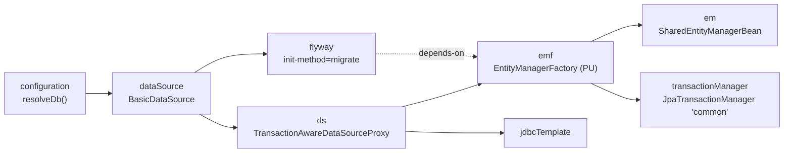
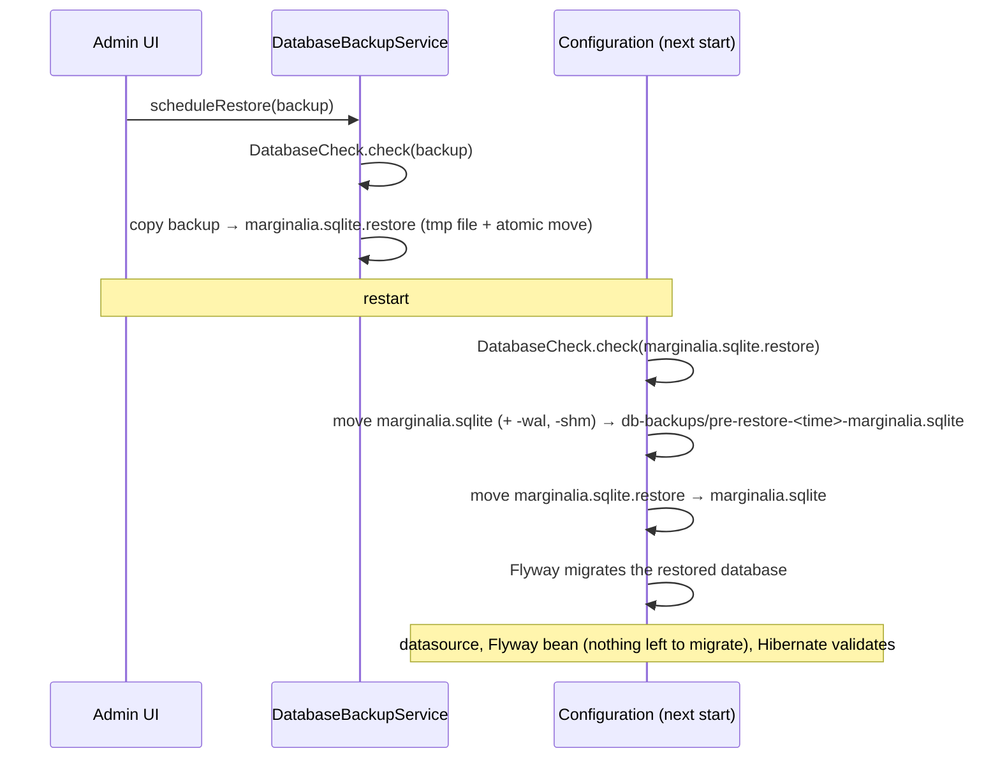

# Database & migrations

Marginalia keeps all its data in one SQLite file. The schema is created and upgraded by Flyway migrations, and
Hibernate maps the entities onto it but never changes it. This page explains the setup, the conventions of the schema
and how to write a migration. What the tables contain is described in [Domain model](domain-model.md).

## The database file

| | |
|---|---|
| File | `<user.home>/.marginalia/marginalia.sqlite`, with `marginalia.sqlite-wal` and `-shm` while it runs |
| JDBC URL | `jdbc:sqlite:<file>?busy_timeout=10000&journal_mode=WAL` (built by `Configuration.resolveDb`) |
| Driver | `org.sqlite.JDBC` (`sqlite-jdbc`) |
| Pool | commons-dbcp `BasicDataSource`, 10-20 connections, validated with `SELECT 1` |
| Journal | WAL - readers don't block the writer; writers wait up to 10 s (`busy_timeout`) for each other |
| Foreign keys | Not enforced (`PRAGMA foreign_keys` is off), see [Conventions](#schema-conventions) |

The beans are in `src/main/resources/META-INF/spring/datasources-config.xml`:



- `flyway` migrates the database when the context starts; `emf` depends on it, so Hibernate only sees a migrated
  schema.
- Hibernate and `jdbcTemplate` use the data source through `TransactionAwareDataSourceProxy`, so plain JDBC code
  joins the current JPA transaction.
- The persistence unit `PU` is defined in `src/main/webapp/config/persistence.xml`: the list of entity classes
  (`exclude-unlisted-classes`), the dialect and `hibernate.hbm2ddl.auto=validate`.

### Looking into the database

The file is an ordinary SQLite database. While Marginalia runs, open it read-only so you don't hold locks:

```sh
sqlite3 -readonly ~/.marginalia/marginalia.sqlite
sqlite> .tables
sqlite> select version, description, success from flyway_schema_history;
sqlite> select id, name, cast(extendedContent as text) from manuscripts;
```

`extendedContent` columns hold UTF-8 JSON, so `cast(... as text)` (or `json_extract`) shows the
[extended attributes](domain-model.md#extendableentity---extended-attributes). Timestamps (`creation`,
`modification`, `lastOpened`) are stored as milliseconds since the epoch, booleans as `0` / `1`.

## Startup: migrate, then validate

1. Before the data source is created, `Configuration.resolveDb` swaps in a staged database restore, if there is one
   (see [Database backups and restores](#database-backups-and-restores)). Then `Configuration.backupBeforeMigration`
   asks `DatabaseCheck.pendingMigrationFrom` whether the existing file is behind the newest bundled `V<n>` migration
   (or has no history table, which Flyway baselines at V1). If so it saves a `VACUUM INTO` copy as
   `db-backups/pre-migration-<time>-V<from>-marginalia.sqlite` and keeps the newest three. A new installation (no file
   or an empty one) and a current database are left alone, and a copy that fails is logged, not fatal. The check
   looks at the Flyway history only, so a Java `Migration` bean without a `V<n>` file does not trigger a copy.
2. Flyway runs every pending migration from `classpath:migration` (`src/main/resources/migration/`) and records it in
   `flyway_schema_history`. `baselineOnMigrate=true` with baseline version `1` makes databases created before Flyway
   was introduced (V1 schema without a history table) start at V1 and get V2 onwards.
3. Hibernate builds the `EntityManagerFactory` and **validates** the schema against the entities: every mapped table
   and column must exist with a compatible type. It never creates or alters anything.

If either step fails, the Spring context doesn't start and Marginalia doesn't serve any page; the cause is in the
log. Typical messages:

| Message | Cause |
|---|---|
| `Schema-validation: missing column [x] in table [y]` | An entity field was mapped as a column without a migration. |
| `Schema-validation: missing table [x]` | A new entity without a migration, or the migration names the table differently. |
| `Validate failed: Migrations have failed validation ... checksum mismatch` | An already applied migration file was edited. |
| `Migration V<n>__... failed` | The SQL of a migration failed; Flyway rolls that migration back (SQLite DDL is transactional, each file is its own transaction, earlier files of the same run stay applied) and startup stops. Flyway Community has no undo, so a migration that succeeded is only reversible from the `pre-migration-*` copy. |

There is also a second, Java-level version check: `ApplicationInitializer` compares `AppSettings.dbVersion` /
`appVersion` with the versions set in `container-config.xml` and runs registered `Migration` beans for data changes
that are easier in Java than in SQL. It runs after Hibernate is up, so a migration can use `jdbcTemplate` or services.
Each migration gets the current version and returns the new one (or the same one when it has nothing to do), so a
migration is written for one version step and ignores the others.

| Type | Version | Class | Change |
|---|---|---|---|
| APP | 1 → 2 | `bound/migration/EncryptApiKeysMigration` | Encrypts the plain text `ais_openaicompat.apiKey` values, see [Encrypted columns](#encrypted-columns). |
| APP | 2 → 3 | `bound/migration/FulltextMigration` | Fills `_fulltext` (added by V9) of the existing rows of every entity with `@Fulltextable` fields, deleted rows included: walks the table by id in batches of 200, one transaction per batch, and calls `ExtendableEntityListener.updateFulltext` on the loaded entity, so `extendedContent` and `modification` stay as they are. Repeating it is harmless. See [Full-text column](domain-model.md#full-text-column). |

To add one: implement `Migration`, register the bean in the `migrations` list of `applicationInitializer` and raise
`appVersion` (or `dbVersion`). A fresh database starts at version 1, so it goes through all migrations too.

## Migrations

| Version | File | Change |
|---|---|---|
| V1 | `V1__initial.sql` | The initial schema, generated from the entities by Hibernate. |
| V2 | `V2__summaries.sql` | `messages.summary_id` - parts can have a summary. |
| V3 | `V3__lorebook_subbooks_shared.sql` | Rebuilds `lorebooks_lorebooks` without the unique constraint, so a lorebook can be a sub-lorebook of several lorebooks. |
| V4 | `V4__manuscript_published_last_opened.sql` | `manuscripts.published` and `manuscripts.lastOpened`. |
| V5 | `V5__protocol_optional_limits.sql` | Rebuilds `protocols` with nullable `maxTokens` / `replyTokens` and turns the old "not set" values (0, negative) into `NULL`. |
| V6 | `V6__indexes.sql` | Indexes matching the queries: tag relations by object and by tag, owner lookups `(userId, is_deleted)`, lorebook entries in order, parts of a book in order, parts by summary, resources by owner and hash, settings by key. Drops the unused and duplicate ones. See [Indexes](#indexes). |
| V7 | `V7__user_login_backoff.sql` | `users.failedLogins` and `users.lockedUntil` (both `not null default 0`) for the login back-off, see [Users](domain-model.md#users). |
| V8 | `V8__resource_link.sql` | `resources.objectId` and `resources.clazz` - the loose link of an uploaded file to the object that uses it - and the indexes of the Resources tab (`(userId, is_deleted, creation)`) and of the link (`(clazz, objectId)`). |
| V9 | `V9__fulltext.sql` | `_fulltext` clob on every table of an extendable entity (`ais`, `entries`, `lorebooks`, `manuscripts`, `messages`, `protocols`, `settings`, `summaries`, `t2e`, `tags`), because the column is mapped in `ExtendableEntity`. Copies `manuscripts.description` into `extendedContent` where the JSON has no value (the extended attribute wins when both exist), then drops the column. The column is filled by `FulltextMigration` (app version 3). |

### Rules

- **Never change a migration that has been released.** Flyway stores a checksum of each applied file and refuses to
  start when it changes. Fix mistakes with a new migration.
- **Name** files `V<next number>__<what_it_does>.sql` (two underscores). Versions are plain integers here.
- **One migration per change**, together with the entity change in the same commit.
- **Keep data.** Users upgrade in place - every migration must turn any existing database into the new schema
  without losing data. Convert old values in SQL (V5 is an example).
- **Only SQL that SQLite understands.** See [SQLite limitations](#sqlite-limitations).
- **Prefer extended attributes.** A field stored in `extendedContent` needs no migration at all; add a column only
  when the value is used in queries (see [Domain model](domain-model.md#adding-a-field-or-an-entity)).

### Adding a column

```sql
-- V10__manuscript_archived.sql
ALTER TABLE manuscripts
    ADD COLUMN archived boolean not null default false;
```

`ADD COLUMN` with `not null` needs a `default`, otherwise existing rows can't get a value. Then map it in the entity:

```java
@Column(nullable = false)
private boolean archived = false;
```

### Adding a table

A new entity needs its table, its sequence table with a first row, and its indexes. Hibernate uses
`GenerationType.AUTO`, which on SQLite means a table-backed sequence named `<table>_SEQ` with a pooled optimizer
(ids are reserved in blocks of 50 - gaps in ids are normal):

```sql
-- V10__bookmarks.sql
create table bookmarks
(
    id              bigint      not null primary key,
    creation        timestamp,
    is_deleted      boolean     not null,
    modification    timestamp,
    uuid            varchar(36) not null unique,
    extendedContent blob,
    _fulltext       clob,
    userId          bigint,
    message_id      bigint
);

create index ix_bookmarks_user on bookmarks (userId, is_deleted);
create index ix_bookmarks_message on bookmarks (message_id);

create table bookmarks_SEQ
(
    next_val bigint
);

INSERT INTO bookmarks_SEQ (next_val) VALUES (1);
```

The columns of `BaseEntity` / `OwnedEntity` / `ExtendableEntity` are always the same: `id`, `creation`,
`is_deleted`, `modification`, `uuid`, `userId` (owner), `extendedContent` and `_fulltext`. Then list the class in
`persistence.xml`. For joined inheritance (a subtype of `AI` or `Protocol`), the subtype table has only `id` plus its
own columns.

### Changing or removing a column

SQLite can rename a column (`ALTER TABLE ... RENAME COLUMN`) and, since 3.35, drop a simple one
(`ALTER TABLE ... DROP COLUMN`), but it can't change a column's type, nullability, default or constraints. For those,
rebuild the table - V3 and V5 show the pattern:

```sql
CREATE TABLE protocols_new ( ... new definition ... );

INSERT INTO protocols_new (id, ...)
SELECT id, ... FROM protocols;          -- convert values here

DROP TABLE protocols;

ALTER TABLE protocols_new RENAME TO protocols;

CREATE INDEX protocol_is_deleted_idx ON protocols (is_deleted);   -- indexes are dropped with the old table
CREATE INDEX protocol_user_id_ix ON protocols (userId);
```

Recreate every index of the old table. Removing an entity field without removing the column is harmless - validation
only checks that mapped columns exist.

### Generating the SQL

`com.github.enerccio.tools.GenerateFlywayDiff` (in `src/main/java/com/github/enerccio/tools/`) asks Hibernate what it
would change to make an existing database match the entities, and prints the SQL. Run its `main` from the
repository root (it reads `marginalia/src/main/webapp/config/persistence.xml`), with `-Duser.home` pointing to a
development home whose database is at the current schema version. Treat the output as a draft:

- Hibernate only creates and adds; it never drops or changes columns.
- It doesn't know about data conversion, defaults for existing rows or the table rebuilds SQLite needs.
- It may print Hibernate's temporary tables (`HT_*`, `HTE_*`) again - leave them out if they already exist.

### Testing a migration

`db/FlywayMigrationTest` checks, without the rest of the application:

- an empty database migrates through all versions and the schema validates against `persistence.xml`,
- migrating twice is a no-op,
- a database at V1 with data upgrades to the latest version, keeping the data,
- a pre-Flyway database (V1 schema, no history table) is baselined and upgraded.

New migrations are picked up automatically by the first two tests. When a migration converts data, add rows to
`insertV1Data()` and assertions to `assertUpgradedData()`, like the existing ones for V2-V5 and V9 (the `description`
of three manuscripts: only in the column, merged into other JSON keys, and in both). A Java migration (`Migration` bean)
needs the Spring context: see `db/FulltextMigrationTest`. Run it with
`mvn test -Dtest=FlywayMigrationTest`.

## Schema conventions

**Names.** Tables are plural (`manuscripts`, `messages`, `entries`), set by `@Table(name = ...)`. Columns use the Java
field name (`maxTokens`, `lastOpened`); relations end in `_id` (`lorebook_id`, `parentScript_id`), except the owner,
which is `userId`, and the soft delete flag, `is_deleted`. Indexes exist only in the migrations, see
[Indexes](#indexes).

**No foreign key constraints.** The tables have no `REFERENCES` clauses (V2's `summary_id` declares one, but SQLite
doesn't enforce it because `PRAGMA foreign_keys` is off). Integrity is kept by the application: rows are soft
deleted, so references stay valid, and the admin *Cleanup* follows the
[cleanup references](domain-model.md#cleanup-references) to decide what may be purged. Code that hard deletes must
clear or move references itself (see `ChatMessageService.deleteNodeAndMigrateChildren`).

**Enums.** `AI.aiType` and `Protocol.protocolType` are stored as ordinals (`tinyint`), all other enums by name.
`SaneSQLiteDialect` turns off the `CHECK` constraints that Hibernate would otherwise generate for enum columns, so a
new enum value doesn't need a table rebuild.

**Large values.** Text that can be long (`name`, `uri`, `apiKey`...) is `@Lob` → `clob`; `extendedContent` is a
`blob` with JSON. SQLite doesn't enforce lengths, so `varchar(255)` is only documentation.

**Encrypted columns.** Secrets are stored encrypted, see [Encrypted columns](#encrypted-columns).

**Hibernate's temporary tables.** `V1__initial.sql` contains `HT_*` and `HTE_*` tables. Hibernate uses them for bulk
updates and deletes on entities with joined inheritance (`AI`, `Protocol`) and for inserts into such hierarchies.
They are part of the schema - don't drop them.

## Indexes

Indexes are created only by Flyway migrations; the entities don't declare any (`@Table(indexes = ...)`), because
Hibernate only validates the schema and never creates them. Name them `ix_<table>_<what>`.

Index what the queries filter on, in the order of the `WHERE` clause, with the equality columns first and the
`ORDER BY` column last:

| Index | Used by |
|---|---|
| `t2e (objectId, clazz, negative)` | Tags of a book, lorebook or entry (`findTagsForObject`, lorebook activation on every generation). |
| `t2e (tag_id, clazz, negative)` | Objects with a tag (`findObjectIdsForTag`, tag filters). |
| `<table> (userId, is_deleted)` | Listing and finding the owner's entities (`ais`, `protocols`, `manuscripts`, `lorebooks`, `tags`). |
| `entries (lorebook_id, ordinal)` | Entries of a lorebook in order. |
| `messages (parentScript_id, creation)`, `messages (parent_id)` | Parts of a book in order, children of a part. |
| `messages (summary_id)` | Parts using a summary (cleanup references). |
| `resources (userId, hash)` | Deduplication of uploaded files. |
| `resources (userId, is_deleted, creation)` | The Resources tab: the user's files, newest first. |
| `resources (clazz, objectId)` | Resources used by an object (the loose link). |
| `settings (key, userId)` | Loading a settings object. |

A single-column index on `is_deleted` alone helps only the *Cleanup* (few rows are deleted); don't add new ones.
Check a query with `EXPLAIN QUERY PLAN` in SQLite - `SCAN <table>` means a full table scan, `SEARCH ... USING INDEX`
means the index is used. `FlywayMigrationTest.tagRelationLookupsUseIndexes` does that for the main lookups.

## Encrypted columns

`OpenAICompatible.apiKey` is mapped with `@Convert(converter = EncryptedStringConverter.class)`. The converter calls
`Configuration.encrypt` / `decrypt`:

- On the first start `Configuration` writes a random UUID to `<data folder>/secret.key`; the AES-256 key is the
  SHA-256 of that UUID. The file is outside the database, so a database backup alone doesn't reveal the secrets.
- A stored value is `enc:` + Base64 of a random 12-byte IV and the AES/GCM ciphertext. Values without the prefix are
  read as they are (plain values from before the migration); a value that can't be decrypted (a database from another
  installation, a different `secret.key`) is logged and read as `null` - the user enters the key again.
- The converter is a Spring bean: `emf` sets `hibernate.resource.beans.container` to a `SpringBeanContainer`, so
  Hibernate asks Spring for converters (and entity listeners) and `@Autowired` fields are injected. Use the same
  converter for any new secret column.
- Code outside JPA (`jdbcTemplate`, migrations) sees the encrypted value and must use `Configuration` itself, as
  `EncryptApiKeysMigration` does.

## SQLite limitations

| Limitation | Consequence |
|---|---|
| One writer at a time | Writes are serialized; long transactions block other users' writes (up to `busy_timeout`, then `SQLITE_BUSY`). Keep transactions short and never call a model inside one - generation runs outside transactions (`@NoTx`). |
| `ALTER TABLE` is limited | Type, nullability and constraint changes need a table rebuild. |
| DDL in transactions | SQLite supports transactional DDL, so a failing migration is rolled back completely. |
| No `VACUUM` inside a transaction | `VACUUM INTO` for backups runs with `@NoTx`. |
| Dynamic typing | A column accepts any value; the entity mapping is what keeps types consistent. |

## Database backups and restores

`DatabaseBackupServiceImpl` backs up the live database with SQLite's `VACUUM INTO '<file>'`, which writes a
consistent, compacted copy without stopping the application. Backups go to `<data folder>/db-backups/` as
`marginalia-<time>.sqlite` (manual) or `marginalia-scheduled-<time>.sqlite`; scheduled ones are rotated (keep last N). `Configuration` writes two more kinds into the same folder, `pre-restore-*` (the database a restore replaced) and `pre-migration-*` (see [Startup](#startup-migrate-then-validate)); the service lists every `.sqlite` file there, and only `marginalia-scheduled-*` counts as scheduled. The methods the UI calls (create, list, download, upload, delete, restore, schedule) call `AdminGuard.requireAdmin()`; the scheduled run (`createScheduledBackup`) and the rotation need no logged-in user.

A database can't be replaced while it's open, so restoring is done in two steps:



`DatabaseCheck.check(File)` is run on *Upload Backup* (`importBackup`), on `scheduleRestore` and on start. It opens the
file read-only and refuses it (`InvalidDatabaseException`, an `IllegalArgumentException` with the reason) when:

- it doesn't start with the SQLite header,
- `PRAGMA integrity_check` reports problems,
- core tables (`users`, `settings`, `manuscripts`, `messages`, `lorebooks`, `entries`, `ais`, `protocols`, `tags`,
  `t2e`) are missing - another application's database,
- `flyway_schema_history` has a failed migration or a version newer than the newest bundled `migration/V*__*.sql` -
  a database of a newer Marginalia version. A database without the history table predates Flyway and is baselined at
  V1 as usual.

`Configuration.applyPendingRestore()` migrates the restored database itself, before the datasource is created, with
the same Flyway configuration as the `flyway` bean (`DatabaseCheck.flywayConfiguration(DataSource)`, used by
`datasources-config.xml` too). If the check fails, the staged file is moved to
`db-backups/rejected-restore-<time>-marginalia.sqlite` and the current database stays. If the migration fails, the
restored file is moved there as well and the `pre-restore-*` database is moved back. Either way the reason is logged
as an error and Marginalia starts with the previous database. A backup from an older version is upgraded on start.

API keys in a backup are encrypted with the installation's `secret.key` (see [Encrypted columns](#encrypted-columns)).
A backup restored on another installation loses them unless `secret.key` is copied along.

## Tests and the database

Tests don't touch your data: `MarginaliaTestBase` starts the Spring configuration with the data folder in
`target/test-home/ctx-*`, so every test context gets a fresh database migrated by the real Flyway configuration. See
[Testing](testing.md).
