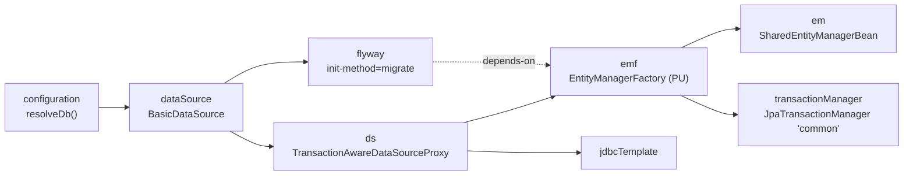
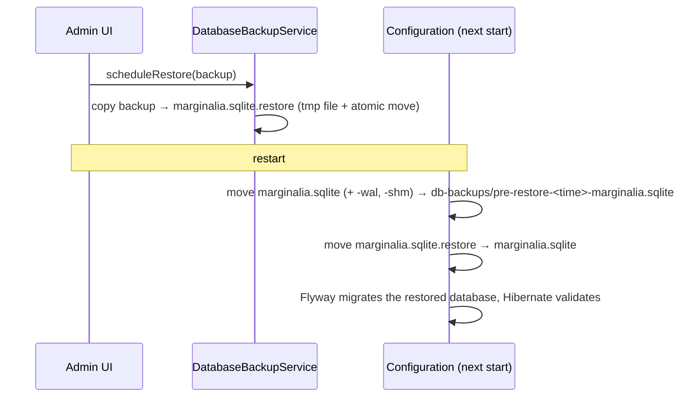

# Database & migrations

Marginalia keeps all its data in one SQLite file. The schema is created and upgraded by Flyway migrations, and
Hibernate maps the entities onto it but never changes it. This page explains the setup, the conventions of the schema
and how to write a migration. What the tables contain is described in [Domain model](domain-model.md).

## The database file

| | |
|---|---|
| File | `<user.home>/.marginalia/marginalia.sqlite`, with `marginalia.sqlite-wal` and `-shm` while it runs |
| JDBC URL | `jdbc:sqlite:<file>?busy_timeout=10000&journal_mode=WAL` (built by `Configuration.resolveDb`) |
| Driver | `org.sqlite.JDBC` (`sqlite-jdbc`) |
| Pool | commons-dbcp `BasicDataSource`, 10-20 connections, validated with `SELECT 1` |
| Journal | WAL - readers don't block the writer; writers wait up to 10 s (`busy_timeout`) for each other |
| Foreign keys | Not enforced (`PRAGMA foreign_keys` is off), see [Conventions](#schema-conventions) |

The beans are in `src/main/resources/META-INF/spring/datasources-config.xml`:



- `flyway` migrates the database when the context starts; `emf` depends on it, so Hibernate only sees a migrated
  schema.
- Hibernate and `jdbcTemplate` use the data source through `TransactionAwareDataSourceProxy`, so plain JDBC code
  joins the current JPA transaction.
- The persistence unit `PU` is defined in `src/main/webapp/config/persistence.xml`: the list of entity classes
  (`exclude-unlisted-classes`), the dialect and `hibernate.hbm2ddl.auto=validate`.

### Looking into the database

The file is an ordinary SQLite database. While Marginalia runs, open it read-only so you don't hold locks:

```sh
sqlite3 -readonly ~/.marginalia/marginalia.sqlite
sqlite> .tables
sqlite> select version, description, success from flyway_schema_history;
sqlite> select id, name, cast(extendedContent as text) from manuscripts;
```

`extendedContent` columns hold UTF-8 JSON, so `cast(... as text)` (or `json_extract`) shows the
[extended attributes](domain-model.md#extendableentity---extended-attributes). Timestamps (`creation`,
`modification`, `lastOpened`) are stored as milliseconds since the epoch, booleans as `0` / `1`.

## Startup: migrate, then validate

1. Before the data source is created, `Configuration.resolveDb` swaps in a staged database restore, if there is one
   (see [Database backups and restores](#database-backups-and-restores)).
2. Flyway runs every pending migration from `classpath:migration` (`src/main/resources/migration/`) and records it in
   `flyway_schema_history`. `baselineOnMigrate=true` with baseline version `1` makes databases created before Flyway
   was introduced (V1 schema without a history table) start at V1 and get V2 onwards.
3. Hibernate builds the `EntityManagerFactory` and **validates** the schema against the entities: every mapped table
   and column must exist with a compatible type. It never creates or alters anything.

If either step fails, the Spring context doesn't start and Marginalia doesn't serve any page; the cause is in the
log. Typical messages:

| Message | Cause |
|---|---|
| `Schema-validation: missing column [x] in table [y]` | An entity field was mapped as a column without a migration. |
| `Schema-validation: missing table [x]` | A new entity without a migration, or the migration names the table differently. |
| `Validate failed: Migrations have failed validation ... checksum mismatch` | An already applied migration file was edited. |
| `Migration V<n>__... failed` | The SQL of a migration failed; Flyway rolls the migration back. |

There is also a second, Java-level version check: `ApplicationInitializer` compares `AppSettings.dbVersion` /
`appVersion` with the versions set in `container-config.xml` and runs registered `Migration` beans for data changes
that are easier in Java than in SQL. None are registered yet (and see BUG-34).

## Migrations

| Version | File | Change |
|---|---|---|
| V1 | `V1__initial.sql` | The initial schema, generated from the entities by Hibernate. |
| V2 | `V2__summaries.sql` | `messages.summary_id` - parts can have a summary. |
| V3 | `V3__lorebook_subbooks_shared.sql` | Rebuilds `lorebooks_lorebooks` without the unique constraint, so a lorebook can be a sub-lorebook of several lorebooks. |
| V4 | `V4__manuscript_published_last_opened.sql` | `manuscripts.published` and `manuscripts.lastOpened`. |
| V5 | `V5__protocol_optional_limits.sql` | Rebuilds `protocols` with nullable `maxTokens` / `replyTokens` and turns the old "not set" values (0, negative) into `NULL`. |

### Rules

- **Never change a migration that has been released.** Flyway stores a checksum of each applied file and refuses to
  start when it changes. Fix mistakes with a new migration.
- **Name** files `V<next number>__<what_it_does>.sql` (two underscores). Versions are plain integers here.
- **One migration per change**, together with the entity change in the same commit.
- **Keep data.** Users upgrade in place - every migration must turn any existing database into the new schema
  without losing data. Convert old values in SQL (V5 is an example).
- **Only SQL that SQLite understands.** See [SQLite limitations](#sqlite-limitations).
- **Prefer extended attributes.** A field stored in `extendedContent` needs no migration at all; add a column only
  when the value is used in queries (see [Domain model](domain-model.md#adding-a-field-or-an-entity)).

### Adding a column

```sql
-- V6__manuscript_archived.sql
ALTER TABLE manuscripts
    ADD COLUMN archived boolean not null default false;
```

`ADD COLUMN` with `not null` needs a `default`, otherwise existing rows can't get a value. Then map it in the entity:

```java
@Column(nullable = false)
private boolean archived = false;
```

### Adding a table

A new entity needs its table, its sequence table with a first row, and its indexes. Hibernate uses
`GenerationType.AUTO`, which on SQLite means a table-backed sequence named `<table>_SEQ` with a pooled optimizer
(ids are reserved in blocks of 50 - gaps in ids are normal):

```sql
-- V6__bookmarks.sql
create table bookmarks
(
    id              bigint      not null primary key,
    creation        timestamp,
    is_deleted      boolean     not null,
    modification    timestamp,
    uuid            varchar(36) not null unique,
    extendedContent blob,
    userId          bigint,
    message_id      bigint
);

create index ix_bookmark_user_id on bookmarks (userId);
create index ix_bookmark_message on bookmarks (message_id);

create table bookmarks_SEQ
(
    next_val bigint
);

INSERT INTO bookmarks_SEQ (next_val) VALUES (1);
```

The columns of `BaseEntity` / `OwnedEntity` / `ExtendableEntity` are always the same: `id`, `creation`,
`is_deleted`, `modification`, `uuid`, `userId` (owner) and `extendedContent`. Then list the class in
`persistence.xml`. For joined inheritance (a subtype of `AI` or `Protocol`), the subtype table has only `id` plus its
own columns.

### Changing or removing a column

SQLite can rename a column (`ALTER TABLE ... RENAME COLUMN`) and, since 3.35, drop a simple one
(`ALTER TABLE ... DROP COLUMN`), but it can't change a column's type, nullability, default or constraints. For those,
rebuild the table - V3 and V5 show the pattern:

```sql
CREATE TABLE protocols_new ( ... new definition ... );

INSERT INTO protocols_new (id, ...)
SELECT id, ... FROM protocols;          -- convert values here

DROP TABLE protocols;

ALTER TABLE protocols_new RENAME TO protocols;

CREATE INDEX protocol_is_deleted_idx ON protocols (is_deleted);   -- indexes are dropped with the old table
CREATE INDEX protocol_user_id_ix ON protocols (userId);
```

Recreate every index of the old table. Removing an entity field without removing the column is harmless - validation
only checks that mapped columns exist.

### Generating the SQL

`com.github.enerccio.tools.GenerateFlywayDiff` (in `src/main/java/com/github/enerccio/tools/`) asks Hibernate what it
would change to make an existing database match the entities, and prints the SQL. Run its `main` from the
repository root (it reads `marginalia/src/main/webapp/config/persistence.xml`), with `-Duser.home` pointing to a
development home whose database is at the current schema version. Treat the output as a draft:

- Hibernate only creates and adds; it never drops or changes columns.
- It doesn't know about data conversion, defaults for existing rows or the table rebuilds SQLite needs.
- It may print Hibernate's temporary tables (`HT_*`, `HTE_*`) again - leave them out if they already exist.

### Testing a migration

`db/FlywayMigrationTest` checks, without the rest of the application:

- an empty database migrates through all versions and the schema validates against `persistence.xml`,
- migrating twice is a no-op,
- a database at V1 with data upgrades to the latest version, keeping the data,
- a pre-Flyway database (V1 schema, no history table) is baselined and upgraded.

New migrations are picked up automatically by the first two tests. When a migration converts data, add rows to
`insertV1Data()` and assertions to `assertUpgradedData()`, like the existing ones for V3-V5. Run it with
`mvn test -Dtest=FlywayMigrationTest`.

## Schema conventions

**Names.** Tables are plural (`manuscripts`, `messages`, `entries`), set by `@Table(name = ...)`. Columns use the Java
field name (`maxTokens`, `lastOpened`); relations end in `_id` (`lorebook_id`, `parentScript_id`), except the owner,
which is `userId`, and the soft delete flag, `is_deleted`. Indexes are named in the entity's `@Table(indexes = ...)`
and must be created by hand in the migration.

**No foreign key constraints.** The tables have no `REFERENCES` clauses (V2's `summary_id` declares one, but SQLite
doesn't enforce it because `PRAGMA foreign_keys` is off). Integrity is kept by the application: rows are soft
deleted, so references stay valid, and the admin *Cleanup* follows the
[cleanup references](domain-model.md#cleanup-references) to decide what may be purged. Code that hard deletes must
clear or move references itself (see `ChatMessageService.deleteNodeAndMigrateChildren`).

**Enums.** `AI.aiType` and `Protocol.protocolType` are stored as ordinals (`tinyint`), all other enums by name.
`SaneSQLiteDialect` turns off the `CHECK` constraints that Hibernate would otherwise generate for enum columns, so a
new enum value doesn't need a table rebuild.

**Large values.** Text that can be long (`name`, `uri`, `apiKey`...) is `@Lob` → `clob`; `extendedContent` is a
`blob` with JSON. SQLite doesn't enforce lengths, so `varchar(255)` is only documentation.

**Hibernate's temporary tables.** `V1__initial.sql` contains `HT_*` and `HTE_*` tables. Hibernate uses them for bulk
updates and deletes on entities with joined inheritance (`AI`, `Protocol`) and for inserts into such hierarchies.
They are part of the schema - don't drop them.

## SQLite limitations

| Limitation | Consequence |
|---|---|
| One writer at a time | Writes are serialized; long transactions block other users' writes (up to `busy_timeout`, then `SQLITE_BUSY`). Keep transactions short and never call a model inside one - generation runs outside transactions (`@NoTx`). |
| `ALTER TABLE` is limited | Type, nullability and constraint changes need a table rebuild. |
| DDL in transactions | SQLite supports transactional DDL, so a failing migration is rolled back completely. |
| No `VACUUM` inside a transaction | `VACUUM INTO` for backups runs with `@NoTx`. |
| Dynamic typing | A column accepts any value; the entity mapping is what keeps types consistent. |

## Database backups and restores

`DatabaseBackupServiceImpl` backs up the live database with SQLite's `VACUUM INTO '<file>'`, which writes a
consistent, compacted copy without stopping the application. Backups go to `<data folder>/db-backups/` as
`marginalia-<time>.sqlite` (manual) or `marginalia-scheduled-<time>.sqlite`; scheduled ones are rotated (keep last N).

A database can't be replaced while it's open, so restoring is done in two steps:



Because Flyway runs after the swap, a backup from an older version is upgraded on start. A backup from a *newer*
version than the running code is not supported: its history contains migrations the running code doesn't have, and
the old code may not work with the newer schema.

!!!warning
An uploaded file is only checked for the SQLite header. If it isn't a Marginalia database, the migration fails on
the next start and Marginalia doesn't start (BUG-39). The previous database is kept as
`db-backups/pre-restore-*.sqlite`; to recover, stop Marginalia and move it back to `marginalia.sqlite`.
!!!

## Tests and the database

Tests don't touch your data: `MarginaliaTestBase` starts the Spring configuration with the data folder in
`target/test-home/ctx-*`, so every test context gets a fresh database migrated by the real Flyway configuration. See
[Testing](testing.md).
