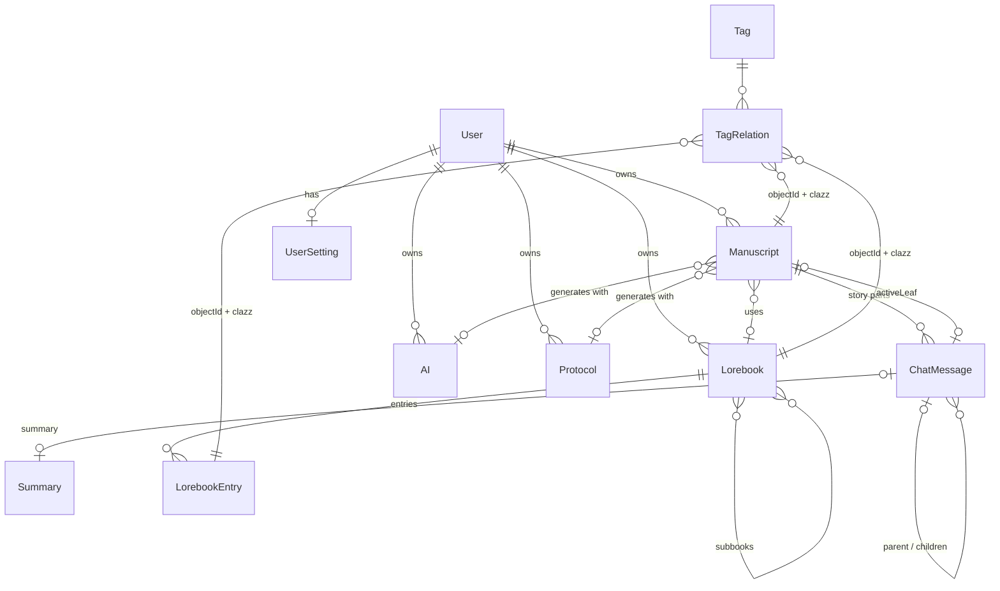
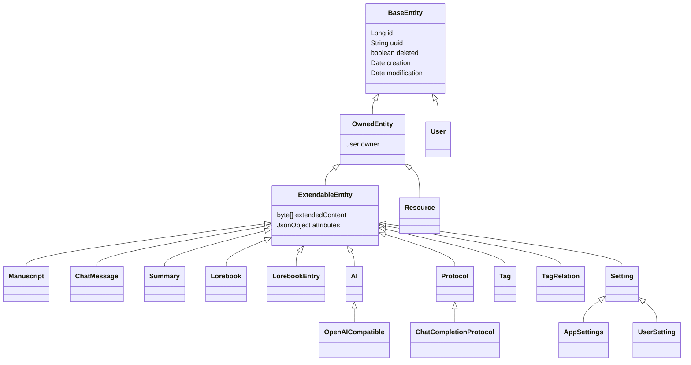
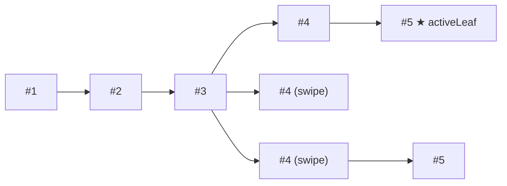

# Domain model

The entities Marginalia stores, how they relate, and the rules every entity follows: identity, ownership, soft
delete, extended attributes and cleanup. Entities are in `domain/model/` (base classes), `domain/model/impl/` and
`domain/security/model/User.java`. How the tables are created and changed is in [Database & migrations](database.md).

## Names in code and UI

Some entities kept their early names. The UI and this manual use the names on the right:

| Class | Table | In the UI |
|---|---|---|
| `Manuscript` | `manuscripts` | Book |
| `ChatMessage` | `messages` | Part (of the story) |
| `Summary` | `summaries` | Summary |
| `Lorebook`, `LorebookEntry` | `lorebooks`, `entries` | Lorebook, entry |
| `AI`, `OpenAICompatible` | `ais`, `ais_openaicompat` | Inference provider |
| `Protocol`, `ChatCompletionProtocol` | `protocols`, `protocols_chatcompletion` | Protocol |
| `Tag`, `TagRelation` | `tags`, `t2e` | Tag |
| `Setting`, `AppSettings`, `UserSetting` | `settings` | Settings page, admin settings |
| `User` | `users` | User |
| `Resource` | `resources` | Resources tab, image attachments of a part (story editor, exports) |

## Overview



Every entity except `User` has an owner, so each user has a separate set of books, lorebooks, providers, protocols
and settings. The relationships between them never cross users: a book can only use the owner's provider, protocol
and lorebook.

## Base classes



### `BaseEntity` - identity and soft delete

| Field | Column | |
|---|---|---|
| `id` | `id` | Database key, generated by Hibernate (`GenerationType.AUTO`, a `<table>_SEQ` table per hierarchy). Used for relations and inside one installation only. |
| `uuid` | `uuid` (unique) | Stable identity, set on the first save. Used wherever an entity leaves the database or must be found again: URLs (`/view/<uuid>`), backups, exports, imports, extension data. |
| `deleted` | `is_deleted` | Soft delete flag. |
| `creation`, `modification` | | Set by the repository on save. Siblings in the story tree are ordered by `creation`. |

`equals` and `hashCode` use the `id`, so don't put unsaved entities into hash-based collections.

**Soft delete.** `delete(entity, false)` - the normal delete - only sets `deleted = true`. All finder queries skip
deleted rows, so to the application the entity is gone, but the row stays and other rows can still point at it. The
administrator's *Cleanup* page later purges deleted rows that nothing needs any more (see [Cleanup references](#cleanup-references)).
`delete(entity, true)` removes the row right away; it is used where nothing can reference the row, e.g. replaced
messages during a backup restore.

### `OwnedEntity` - ownership

`owner` (column `userId`) is the user the entity belongs to; `null` for installation-wide rows (`AppSettings`).
`OwnedServiceImpl.save` fills it with the current user when a new entity has no owner. Lookups that start from
user input go through the owner-aware finders:

| Method | Returns |
|---|---|
| `findAllForUser()`, `findAllIdsForUser()` | Non-deleted entities of the current user. |
| `findForUser(uuid)` | The entity with this uuid if it belongs to the current user and isn't deleted, otherwise `null`. |
| `find(id)` | Any entity, regardless of owner and `deleted` - only for ids taken from the user's own data. |

### `ExtendableEntity` - extended attributes

Most of an entity's data is not in table columns but in one JSON document stored in the `extendedContent` blob. Two
kinds of fields end up there:

- fields annotated `@ExtendedAttribute` (they are also `@Transient`, so Hibernate ignores them), and
- `attributes`, a free-form `JsonObject` for extensions. Its keys are stored with the prefix `attributes_` next to
  the other fields.

```json
{
  "instructions": "Mara finds the lighthouse logbook.",
  "response": "The logbook was heavier than she expected...",
  "modelUsed": "gpt-4.1",
  "request": "2026.10.08Z14:03:11.512",
  "attributes_reviewer": { "reviews": [ ... ] }
}
```

`ExtendableEntityListener` converts between the fields and the document:

- **Load** (`@PostLoad`): the JSON is parsed and the fields are set. Supported field types are `String`, numbers,
  `Boolean`, `Date` (ISO-8601 instant in UTC, e.g. `2026-10-09T08:15:30.123Z`; values in the old `yyyy.MM.dd'Z'HH:mm:ss.SSS` format, written in the server's time zone, are still read), enums (by name) and `JsonObject` for `inject = true`.
- **Types**: the values are written with `toString()`, so a field can't be a collection. A list is kept as a JSON string
  in a `String` field with typed accessors, like `ChatMessage.imageAttachments` (`getImages()` / `setImages(...)`, a JSON
  array of `ImageAttachment(resource uuid, caption)`).
- **Save**: `JpaExtendableRepository.save` serializes the fields into `extendedContent` before the entity is written.

Because the fields are `@Transient`, Hibernate's dirty checking doesn't see them. **A change to an extended attribute
is only stored by calling the service's `save`.** Changing it on a managed entity and letting the transaction commit
does nothing.

`saveWithoutEvent` writes `extendedContent` as it is, without serializing the fields first. It is used when
`extendedContent` was set directly - copying the JSON of a backup into a restored entity - and must not be overwritten
by the (empty) fields.

Why most fields live in JSON:

- Adding or removing a field needs no database migration.
- Extensions can store data on any entity (`getAttributes().add("myplugin", ...)`) without their own tables.
- Book backups copy `extendedContent` as a whole, so extension data and new fields of books and parts travel with
  them (lorebook exports don't, see [Backups and copies](#backups-and-copies)).

The price is that extended attributes can't be queried or indexed in SQL. Anything the application filters, sorts or
joins on is a real column: relations, `name`, `enabled`, `ordinal`, `published`, `lastOpened`, `tokenCount`,
`wordCount`...

## Books and the story

### `Manuscript` (book)

| Field | Stored | |
|---|---|---|
| `name` | column | Title. |
| `description` | column and JSON | Description shown in the book list (it is both a column and an extended attribute; the JSON value wins on load). |
| `ai`, `protocol` | FK columns | Inference provider and protocol used for generation. |
| `lorebook` | FK column | The book's lorebook (with its sub-lorebooks). |
| `activeLeaf` | FK column | The last part of the branch currently shown and continued. |
| `published` | column | Readable by everyone at `/view/<uuid>`. |
| `lastOpened` | column | When the owner last opened the book; orders the book lists. |
| `template`, `pov`, `tense`, `style`, `userPrompt`, `summaryPrompt`, `metaSummaryPrompt` | JSON | The book's prompt overrides (*Prompts* tab); empty means the user's defaults from `UserSetting`, then `Defaults`. |
| `language` | JSON | Language of the story (`Language`, English when not set): the `lang` of the story views, which the browser uses for hyphenation and justification, and the language of the exports. |
| `showBookStyles` | JSON | Story display option. |
| `backupStrategy`, `backupStrategyValue`, `backupStrategyCurrentValue` | JSON | Per-book backup override and its progress counter. |

Tags of a book are `TagRelation`s (see [Tags](#tags)).

### `ChatMessage` (part) and the story tree

The story is a **tree** of parts. Each part points to its `parent` (`null` for the first part) and to its book
(`parentScript`). The book's `activeLeaf` selects one path from the root - the branch the user sees.



| Action in the UI | In the tree |
|---|---|
| Generate the next part | New child of the active leaf, which becomes the new active leaf. |
| Swipe | New sibling of the last part (another child of its parent). Moving between swipes sets `activeLeaf` to the deepest last descendant of the chosen sibling (`ChatMessageService.swipeTo`). |
| Regenerate | Replaces the text of the last part in place. |
| Branch story | Copies a part as a new sibling (`ChatMessageService.branch`), so the story can continue differently from there. |
| Delete a part | Its children are re-attached to its parent, then it is deleted (`deleteNodeAndMigrateChildren`). |

Siblings are ordered by `creation`. The branch from the root to a leaf is read with a recursive SQL query
(`JpaChatMessageRepository.findBranchFromLeaf`).

| Field | Stored | |
|---|---|---|
| `parent`, `parentScript` | FK columns | Tree position and book. |
| `summary` | FK column | Summary covering this part and the parts before it (see below). |
| `tokenCount`, `wordCount` | columns | Size of the text, summed for the book statistics. |
| `edited` | column | The user edited the generated text. |
| `response` | JSON | The text of the part. |
| `responseReasoning` | JSON | Reasoning of a reasoning model. |
| `instructions`, `sceneSetting`, `povCharacter`, `presentCharacters` | JSON | The instruction panel it was generated from (`TurnInput`). |
| `builtPrompt`, `builtPromptTokens`, `backgroundLore` | JSON | The full prompt sent to the model and the activated lore (*View prompt*). |
| `modelUsed`, `protocolUsed`, `promptTokens`, `tokenReasoningCount` | JSON | Generation metadata. |
| `request`, `ttft`, `reasoningEnd` | JSON | Timestamps for the timing metrics. |
| `scrollPosition` | JSON | UI state. |

Template variables are stored when a part is generated (`GenerateNewMessageStep`): local ones (`setvar`), which
follow the branch, in the new part's `attributes`, global ones (`setglobalvar`) in the book's `attributes`.

### `Summary`

A summary belongs to one part and covers that part and all earlier parts back to the previous part with a summary
(see [Summaries](../user/books/summaries.md)). A **meta summary** (`summaryType` = `META_SUMMARY`) stands in for a
range of summaries: it is stored on the part of the newest of them, in place of the summary that part had.

| Field | |
|---|---|
| `summary`, `summaryTokens` | The text and its size. |
| `reasoning`, `reasoningTokens` | Reasoning of a reasoning model. |
| `summaryMessageHash` | SHA-512 of the **block** the summary stands for, see [below](#the-summary-chain). When the story in it changes (edit, regenerate), the hash no longer matches and the generation drops the summary as outdated. |
| `summaryType` | `SummaryType`: `SUMMARY` or `META_SUMMARY`. Missing (null) in data from before meta summaries, `getSummaryType()` returns `SUMMARY` then. |
| `nextSummaryUuid` | Meta summary only: `uuid` of the summary where the merged summaries end, the chain continues with it. `null`: the meta summary reaches back to the root. |
| `replacedSummary` | Meta summary only: the extended content (JSON, as `ExtendableEntityListener` writes it) of the summary the meta summary replaced on its part. Deleting the meta summary can restore it. |

All of them are `@ExtendedAttribute` fields, so no migration was needed and they travel with backups.

A summary is owned by its part (`@CleanupReference(OWNS)`); branching a part copies its summary (all of the fields
above).

#### The summary chain

The summaries of a branch are walked from the newest part to the root (`SummaryService.collectBlocks`; the generation,
the invalidation check and the overview all use it):

- A part with a summary starts a **block**: the part and the parts after it (older), up to the next block.
- After a meta summary the summaries are skipped (they belong to its block) until the one whose `uuid` is its
  `nextSummaryUuid`, which starts the next block. The meta summary block's hash includes the text of the skipped
  summaries.
- The hash of a block is SHA-512 over, part by part: the text of the part, and the text of the summary of the part if
  it has one - except for the head of the block, whose own summary is what the hash checks (it didn't exist yet when
  the hash was made). A normal block has no other summaries in it, so its hash is that of the texts only.

Deleting a meta summary (`SummaryService.removeSummary(part, unwind)`) with `unwind` restores the summary from
`replacedSummary`: it is deserialized into a new `Summary`. Because that summary can be a meta summary with its own
`replacedSummary`, unwinding nests. A meta summary takes over the `uuid` of the summary it replaces
(`attachMetaSummary`), and the restored summary gets it back, so the `nextSummaryUuid` of other meta summaries stays
valid. Restoring a backup creates all summaries with new `uuid`s, so `ManuscriptServiceImpl.restoreMessages` rewrites
the `nextSummaryUuid` of the restored meta summaries (also inside `replacedSummary`) to the new ones.

## Lorebooks

### `Lorebook`

| Field | |
|---|---|
| `name`, `enabled` | Columns. A disabled lorebook contributes nothing. |
| `subbooks` | Other lorebooks included in this one (join table `lorebooks_lorebooks`). A lorebook can be a sub-lorebook of several lorebooks. |
| `cachedEntries` | Transient; filled by `LorebookService.fillEntries` for generation and the editor. |

### `LorebookEntry`

| Field | Stored | |
|---|---|---|
| `lorebook` | FK column | |
| `name`, `enabled`, `ordinal` | columns | `ordinal` orders the entries in the prompt. |
| `payload` | JSON | The lore text (a template). |
| `comment` | JSON | Note for the author, never sent. |
| `filtering`, `filteringMode` | JSON | Activation filter: text to find, or a regular expression (`FilteringMode.TEXT` / `REGEX`). |
| `insertionMode` | JSON | `IN_LORE_BLOCK` or `BEFORE_USER_PROMPT`. |
| `cachedTags`, `cachedNegativeTags` | transient | Filled by `fillEntries`: the entry's tags plus the tags of its lorebook, and the entry's negative tags. |

How entries are activated is described in [Lorebooks](../user/lorebooks/entries.md) and
[Generation pipeline](generation-pipeline.md).

## Tags

`Tag` is a value (`value`) owned by a user. `TagRelation` (table `t2e`) attaches a tag to any entity:

| Field | |
|---|---|
| `tag` | The tag. |
| `objectId`, `clazz` | The tagged entity: its id and its fully qualified class name. |
| `negative` | A negative tag (lorebook entries: the entry is *not* activated when the book has this tag). |

Books, lorebooks and lorebook entries are tagged. `TagRelationService` creates and removes relations and finds the
tags of an object (`getTagsForObject(entity)`, `getTagsForObject(entity, true)` for negative ones). Because the
relation is polymorphic, there is no foreign key from `t2e` to the tagged table; cleanup follows `objectId` / `clazz`
through `@CleanupReference(targetClassField = "clazz")`.

## Inference providers and protocols

Both use joined inheritance: a base table with the common fields and one table per type. Today each has one type.

### `AI` / `OpenAICompatible` (inference provider)

| Field | Stored | |
|---|---|---|
| `aiType` | column (ordinal) | `AIType.OPEN_AI_COMPATIBLE`. `InferenceServices` picks the implementation by this type. |
| `name` | column | |
| `maxContext`, `maxCompletionTokens` | columns | Context size and maximum response tokens of the model. |
| `enabledReasoning`, `reasoningEffort` | columns | Reasoning settings. |
| `needsJailbreak`, `jailbreak` | columns | Text put before the system prompt. |
| `uri`, `model`, `modelName`, `apiKey` | columns (`ais_openaicompat`) | Base URL, the model id sent to the API, its label in the model list, the API key (encrypted, see [Encrypted columns](database.md#encrypted-columns)). |
| `additionalParameters` | JSON (`additionalParameters_*`) | Extra fields added to every request; they win over the protocol's settings. |

### `Protocol` / `ChatCompletionProtocol`

| Field | Stored | |
|---|---|---|
| `name`, `protocolType` | columns | `ProtocolType.CHAT_COMPLETION`. |
| `maxTokens`, `replyTokens` | columns | Optional overrides of the provider's context and response limits; `null` = use the provider's (`TokenLimits`). |
| `temperature`, `topP`, `frequencyPenalty`, `presencePenalty` and their `...Enabled` flags | JSON | Sampling settings; a disabled setting is not sent. |

!!!warning Enum columns
`AI.aiType` and `Protocol.protocolType` are stored as **ordinals**: add new values only at the end of `AIType` and
`ProtocolType`, never reorder them. All other enums (`AI.reasoningEffort` as a column, `FilteringMode`,
`InsertionMode` and `BackupStrategy` in the JSON) are stored by **name**: renaming a value breaks existing data.
!!!

## Settings

`Setting` is one table (`settings`) for all settings classes, with the class name in `DTYPE` and in `key`. Almost all
values are extended attributes.

| Class | Owner | Contains |
|---|---|---|
| `AppSettings` | none (one per installation) | Data versions (`dbVersion`, `appVersion`), the database backup schedule (`backupScheduleEnabled`, `backupSchedule`, `backupKeep`, `lastScheduledBackup`, `backupScheduleChanged`). |
| `UserSetting` | each user | Default model and protocol (ids, `@CleanupReference(WEAK)`), default prompts (`masterTemplate`, `defaultPov`, `defaultTense`, `defaultStyle`, `defaultUserPrompt`, `defaultSummaryPrompt`, `defaultMetaSummaryPrompt`), default book backup strategy. |

`SettingService.getOrCreate(UserSetting.class)` returns the current user's settings, creating them on first use;
`getOrCreateApp(AppSettings.class)` the installation's. Extensions keep their settings in the `attributes` of
`UserSetting` (Reviewer and Side Query profiles do).

The prompt used for a book is resolved in three levels: the book's value (`Manuscript.template`...), else the user's
default (`UserSetting.masterTemplate`...), else the built-in default (`Defaults`).

## Users

`User` extends `BaseEntity` directly - it has no owner and no extended attributes.

| Field | |
|---|---|
| `login` | Unique login name. |
| `fullName` | Display name. |
| `passwordHash` | Password hash (`UserServiceImpl`). |
| `savedLogins` | The *Save login* tokens as text, one `identifier;hashedSecret;created;lastAccess` entry per login, separated by `\|` (`PersistedLoginInfo`, read and written by `UserServiceImpl`). |
| `isAdmin` | Administrator. |
| `failedLogins`, `lockedUntil` | Login back-off: consecutive failed logins and the time (epoch milliseconds, `0` = not locked) until which the account refuses logins. Real columns (V7), reset by a successful login, a password change or clear and the administrator's unlock. |

The current user of a session is the session-scoped `user` bean (see [Architecture](architecture.md#spring-wiring)),
which holds a copy of the logged-in user's id, login and name - load the entity through `UserService` when you need
more.

## Resources

`Resource` (`resources`, an `OwnedEntity`) is an uploaded file; today the files are the images attached to parts
(`ChatMessage.getImages()`, see [Extended attributes](#extendableentity---extended-attributes)).

| Field | |
|---|---|
| `path` | File name in the user's `images` folder (images) or `resources` folder (other files) of the data folder. The files are stored by content: uploading the same bytes again reuses the file. |
| `hash` | Hash of the content; with the owner it is the key for that deduplication (`ix_resources_user_hash`). |
| `mimeType`, `originalName` | Detected content type and the name the file was uploaded with. |
| `objectId`, `clazz` | Loose link to the object that uses the file (class name and id, like `TagRelation`). Bookkeeping for the Resources tab only - not a cleanup reference, the object may be gone. |

Deleting a resource is a soft delete like any other; files are never deleted from disk.

## Cleanup references

Soft-deleted rows are purged by `CleanupService` (*Admin → Cleanup*). Before purging, it builds a graph of all
references between rows and decides what may go. Each reference has a policy (`@CleanupReference`, in
`domain/traits/`):

| Policy | Meaning | Used for |
|---|---|---|
| `STRONG` (default) | The referenced row can't be purged while the reference exists. | `Manuscript.ai`, `.protocol`, `.lorebook`, `.activeLeaf` |
| `OWNED_BY` | The referencing row belongs to the referenced one and is purged with it. | `ChatMessage.parentScript`, `.parent`; `LorebookEntry.lorebook`; `TagRelation.tag`, `.objectId`; every `owner` |
| `OWNS` | The referenced row belongs to the referencing one and is purged with it, unless referenced elsewhere. | `ChatMessage.summary` |
| `WEAK` | The reference doesn't block the purge; it is cleared when the referenced row goes. | `Lorebook.subbooks`, `UserSetting.defaultModel`, `.defaultProtocol` |

JPA associations are found automatically from the Hibernate metamodel and default to `STRONG`. Plain id fields
pointing to other entities ("soft references", including extended attributes) are only seen when annotated with
`target = SomeEntity.class` or, for polymorphic ones, `targetClassField = "clazz"`. On an entity class,
`field = "..."` sets the policy of an inherited field (`OwnedEntity` makes `owner` `OWNED_BY`, so a deleted user
is purged together with everything they own).

So a deleted provider that a book still uses shows up as *blocked* on the Cleanup page until the book is switched to
another provider, while a deleted book takes its parts, their summaries and its tag relations with it.

## Backups and copies

Book backups (`BackupService`) serialize a book as JSON: its columns, its `extendedContent` as is, its tags, all
parts (with `extendedContent` and summaries) and references to its provider, protocol and lorebook by uuid and name.
Restoring or cloning creates new rows (new ids and uuids for the parts) and copies `extendedContent` unchanged, so
extended attributes and extension data come back exactly as they were. Linked entities are resolved among the
current user's own entities, first by uuid, then by name.

Lorebooks are different: lorebook exports (`LorebookServiceImpl.exportLorebook`) and the lorebooks stored inside book
backups list their fields one by one (`name`, `payload`, `comment`, `filtering`...), so the `attributes` of lorebooks
and entries - extension data such as the Lorebook VCS history - are **not** included.

Keep this in mind when adding data: for books and parts anything in `extendedContent` is backed up automatically,
while a new column has to be added to the backup and restore code (`BackupServiceImpl`,
`ManuscriptServiceImpl.restoreBackup` / `restoreMessages`); a new lorebook or entry field has to be added to the
export and import code in either case.

## Adding a field or an entity

**A field on an existing entity:**

1. Decide where it lives. Prefer an extended attribute (`@ExtendedAttribute @Transient`) - no migration, backed up
   automatically. Use a column only when you need to query, sort or join on it.
2. For a column: add a Flyway migration (see [Database & migrations](database.md)); Hibernate validates the schema on
   start. Extend the backup / restore code if the value should survive a backup.
3. For a reference to another entity: think about its cleanup policy and annotate it if `STRONG` isn't right.
   Soft references (ids) must be annotated with `target` or `targetClassField`, otherwise cleanup may purge the
   referenced row.
4. Save it through the service's `save` (not `saveWithoutEvent`).

**A new entity:**

1. Extend `ExtendableEntity` (or `OwnedEntity` if it never needs extended data) and annotate the references.
2. List the class in `src/main/webapp/config/persistence.xml` - unlisted classes are ignored.
3. Write a Flyway migration creating the table, its `<table>_SEQ` table and indexes.
4. Add a repository (`JpaExtendableRepository` subclass) and a service (`ExtendableServiceImpl` subclass), and
   define both beans in `services-config.xml`.
5. Add a CRUD test based on `ExtendableCrudContract` (see [Testing](testing.md)).
6. Decide whether it belongs in book backups or lorebook exports.
