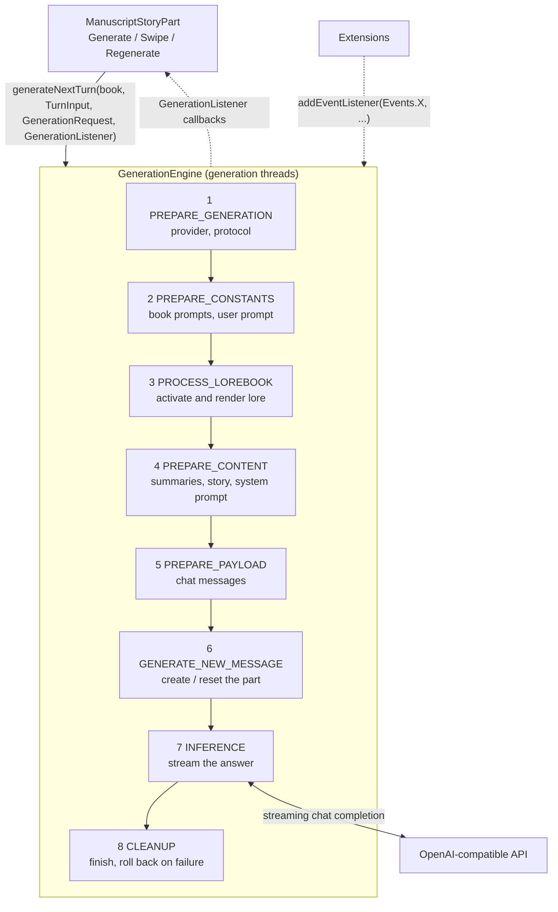
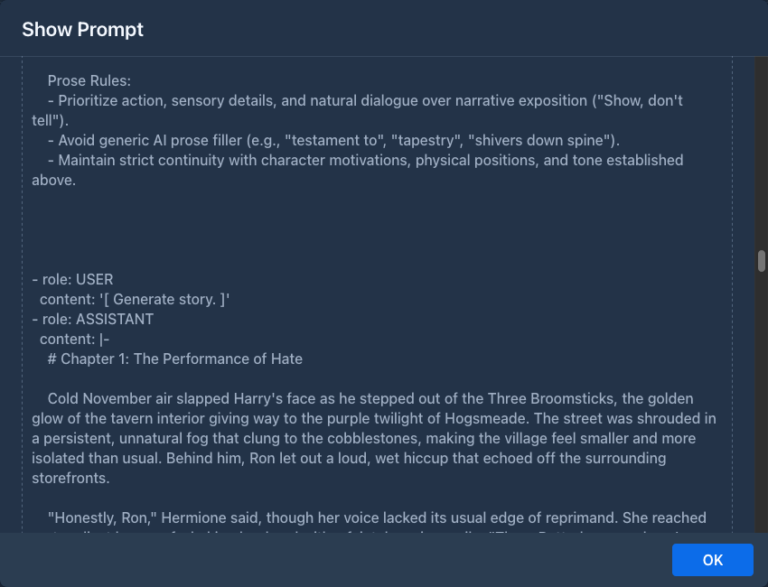

# Generation pipeline

How Marginalia turns the instruction panel into a new story part: the steps that build the prompt, how the prompt is
fitted into the model's context, how the answer is streamed into the part, and the events extensions can use to change
any of it. The code is in `domain/service/impl/StoryGenerationServiceImpl.java` and
`domain/service/impl/generation/`.

## Overview



The steps always run in this order. Any step can jump straight to `CLEANUP` (on an error, a validation problem or
cancellation), and `CLEANUP` always runs last.

## Starting a generation

```java
CancellationToken token = storyGenerationService.generateNextTurn(
        manuscript,                                  // the book
        new TurnInput(scene, povCharacter, presentCharacters, instructions),
        GenerationRequest.newMessage(),              // or newSwipe(part), regenerate(part)
        listener);                                   // GenerationListener - UI callbacks
```

`generateNextTurn` is `@NoTx` and returns immediately with a `CancellationToken`; `token.cancel()` stops the
generation. It must be called on a thread with a request (the UI thread): it captures the session in
`ThreadCopyRequestAttributes` so the steps run as the user who started the generation (see
[The current user](services.md#the-current-user)).

| `GenerationRequest` | `requestType` | Meaning |
|---|---|---|
| `newMessage()` | `NEW_MESSAGE` | Add a part after the book's active leaf. |
| `regenerate(part)` | `REGENERATE` | Write the given part (the last one) again, in place. |
| `newSwipe(part)` | `SWIPE` | Write another version of a part as its sibling. |

`TurnInput` holds the four fields of the instruction panel: `sceneSetting`, `povCharacter`, `presentCharacters`,
`instructions`.

## The engine

`StoryGenerationServiceImpl` holds the installed steps (from `services-config.xml`, one per `GenerationStepType`) and
a cached thread pool (threads named `Generation thread NNN`). Each call creates a `GenerationEngine`, which implements
`GenerationController` - the object every step works with:

| Controller member | |
|---|---|
| `getManuscript()` / `setManuscript()` | The book; steps replace it with the saved copy after changes. |
| `getInput()`, `getRequest()` | The `TurnInput` and `GenerationRequest`. |
| `getPrePromptData()` | `PrePromptData` - the prompts collected so far (see [Prompt data](#prompt-data)). |
| `getPayload()` | The chat messages sent to the model (from `PREPARE_PAYLOAD`). |
| `getMessage()` | The part being generated (from `GENERATE_NEW_MESSAGE`). |
| `getProperties()` | Shared map for everything else, keys in `GenerationProperties`. |
| `getState()` | `NOT_SUCCESSFUL` → `PARTIAL_SUCCESS` (first response text arrived) → `SUCCESSFUL` (answer complete). |
| `getUIListener()` | The `GenerationListener` of the caller. |
| `next()`, `jumpTo(type)` | Continue with the next step, or jump (usually to `CLEANUP`). |
| `emitEvent(event, continuation)` | Run the listeners of an event, then the continuation. |

### Continuation style

The engine never blocks a thread while it waits - for event listeners, for a question to the user or for the model.
Every step is written as a chain of callbacks: it emits an event and passes the rest of its work as the
continuation, which the engine runs on a pool thread once all listeners are done:

```java
protected void onStep(GenerationController controller) throws Exception {
    controller.emitEvent(Events.BEFORE_PREPARE_PAYLOAD, () -> {
        // ... build the payload ...
        controller.setPayload(payload);
        controller.emitEvent(Events.AFTER_PREPARE_PAYLOAD, controller::next);
    });
}
```

`GenerationStepBase` wraps each step: it enters the user's request scope, checks for cancellation and interruption,
and turns any exception into `listener.onError(e)` plus a jump to `CLEANUP`. Continuations are wrapped the same way.
`forEachAsync` iterates a list in this style (used for lorebook entries, which emit an event each).

## The steps

### 1. `PREPARE_GENERATION` - `PrepareForGenerationStep`

Loads the book's inference provider (`AI`) and protocol and checks that both are set and that `InferenceServices` has
an implementation for the provider type. Otherwise the user gets *Book is missing model.* / *Book is missing protocol.* and the
generation ends.

Events: `BEFORE_PREPARE_GENERATION`, `AFTER_PREPARE_GENERATION`.

### 2. `PREPARE_CONSTANTS` - `PrepareConstantsStep`

Fills a new `PrePromptData` with the parts of the prompt that don't depend on the story:

- the provider's jailbreak (if *Needs Jailbreak* is on) and its token count,
- the book's effective prompts - master template, POV, tense, style, user prompt - each resolved book → user settings
  → `Defaults` by `ManuscriptService`.

After `AFTER_STATIC_TEMPLATE_DATA` (where listeners may replace any of these), it renders the **user prompt** template
with `UserPromptData` (the four `TurnInput` fields) into `userPromptProcessed` and counts its tokens. The first
template rendering creates the generation's `TemplateContext` (see [Template context](#template-context)).

Events: `BEFORE_PREPARE_CONSTANT_DATA`, `AFTER_STATIC_TEMPLATE_DATA`, `AFTER_PREPARE_CONSTANT_DATA`.

### 3. `PROCESS_LOREBOOK` - `ProcessLorebookStep`

Skipped when the book has no lorebook. Otherwise:

1. **Collect lorebooks**: the book's lorebook and, breadth-first, all its sub-lorebooks. Deleted and disabled
   lorebooks are skipped together with their sub-lorebooks; each lorebook is used once, so cycles are harmless. Each
   is loaded with `LorebookService.fillEntries` (entries with their effective tags) and detached.
2. **Order entries** of all collected lorebooks by `ordinal` (ascending), then by creation time.
3. **Activate** each entry - an entry is active when all of these hold:

   | Check | Rule |
   |---|---|
   | enabled | `entry.enabled` |
   | negative tags | none of the entry's negative tags is a tag of the book |
   | tags | the entry has no tags, or one of them is a tag of the book (the entry's tags include the tags of its lorebook) |
   | filter | no filter, or the filter matches the **rendered user prompt**: `TEXT` - case-insensitive substring; `REGEX` - case-insensitive `find()` (`DOTALL`); an invalid regex never matches |

4. **Render** the active entries' payloads as templates with one shared `LorebookTemplateData` - so variables set in
   one entry are visible in the following ones. A payload that fails to render is used as it is.
5. **Insert**: payloads with `IN_LORE_BLOCK` are joined into `backgroundLore` (the master template's
   `{{backgroundLore}}`); payloads with `BEFORE_USER_PROMPT` are joined into `backgroundUserLore` and put in front of
   the user prompt.

Events: `BEFORE_PROCESS_LOREBOOK`, `PROCESS_LOREBOOKS` (the list in `LOREBOOKS` can be changed),
`PROCESS_LOREBOOK_ENTRY` (once per entry, `LOREBOOK_ENTRY`), `PROCESS_ACTIVATED_ENTRIES` (`ACTIVATED_LOREBOOK_ENTRIES`
can be changed), `AFTER_PROCESS_LOREBOOK`.

### 4. `PREPARE_CONTENT` - `PrepareContentStep`

Decides which part of the story goes into the prompt and renders the system prompt.

**Summaries.** The branch from the root to the active leaf is read, and the summaries on it are collected (oldest
first) into `SUMMARIES` with `SummaryService.collectBlocks`: a meta summary replaces the summaries it merged, which are
skipped, see [the summary chain](domain-model.md#the-summary-chain). Each summary stores a hash of the story it covers;
when that was changed since, the summary is removed (a meta summary is unwound to the summary it replaced, which is
checked in turn) and the user is asked whether to continue without it (`listener.askQuestion`). The newest part
with a summary is the **stop part**: it and everything before it is represented by the summaries.

**Token budget.** With `TokenLimits`:

```
limit      = context tokens − response tokens        (protocol overrides, else provider limits)
baseTokens = system template rendered with lore and summaries (no story)
           + jailbreak + rendered user prompt + 100
reserved   = PrePromptData.reservedTokens            (set by extensions, 0 by default)
```

If `baseTokens + reserved ≥ limit`, the generation stops with *Contextual limit not sufficient.* Otherwise parts are taken from the
newest backwards - skipping the part being regenerated, stopping at the stop part - starting from
`baseTokens + reserved` and counting each part as its `tokenCount + 100`. A part is added only if the running total with it stays within `limit − 256`; the first part that
doesn't fit ends the loop. The chosen texts, oldest first, become `MANUSCRIPT_CHRONICLE`.

**System prompt.** The master template is rendered with `MasterTemplateData` (`backgroundLore`, `summaries`,
`narrativePov`, `narrativeTense`, `style` + the template context) into `systemPrompt`. The estimate above renders it
with a *fork* of the template context, so macros that change variables don't run twice.

Events: `BEFORE_PREPARE_CONTENT`, `BEFORE_SUMMARIES` (`SUMMARIES` can be changed), `AFTER_MANUSCRIPT_CONCATENATION`
(`MANUSCRIPT_CHRONICLE` can be changed), `AFTER_PREPARE_CONTENT`.

### 5. `PREPARE_PAYLOAD` - `PreparePayloadStep`

Builds the chat completion messages:

```
system     jailbreak + "\n\n" + system prompt           (master template)
user       [ Generate story. ]
assistant  <oldest part in the chronicle>
user       [ Generate more story. ]
assistant  <next part>
...
user       lore before user prompt + "\n\n" + rendered user prompt
```

Earlier parts are sent as the model's own previous answers, each preceded by a short placeholder user turn. The final
user message carries the instructions. Only the text of the parts is sent: the images attached to a part are not part of
it and the model never sees them.

The payload is stored in the part (`builtPrompt`) and can be inspected in the story editor with *View prompt*:



Events: `BEFORE_PREPARE_PAYLOAD`, `AFTER_PREPARE_PAYLOAD` (the payload can be changed; what is set here is what is
sent).

### 6. `GENERATE_NEW_MESSAGE` - `GenerateNewMessageStep`

Prepares the part that receives the answer:

| Request | Part |
|---|---|
| `NEW_MESSAGE` | A new part, child of the active leaf (or the first part of the book). |
| `SWIPE` | A new part, sibling of the swiped one. |
| `REGENERATE` | The existing part, cleared. A full copy of it as it was (`ChatMessage.copyOf`, attributes deep copied) is kept in the `ORIGINAL_MESSAGE` property first. |

The part gets the `TurnInput`, the model and protocol names, the payload as JSON (`builtPrompt`, shown by *View
prompt*), the activated lore and the request time. The template variables of the generation are stored: local ones in
the part's `attributes`, global ones in the book's. The part becomes the book's active leaf, both are saved
and `listener.onNodeCreated(part)` lets the UI show it. The state stays `NOT_SUCCESSFUL` - until text arrives, the
part is only a placeholder that cleanup removes or restores.

Events: `BEFORE_GENERATE_NEW_MESSAGE`, `AFTER_GENERATE_NEW_MESSAGE` (the part is available as `getMessage()`).

### 7. `INFERENCE` - `InferenceStep`

Counts the prompt tokens, then calls `InferenceService.stream(payload, protocol, callback)`. For each chunk:

- **reasoning** chunks are appended to `responseReasoning` (`REASONING_CHUNK_RECEIVED`, the text in
  `REASONING_CHUNK`),
- **response** chunks are appended to `response`, with approximate token and word counts (`CHUNK_RECEIVED`, the text
  in `CHUNK`),
- the first chunk sets the time to first token, the first response chunk the end of reasoning,
- the part and the book are saved and the UI gets `onReasoningChunk` / `onResponseChunk` and `onMetricsUpdated`,
- once the response has some non-blank text, the state becomes `PARTIAL_SUCCESS` (reasoning alone doesn't count).

Listeners of the chunk events can change the chunk text before it is appended. The stream is pulled: the inference
service delivers the next chunk only after the step calls `continueInference()`, so a slow listener slows the stream
down instead of piling up chunks.

On completion the exact token counts are computed, the state becomes `SUCCESSFUL` (`AFTER_INFERENCE`) and the engine
moves to `CLEANUP`. An error is reported with `onError` and goes to `CLEANUP`.

### 8. `CLEANUP` - `CleanupStep`

Always the last step. Depending on the state:

| State | What happens |
|---|---|
| `SUCCESSFUL` | `onComplete(part)`. |
| `PARTIAL_SUCCESS` | The part keeps the text that arrived (stopped or failed mid-stream): `onCancelled(part)`. |
| `NOT_SUCCESSFUL`, no part yet | `onCancelled(null)`. |
| `NOT_SUCCESSFUL`, part exists (no text arrived) | New part: the book's active leaf goes back to its parent, the part is deleted (children moved to its parent), `onCancelled(null)`. Swipe: the swiped version becomes active again, the new sibling is deleted, `onCancelled(previous)`. Regenerate: every value of the part is restored from `ORIGINAL_MESSAGE` (`loadFrom`, attributes included), `onCancelled(part)`. |

Event: `BEFORE_CLEANUP`.

## Prompt data

`PrePromptData` (`generation/dto/`) collects the prompt as the steps build it:

| Field | Set in | |
|---|---|---|
| `jailbreak`, `jailbreakTokens` | `PREPARE_CONSTANTS` | |
| `generalTemplate`, `pov`, `tense`, `style`, `userPrompt` | `PREPARE_CONSTANTS` | Effective templates and values of the book. |
| `userPromptProcessed`, `userPromptProcessedTokens` | `PREPARE_CONSTANTS`, extended in `PROCESS_LOREBOOK` | Rendered user prompt, with the before-user-prompt lore in front. |
| `backgroundLore`, `backgroundLoreTokens` | `PROCESS_LOREBOOK` | Lore for the master template. |
| `backgroundUserLore`, `backgroundUserLoreTokens` | `PROCESS_LOREBOOK` | Lore put before the user prompt. |
| `systemPrompt`, `systemPromptTokens` | `PREPARE_CONTENT` | Rendered master template. |
| `reservedTokens` | extensions, up to `BEFORE_SUMMARIES` | Room for text extensions add to the prompt later (e.g. a message inserted into the payload); taken from the room for the story. Add to it, don't overwrite it. See [Generation events](plugins/generation-events.md#reserving-tokens). |

## Template context

All templates of one generation - user prompt, lorebook entries, master template - share one `TemplateContext`
(`GenerationProperties.TEMPLATE_CONTEXT`), created by `GenerationStepBase.getTemplateContext` on first use. It holds
what the macros read: the `TurnInput` fields, POV / tense / style, the book's name and description, the model name and
token limits, the generation type (`normal`, `regenerate`, `swipe`), the story so far (`{{lastMessage}}`...), the last
instructions and time, the latest summary, and the variables - local ones loaded from the last part of the branch,
global ones from the book. Because it is shared, a variable set in the user prompt is visible in lore entries and the
master template. See [Templating & macros](templating.md).

## Events for extensions

Extensions hook into generation by registering listeners:

```java
Registration registration = storyGenerationService.addEventListener(Events.PROCESS_ACTIVATED_ENTRIES,
        (event, chain) -> {
            try {
                List<LorebookEntry> active = event.getProperty(GenerationProperties.ACTIVATED_LOREBOOK_ENTRIES);
                active.removeIf(entry -> entry.getName().startsWith("[off]"));
            } finally {
                chain.next();                 // always - otherwise the generation never continues
            }
        });

// in onExtensionUnload
registration.unregister();
```

Rules:

- **Call `chain.next()` exactly once** in every listener, also when it fails. `chain.terminate()` skips the remaining
  listeners of this event and continues the generation; `event.terminateEvents()` marks the event so the remaining
  listeners are skipped when `next()` is called. A listener that calls neither leaves the generation hanging.
- A listener may call `next()` later, from another thread - for example after an asynchronous request of its own.
- An exception thrown by a listener is logged and the chain continues with the next listener.
- Listeners are **global**: they receive the events of every generation of every user. Use `event.getManuscript()`
  and the current user to decide whether to act, and keep per-generation data in `event.getProperties()` under a key
  prefixed with the extension's package.
- Listeners run on generation threads inside the user's request scope, so services work; UI changes need
  `ui.access(...)`.
- Unregister on unload - registrations are not removed automatically.

The bundled Author's Note plugin is a complete example: it reserves tokens in `BEFORE_PREPARE_CONTENT`
(`PrePromptData.reservedTokens`) and inserts a message into the payload in `AFTER_PREPARE_PAYLOAD`, see
[Generation events](plugins/generation-events.md).

### Events

| Event | Step | Available / changeable |
|---|---|---|
| `BEFORE_PREPARE_GENERATION`, `AFTER_PREPARE_GENERATION` | 1 | book, input, request |
| `BEFORE_PREPARE_CONSTANT_DATA` | 2 | |
| `AFTER_STATIC_TEMPLATE_DATA` | 2 | `PrePromptData` with the book's templates - can be replaced |
| `AFTER_PREPARE_CONSTANT_DATA` | 2 | rendered user prompt, `TEMPLATE_CONTEXT` |
| `BEFORE_PROCESS_LOREBOOK` | 3 | |
| `PROCESS_LOREBOOKS` | 3 | `LOREBOOKS` (read back) |
| `PROCESS_LOREBOOK_ENTRY` | 3 | `LOREBOOK_ENTRY`, once per entry |
| `PROCESS_ACTIVATED_ENTRIES` | 3 | `ACTIVATED_LOREBOOK_ENTRIES` (read back) |
| `AFTER_PROCESS_LOREBOOK` | 3 | `backgroundLore`, `LOREBOOK_TEMPLATE_DATA` |
| `BEFORE_PREPARE_CONTENT` | 4 | `PrePromptData.reservedTokens` - reserve room for text added later |
| `BEFORE_SUMMARIES` | 4 | `SUMMARIES` (read back) |
| `AFTER_MANUSCRIPT_CONCATENATION` | 4 | `MANUSCRIPT_CHRONICLE` (read back) |
| `AFTER_PREPARE_CONTENT` | 4 | `systemPrompt` |
| `BEFORE_PREPARE_PAYLOAD`, `AFTER_PREPARE_PAYLOAD` | 5 | payload (after) - what is set is sent |
| `BEFORE_GENERATE_NEW_MESSAGE`, `AFTER_GENERATE_NEW_MESSAGE` | 6 | the part (after), `ORIGINAL_MESSAGE` for regenerate |
| `BEFORE_INFERENCE` | 7 | |
| `REASONING_CHUNK_RECEIVED`, `CHUNK_RECEIVED` | 7 | `REASONING_CHUNK` / `CHUNK` (read back), per chunk |
| `AFTER_INFERENCE` | 7 | complete part |
| `BEFORE_CLEANUP` | 8 | state |

"Read back" means the step reads the property again after the event, so listeners can replace or modify the value.
`GenerationProperties` documents each key.

## Cancellation and errors

- **Stop** in the UI calls `CancellationToken.cancel()`. Every step, continuation and chunk checks the token and jumps
  to `CLEANUP`, which keeps what was generated so far (`PARTIAL_SUCCESS`) - or, when nothing arrived yet, removes
  the new part or restores the regenerated one, like after an error. Only `CLEANUP` reports the end to the listener.
- **Errors** - an exception in a step or continuation, a failed request - are reported with
  `GenerationListener.onError` and also end in `CLEANUP`. Validation problems (no provider, context too small) use
  `onSimpleError` with a localized message.
- **Questions** - `listener.askQuestion(text, yes, no)` lets a step ask the user and continue in one of two
  continuations (`controller.wrapCallback(...)`); used for invalidated summaries.

## Changing the pipeline

- **Small changes** (prompt wording, lore filtering, post-processing the answer) - an event listener in an extension
  is usually enough; see above.
- **Replacing a step** - `installedSteps` in `services-config.xml` lists one implementation per
  `GenerationStepType`. A replacement must emit the same events and properties, call `next()` / `jumpTo()` exactly
  once per path and set the controller state the later steps expect.
- **A new step** needs a new `GenerationStepType` value at the right position (the order of the enum is the order of
  execution) and an entry in `installedSteps`. Steps without an implementation make the generation report
  *NOT IMPLEMENTED*.

## Testing

`generation/LorebookActivationTest`, `GenerationRequestTest`, `BuiltPromptHistoryTest` (which parts of the story are in
the prompt for a new part, a swipe and a regenerate), `ReservedTokensTest` (`reservedTokens`), `FailedGenerationTest`
(the cleanup rules above) and `MetaSummaryTest` run real generations against `MockLLMServer`, an OpenAI-compatible
fake with scripted answers, and inspect the request the model received (`InferenceCollector`) and the parts that were
stored. `GenerationTestBase` / `GenerationRun` start a generation and
wait for it to finish. See [Testing](testing.md).
