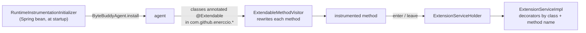

# @Extendable hooks

Most of what a plugin does starts with a **decorator**: an object whose `onMethodEnter` and `onMethodLeave` run
before and after a method of an application class. Any method of a class annotated `@Extendable` can be decorated,
private ones included, and the decorator can read the method's arguments and local variables. This page explains how
that works and how to use it.

## Instrumentation



`RuntimeInstrumentationInitializer` installs a ByteBuddy agent into the running JVM when the Spring context starts.
The agent transforms every class annotated `@Extendable` whose name starts with `com.github.enerccio` - classes
loaded later when they are loaded, classes already loaded by retransformation. Only method bodies change; the class
keeps its fields and methods (`disableClassFormatChanges`), which is what makes retransformation possible.

`ExtendableMethodVisitor` rewrites every method that is not a constructor, not static and not synthetic (lambda
bodies are synthetic). In pseudo-code, an instrumented method looks like this:

```java
ReturnType method(A a, B b) {
    ExtensionService service = ExtensionServiceHolder.getInstance();
    ExtendableMethodContext context = service.createContextHolder(this);
    context.registerMethodArgument("a", a, A.class);           // declared parameter types
    context.registerMethodArgument("b", b, B.class);
    service.onExtendableMethodEnter(DeclaringClass.class, this, context, "method");
    a = (A) <argument "a" from context>;                        // decorators may have replaced it
    b = (B) <argument "b" from context>;
    try {
        ... original body; after every store into an object local variable:
        context.registerLocalVariable("name", value, value.getClass());
        ... before every return:
        service.onExtendableMethodLeave(DeclaringClass.class, this, context, "method", null);
        return result;
    } catch (Throwable t) {
        service.onExtendableMethodLeave(DeclaringClass.class, this, context, "method", t);
        throw t;
    }
}
```

This runs on **every** call, whether a decorator is registered or not. That's why `@Extendable` is on UI classes,
which run at human speed, and not on services or entities.

Names come from the class file: parameter names from the `MethodParameters` attribute (the application is compiled
with `-parameters`), local variable names from the local variable table (`preserveAllLocals`). If either is
missing, arguments are called `arg0`, `arg1`... and locals `var<slot>`.

## Registering a decorator

```java
ExtensionDecorator decorator = new ExtensionDecorator() {
    @Override
    public void onMethodEnter(Object instrumented, ExtendableMethodContext context) throws Exception {
        // before the body: arguments are known, no locals yet
    }

    @Override
    public void onMethodLeave(Object instrumented, ExtendableMethodContext context, Throwable throwing) throws Exception {
        // after the body: arguments, locals, fields; throwing != null if the method is throwing
    }
};

extensionService.registerDecorator(decorator,
        "com.github.enerccio.marginalia.ui.dialogs.manuscript.ManuscriptStoryPart", "createSidebarButton");

// in onExtensionUnload
extensionService.unregisterDecorator(decorator);    // removes it from every method it was registered for
```

- `instrumented` is the object whose method runs (`this`).
- **Class name** is the binary name of the class that *declares* the method: nested classes use `$`
  (`ManuscriptStoryPart$ChatMessageCard`). A method inherited from a superclass is reported under the superclass,
  for all subclasses; a subclass's own methods under the subclass. The class itself must be `@Extendable` - the
  annotation is not inherited, and nested classes need their own.
- **Method name** only: all overloads of a method share its decorators. Check the arguments
  (`hasMethodArgument(name, type)`) if you need to tell overloads apart.
- Several decorators on the same method run in the order they were registered, for enter and for leave.
- A decorator registered for a class or method that doesn't exist is accepted and never called - check names
  carefully.
- Decorators are **global**: they run for every user and every session. Use the arguments and fields to decide
  whether to act. The current user is the session-scoped `User` bean, injected as in services
  ([The current user](../services.md#the-current-user)) - on the UI thread it resolves to the session's user.

## The method context

Each call gets its own `ExtendableMethodContext` (calls don't share them, recursive and concurrent calls neither).

| Method | Use |
|---|---|
| `getMethodArgument(name, type)` | An argument by parameter name. Primitives come boxed, but ask for the primitive type (`int.class`) - the registered type is the primitive and `Integer.class` is not accepted. |
| `hasMethodArgument(name)`, `hasMethodArgument(name, type)` | Check before reading. |
| `registerMethodArgument(name, value, type)` | In `onMethodEnter`: **replace** an argument - the method body sees the new value. Use the declared type. A value that can't be cast to the parameter type (or `null` for a primitive) makes the method throw before its body runs. |
| `getLocalVariable(name, type)` | A local variable by name, with its latest value. Only in `onMethodLeave` (none exist on enter). |
| `hasLocalVariable(name)`, `hasLocalVariable(name, type)` | Check before reading - a local stored only on some paths may be missing. |
| `getReflectiveFieldValue(object, field, type)` | Read a field of any object, private fields and fields of superclasses included. |
| `setReflectiveFieldValue(object, field, value, type)` | Write a field. |
| `callReflectiveMethod(object, name, argTypes, args, returnType)` | Call any method, private ones included. `argTypes` must be the exact declared parameter types; pass `void.class` as the return type for `void` methods. |

Type checks are against the **registered** type: for arguments the declared parameter type, for locals the runtime
class of the value (`Object` when the value was `null`), for fields and methods the declared type. The requested type
must be the same or a supertype.

Local variables, in detail:

- Only **object** locals are recorded (`ASTORE`): `int`, `boolean` and other primitive locals are not.
- A local is recorded each time it's assigned, so you get its last value. Locals in different scopes that reuse the
  same slot keep their own names.
- Locals of lambdas (event listeners) belong to the synthetic lambda method, which is not instrumented.

### Errors

The getters and the reflective calls throw a `ModCompatibilityException` (a private `RuntimeException` subclass of
`ExtensionServiceImpl`) when a name doesn't exist or the type doesn't match. `ExtensionServiceImpl` catches everything a decorator throws, so a failing decorator
never breaks the decorated method or the other decorators:

- in `onMethodLeave`, a `ModCompatibilityException` is logged as a warning:
  `Mod '<decorator class>' skipped on <class>.<method>: Required component variable 'sidebarBtn' was not found ...`;
- anything else, and anything in `onMethodEnter`, is logged as an error with the stack trace.

That makes a renamed variable a log line, not a crash - but also easy to miss. When you work on a plugin, watch the
log.

## What a decorator can't do

- **Change the return value or skip the method.** The body always runs and its result is returned. To change what a
  method produces, change it afterwards: the component it built (a local variable or field), the entity it saved.
- **Decorate constructors, static methods or lambda bodies.** Decorate the method the constructor calls (for example
  `ChatMessageCard`'s constructor calls `createMenuItems()`), or the method that registers the listener.
- **Decorate classes that aren't `@Extendable`**, plugin classes, or library classes.
- **Read primitive locals.** Read the fields or objects they end up in.

## Extension points

The `@Extendable` classes are listed in [User interface → Extension points](../ui.md#extension-points). To find a
hook for what you want to do:

1. Find the component in the UI and the class that builds it ([User interface](../ui.md) maps screens to classes).
2. Find the method that builds or refreshes it - preferably one that runs every time the component is (re)built, so
   that your change is applied again.
3. Find how to reach the component: a local variable of that method (`getLocalVariable`), a field
   (`getReflectiveFieldValue`), or the method's arguments.
4. Decide on enter or leave: almost always `onMethodLeave`, when the component exists. `onMethodEnter` is for
   reading state the method is about to overwrite, or replacing arguments - the bundled plugins save their settings
   in `UserPart.save`'s *enter*, so that the application's own `settingService.save(userSetting)` in the body
   stores them.

Methods the bundled plugins use, as examples:

| Class | Method | Reached through | Used for |
|---|---|---|---|
| `ManuscriptStoryPart` | `createSidebarButton(msg, orderId, dbId)` | arguments; local `sidebarBtn`; field `sidebarList` | Change the sidebar entry of a part (Chapter Marker). |
| `ManuscriptStoryPart` | `renderStoryContent()` | fields `leftBar`, `currentManuscript` | Add a tab next to the story outline (Side Query). Runs on every redraw of the story. |
| `ManuscriptStoryPart$ChatMessageCard` | `createMenuItems()` | fields `hamburgerMenu`, `message` | Add items to a part's menu (Reviewer). |
| `ManuscriptStoryPart$ChatMessageCard` | `refreshSummaryMenuItems()` | fields `hamburgerMenu`, `message` | Update menu items when the menu opens (Reviewer). |
| `ManuscriptStoryPart$ChatMessageCard` | `autosaveAndSwapToMarkdown()` | fields `message`, `this$0` (the outer `ManuscriptStoryPart`) | React to an edited part (Chapter Marker). |
| `UserPart` | `refresh()` / `save()` | fields `extensionSettings`, `userSetting` | Add a settings panel; save its values (Reviewer, Side Query). |
| `LorebookView` | `create()` | local `lorebookHeaderLayout` | Add a panel above the lorebook header (Lorebook VCS). |
| `LorebookView` | `createEntryDetailLayout(entry)` | argument `entry`; local `detailsLayout` | Add a panel to each entry's details (Lorebook VCS). |

Inner classes reach their outer instance through the synthetic field `this$0`.

## Keeping hooks working

Everything a decorator uses is a name: the class, the method, the argument, the local, the field. None of it is
checked at compile time. To keep the damage small:

- Prefer arguments and fields over locals, and locals over walking the component tree.
- Use `hasLocalVariable` / `hasMethodArgument` and fall back gracefully, as Chapter Marker does when `sidebarBtn`
  isn't found (it takes the last button of `sidebarList`).
- Keep all names in constants in one place, so a rename in the application is a one-line change in the plugin.
- Use the application's public methods where they exist (`LorebookView.getCurrentLorebook()`) instead of reading
  the field.

When you change the application, the other side applies: renaming or restructuring an `@Extendable` method can break
plugins. Check `marginalia/plugins/` (a search for the method or variable name is usually enough) and mention the
change in the release notes.
