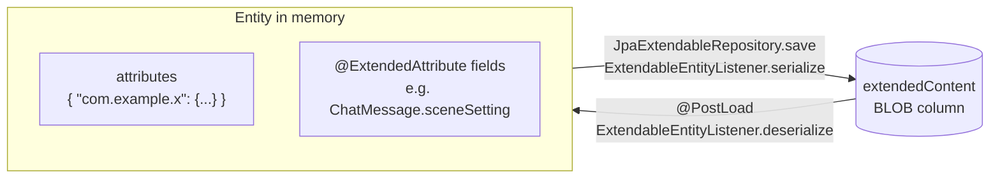

# Extended attributes

Plugins can't add tables or columns - there is no way to run their own Flyway migrations. Instead, every data entity
carries a JSON object where a plugin can keep whatever it needs: `ExtendableEntity.attributes`. It is saved with the
entity, loaded with it, and travels with it into backups.

## Where attributes are

All data entities extend `ExtendableEntity` ([Domain model](../domain-model.md)):

| Entity | Typical plugin data |
|---|---|
| `Manuscript` (book) | Per-book state and settings - Side Query keeps its chat sessions here. |
| `ChatMessage` (story part) | Data about one part - Reviewer keeps the reviews of the part here. |
| `Summary` | Data about a summary. |
| `Lorebook`, `LorebookEntry` | Lore metadata - Lorebook VCS keeps the revision history in the lorebook. |
| `AI` (inference provider), `Protocol`, `Tag` | Per-provider or per-protocol options. |
| `UserSetting` | Per-user plugin settings - Reviewer and Side Query keep theirs here. |
| `AppSettings` | Settings for the whole installation (administrators). |

`User` and `Resource` are not extendable.

```java
JsonObject attributes = entity.getAttributes();       // never null after loading; a new entity starts with {}
```

## Storing and reading data

Use one top-level key per plugin, named after the plugin's package, and put a JSON tree of your own model classes
under it. The bundled plugins all follow this pattern:

```java
public class ReviewerSettings {
    public static final String KEY = "com.github.enerccio.marginalia.extensions.reviewer";
    ...
}

public ReviewData getReviewData(ChatMessage message) {
    JsonObject attrs = message.getAttributes();
    if (attrs != null && attrs.has(ReviewerSettings.KEY)) {
        return gson.fromJson(attrs.get(ReviewerSettings.KEY), ReviewData.class);
    }
    return null;
}

public void saveReviewData(ChatMessage message, ReviewData data) throws Exception {
    JsonObject attrs = message.getAttributes();
    if (attrs == null) {
        attrs = new JsonObject();
        message.setAttributes(attrs);
    }
    attrs.add(ReviewerSettings.KEY, gson.toJsonTree(data));
    chatMessageService.save(message);
}
```

Rules:

- **Save through the entity's service** - `save(...)`, not `saveWithoutEvent(...)`. See
  [How attributes are stored](#how-attributes-are-stored) for why.
- **Load before you change.** Entities held by the UI are detached copies, and the one you got from a decorator may
  be older than the database. Reload it (`service.find(entity)` or `find(id)`), change the attributes, save it, and
  use the returned object from then on. Saving an old copy overwrites changes made since - to the plugin's data and
  to the rest of the entity. Lorebook VCS's `saveVCSData` is a good template:

  ```java
  Lorebook fresh = lorebookService.find(lorebook);
  fresh.getAttributes().add(LorebookVCSData.KEY, gson.toJsonTree(data));
  Lorebook saved = lorebookService.save(fresh);
  ```

  The same goes for the plugin's own data: when several components edit parts of one JSON tree, each change should
  re-read the stored tree, change only its part and save it (Lorebook VCS's `updateEntryData`), not save a copy it
  loaded earlier.

- **Version your data.** There are no migrations; if the format changes, read old formats too (a `version` field in
  your JSON tree makes this easy) and never fail on data you don't understand.
- **Keep it small.** The whole JSON object is serialized on every save of the entity, and some entities are saved
  often - a story part is saved up to every 250 ms while it's generated. Megabytes of history in a part's attributes
  slow generation down. Lorebook VCS stores the history once per lorebook, not per entry, for this reason.

### Settings

- Per user: `settingService.getOrCreate(UserSetting.class)` returns the current user's settings; store under your
  key, save with `settingService.save(userSetting)`. To add the settings to the *Settings* screen, see
  [Extending the UI → Settings panels](ui-extensions.md#settings-panels).
- Whole installation: `AppSettings` the same way, only administrators should change it.

### Keys used by the application

The application itself uses `attributes` too. Don't use these keys:

| Key | Entity | Content |
|---|---|---|
| `templateVariables` | `ChatMessage`, `Manuscript` | Template variables set by macros (`setvar`, `setglobalvar`...) - local ones on the part, global ones on the book. |

## How attributes are stored



`attributes` is not a column. The entity has one `extendedContent` column (bytes, UTF-8 JSON), and
`ExtendableEntityListener` converts between the two:

- **On save** (`JpaExtendableRepository.save`) it builds one JSON object: each `@ExtendedAttribute` field of the
  entity under its field name, as a string, and each key of `attributes` with the prefix `attributes_`.
- **On load** (`@PostLoad`) and after every save it fills the fields and `attributes` back from that JSON.

The column of a story part looks like this:

```json
{
  "sceneSetting": "The lighthouse at night",
  "response": "The lamp turned...",
  "attributes_templateVariables": { "mood": "grim" },
  "attributes_com.github.enerccio.marginalia.extensions.reviewer": { "reviews": [ ... ], "current": 0 }
}
```

Two things follow from this:

- `saveWithoutEvent` (used by backup restore, which writes `extendedContent` directly) **does not serialize**:
  changes to `attributes` saved that way are lost. Always use `save`.
- The `_fulltext` column that is written next to `extendedContent` is built only from the application's
  `@Fulltextable` fields (see [Domain model](../domain-model.md#full-text-column)). A plugin's `attributes` are not in
  it and can't be added to it.
- `@ExtendedAttribute` is the application's own way of adding fields to an entity without a migration - many fields
  of `ChatMessage`, `Manuscript`, `Protocol` and the settings are stored like this. It works for `String`, the
  numeric types, `boolean`, `Date` and enums, stored as strings (dates as ISO-8601 instants in UTC).
  `@ExtendedAttribute(inject = true, injectPrefix = ...)` on a `JsonObject` field spreads its keys with that prefix,
  which is how `attributes` itself is declared. This is for application code: a plugin can't add fields to an entity
  class, it uses `attributes`.

## Where the data goes

| Operation | Attributes |
|---|---|
| Database backup / restore (*Admin → Database Backups*) | Included - it's the whole database file. |
| Book backup, export, restore, clone | Included for the book, its parts and their summaries (the `extendedContent` of each). |
| Branch Story | The part's attributes are copied to the new branch. |
| Regenerate | The part is reused: its attributes stay, also data that described the old text. If the request fails before any text arrived, the part is restored with the attributes it had before. |
| Swipe | A new part - starts with no plugin data. |
| Lorebook export / import | **Not included** - only the entries' content is exported. Lorebook VCS has its own history export for this reason. |
| Lorebooks inside a book backup | Not included, same as lorebook export. |

Plan for the cases where your data does not follow: data that describes a part's text (a review) may be stale after
*Regenerate*; data stored on a lorebook is gone after the user exports and imports it.

## References to other entities

If your data refers to another entity, store its `uuid` (or `id`). The *Cleanup* page of the administration purges
soft-deleted rows ([Domain model](../domain-model.md)), and it knows only the references the application declares
(`@CleanupReference`) - ids inside a plugin's attributes are invisible to it. Two consequences:

- A deleted entity your data points to can be purged. Always handle a reference that resolves to nothing or to a
  deleted entity. Reviewer falls back to the book's provider when the configured one is missing or deleted:

  ```java
  AI configuredAi = aiService.find(setting.getSelectedAiId());
  if (configuredAi != null && !configuredAi.isDeleted()) {
      return configuredAi;
  }
  return aiService.find(manuscript.getAi());
  ```

- If a reference must keep its target alive, or must be cleared when the target is purged, register a
  `CleanupService.CleanupContributor`:

  ```java
  cleanupContributor = new CleanupService.CleanupContributor() {
      @Override
      public void collectReferences(Set<CleanupService.EntityKey> candidates, CleanupService.BlockSink sink) {
          // during Analyze / Purge: block candidates the plugin still references
          for (Long aiId : idsOfProvidersMyPluginUses()) {
              CleanupService.EntityKey key = new CleanupService.EntityKey(AI.class, aiId);
              if (candidates.contains(key)) {
                  sink.block(key, "used by My Plugin");      // shown as the reason on the Cleanup page
              }
          }
      }

      @Override
      public void beforePurge(Set<CleanupService.EntityKey> purged) {
          // in the purge transaction, before the rows are removed: drop references to them
      }
  };
  cleanupService.registerContributor(cleanupContributor);    // onExtensionLoad
  cleanupService.unregisterContributor(cleanupContributor);  // onExtensionUnload
  ```

  `EntityKey` uses the root entity class of a hierarchy (`AI`, not `OpenAICompatible`). Cleanup runs for the whole
  installation, not for one user - don't use `currentUser` in a contributor.

When resolving anything that came from data the user can edit or import, use `findForUser(uuid)` so that one user's
data can't point a plugin at another user's entity.
