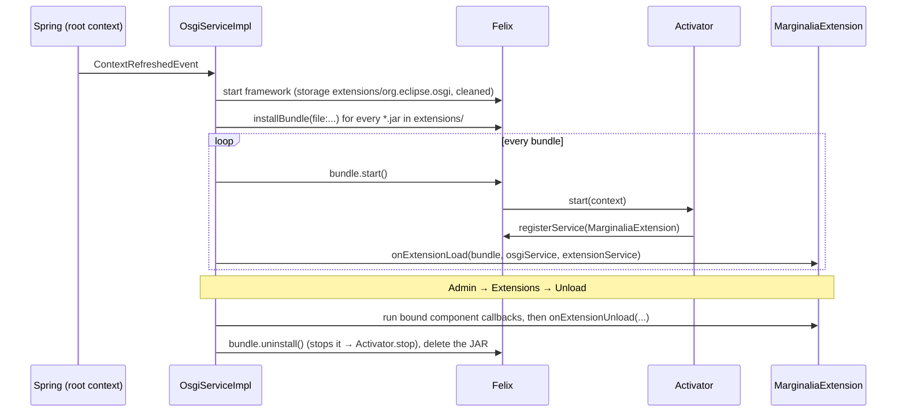

# Plugin basics

This page covers what every plugin needs: the Maven project, the bundle activator, the `MarginaliaExtension` and how
Marginalia loads, starts and unloads it.

## Project layout

A plugin is an ordinary Maven project with `bundle` packaging:

```
myplugin/
├── pom.xml
└── src/main/java/com/example/marginalia/myplugin/
    ├── MyPluginActivator.java     BundleActivator - registers the extension
    ├── MyPluginExtension.java     MarginaliaExtension - registers hooks, cleans up
    ├── model/                     data classes stored as JSON in attributes (optional)
    ├── service/                   plugin logic, @Configurable (optional)
    └── ui/                        Vaadin components (optional)
```

Use your own package. The bundled plugins live under `com.github.enerccio.marginalia.extensions.<name>`; a third-party
plugin should not.

## pom.xml

The easiest start is to copy the `pom.xml` of `marginalia/plugins/chaptermarker` and change the coordinates and the
package names. The important parts:

```xml
<packaging>bundle</packaging>

<dependencies>
    <!-- the application's classes, installed by `mvn install` in marginalia/ -->
    <dependency>
        <groupId>io.github.enerccio</groupId>
        <artifactId>marginalia</artifactId>
        <version>1.0.0</version>
        <classifier>classes</classifier>
        <scope>provided</scope>
    </dependency>
    <!-- plus, all `provided`: org.apache.felix.framework, vaadin-core, and any library
         of the application you use directly (gson, commons-lang3, font-awesome-iron-iconset...) -->
</dependencies>

<build>
    <plugins>
        <!-- maven-compiler-plugin, release 25 -->
        <!-- aspectj-maven-plugin with spring-aspects as aspect library - needed for @Configurable -->
        <plugin>
            <groupId>org.apache.felix</groupId>
            <artifactId>maven-bundle-plugin</artifactId>
            <version>6.2.0</version>
            <extensions>true</extensions>
            <configuration>
                <instructions>
                    <Bundle-SymbolicName>${project.artifactId}</Bundle-SymbolicName>
                    <Bundle-Version>${project.version}</Bundle-Version>
                    <Bundle-Activator>com.example.marginalia.myplugin.MyPluginActivator</Bundle-Activator>
                    <Import-Package>!com.example.marginalia.myplugin.*</Import-Package>
                    <Export-Package>com.example.marginalia.myplugin.*</Export-Package>
                </instructions>
            </configuration>
        </plugin>
    </plugins>
</build>
```

- **Everything from the application is `provided`.** Marginalia runs the bundle with boot delegation for all packages
  (see [Class loading](#class-loading)), so the bundle sees exactly the classes and libraries of the running WAR.
  Bundling your own copy of Vaadin, Spring or Gson would create a second, incompatible copy of their classes.
- **Versions must match the application.** Take the Vaadin, Gson and commons versions from `marginalia/pom.xml`.
  Compiling against a different Vaadin version than the one that runs usually works until it doesn't.
- **`Import-Package` imports nothing.** The single negated entry stops bnd from generating `Import-Package` headers -
  they are not needed with boot delegation and would make the bundle fail to resolve.
- **AspectJ** weaves Spring's `AnnotationBeanConfigurerAspect` into the plugin's classes, so a plugin class annotated
  `@Configurable` gets its `@Autowired` fields injected from the application's Spring context, like the
  application's own UI classes ([AspectJ weaving](../building.md#aspectj-weaving)). Without it, those fields stay
  `null`.
- Libraries the application doesn't have must be embedded in the bundle (`Embed-Dependency`, commented out in the
  Reviewer's `pom.xml`) or shaded. Keep this to a minimum.

Build with `mvn package`; the result is `target/<artifactId>-<version>.jar`. The application must be installed in the
local Maven repository first (`mvn install -DskipTests` in `marginalia/`), and reinstalled whenever you change
classes the plugin uses.

## The activator

The bundle's activator registers one `MarginaliaExtension` as an OSGi service. That's all it should do - Marginalia
discovers the service and calls it:

```java
public class MyPluginActivator implements BundleActivator {

    private ServiceRegistration<MarginaliaExtension> registration;

    @Override
    public void start(BundleContext context) {
        registration = context.registerService(MarginaliaExtension.class, new MyPluginExtension(), null);
    }

    @Override
    public void stop(BundleContext context) {
        if (registration != null) {
            registration.unregister();
            registration = null;
        }
    }
}
```

Only bundles that register a `MarginaliaExtension` are listed in *Admin → Extensions*.

## The extension

```java
public interface MarginaliaExtension {

    void onExtensionLoad(Bundle bundle, OsgiService parentService, ExtensionService extensionService);

    void onExtensionUnload(Bundle b, OsgiServiceImpl osgiService, ExtensionService extensionService);
}
```

- `onExtensionLoad` registers everything the plugin needs: decorators (`extensionService.registerDecorator(...)`,
  see [@Extendable hooks](extendable.md)), generation listeners
  (`storyGenerationService.addEventListener(...)`, see [Generation pipeline](../generation-pipeline.md#events-for-extensions)),
  cleanup contributors ([Extended attributes](extended-attributes.md#references-to-other-entities)). It should not build UI - there is no UI at that moment. UI is added later, from decorators, when the
  user opens the screen the plugin extends.
- `onExtensionUnload` undoes all of it: unregister every decorator and listener, remove the components the plugin
  added to open screens ([Unloading](ui-extensions.md#unloading)), stop background work. Nothing is removed
  automatically - a decorator left registered keeps running, from a bundle that no longer exists.

Annotate the extension `@Configurable` and inject what you need:

```java
@Configurable
public class MyPluginExtension implements MarginaliaExtension {

    @Autowired
    private Localization loc;

    @Autowired
    private ChatMessageService chatMessageService;

    @Autowired
    private StoryGenerationService storyGenerationService;
    ...
}
```

Any bean of the application can be injected - every service in `domain/service` ([Services](../services.md)),
`Localization`, `InferenceServices`, `Configuration`, `OsgiService`... Plugin classes created with `new` (services,
dialogs, forms) can be `@Configurable` too; the bundled plugins create their service object in the extension
(`new ReviewerService()`) and it is injected the same way.

!!!warning Errors in onExtensionLoad
At startup `onExtensionLoad` runs without a UI, so `UIUtils.internalServerError(...)` (which opens a dialog) can't
show anything. Throw instead: an exception that escapes `onExtensionLoad` is logged, `onExtensionUnload` is called to
undo what was registered so far and the bundle is stopped. The other extensions load normally; an upload shows the
error to the administrator.
!!!

## Lifecycle



- **Startup.** `OsgiServiceImpl` listens for the root context's `ContextRefreshedEvent`, starts Felix with its
  storage in `~/.marginalia/extensions/org.eclipse.osgi` (wiped on every start, so the JARs are always read fresh),
  installs every `*.jar` in `~/.marginalia/extensions` and starts them. For each `MarginaliaExtension` service a
  bundle registered, it calls `onExtensionLoad`. Each JAR is installed and started on its own: one that can't be
  installed (not a bundle, a second copy of an installed plugin) or fails to start is logged with its file name and
  skipped.
- **Installing at runtime.** *Admin → Extensions → Load Extension (.jar)* writes the uploaded file into
  `~/.marginalia/extensions` (the file name is sanitized: only letters, digits, `.`, `_` and `-`) and installs and
  starts it the same way (`OsgiService.installPackage`). Screens that are already open are not rebuilt: the plugin's
  decorators run the next time the decorated methods run (the next time the user opens a book, a tab...).
- **Updating.** Uploading a bundle whose symbolic name (or file name) is already installed replaces it: the old one is
  unloaded as by *Unload*, uninstalled and its JAR deleted, then the new one is loaded. If the new one fails to
  install or start, its JAR is deleted and the old one is put back.
- **Unloading.** *Unload* calls the callbacks registered with `bindAttachableComponent`, then `onExtensionUnload`,
  uninstalls the bundle and **deletes its JAR** (`OsgiService.uninstallPackage`). Bundles that failed to start are
  listed too (state `INSTALLED` or `RESOLVED`) and can be unloaded the same way.
- **Shutdown.** When the application stops (the root context closes), every extension is unloaded the same way -
  bound callbacks, `onExtensionUnload`, the activator's `stop` - and the framework is stopped. Still save data as you
  go: a killed process runs none of this.

## Class loading

Felix is started with `org.osgi.framework.bootdelegation=*` and the framework class loader as the bundle parent, which
is the web application's class loader. Every class a bundle asks for is therefore looked up in the application
first: Marginalia's own classes, Vaadin, Spring, Hibernate, Gson, everything in `WEB-INF/lib`. The consequences:

- Plugins use the application's classes directly - no imports, no service lookups, `instanceof` and casts work.
- A plugin can't override or replace a library of the application, and can't use a different version of one.
- Plugins don't see each other's classes through imports either; if two plugins need to cooperate, do it through
  shared data (attributes) or through the application's components.
- The plugin's own classes are loaded by the bundle's class loader, so the class names you pass to
  `registerDecorator` must be those of the **application's** classes; a plugin's own classes are never instrumented.

## The development loop

1. Run Marginalia from your IDE or a local Jetty with a separate data folder
   ([Running locally](../building.md#running-locally)).
2. `mvn package` the plugin.
3. Load the JAR in *Admin → Extensions*, or copy it into `<data folder>/extensions` and restart.
4. Open the screen the plugin extends. If nothing happens, check the log: a decorator that can't find an argument,
   local variable or field logs `Mod '<class>' skipped on <class>.<method>: ...` with the missing name; other
   exceptions are logged as `Unhandled exception in extension ...`.
5. To try a new build: *Unload* the plugin (it deletes the JAR), load the new one.

When a plugin uses a class or method of the application that changed, the plugin fails at runtime with a
`NoSuchMethodError` or `NoClassDefFoundError`. Rebuild it against the current application.
