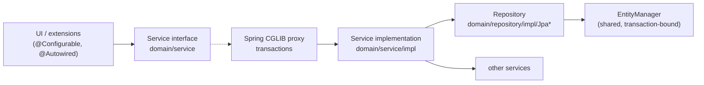

# Services

The service layer holds Marginalia's logic: everything the UI does to data goes through a service, and services are
the main API extensions use. This page describes how services and repositories are built, how transactions and the
current user work, and what each service is for. The generation engine has its own page,
[Generation pipeline](generation-pipeline.md).

## Layers



- **Interfaces** live in `domain/service/` (and `domain/security/service/`), implementations in `.../impl/`. Code
  always depends on the interface.
- **Beans** are declared in `META-INF/spring/services-config.xml`. Each entity service gets its repository injected
  through the `repository` property; everything else is `@Autowired` inside the implementation.
- **Repositories** (`domain/repository/impl/Jpa*Repository`) contain the JPQL and native SQL. They are called only by
  their service.

## The generic service hierarchy

Entity services extend a generic base that matches the entity's base class:

| Service base | For | Adds |
|---|---|---|
| `BaseService` / `BaseServiceImpl` | `BaseEntity` (`User`) | `find(id)`, `find(entity)` (reload), `find(uuid)` → id, `findAll()`, `findAllIds()`, `save`, `saveWithoutEvent`, `delete(entity, hard)`, `evict` |
| `OwnedService` / `OwnedServiceImpl` | `OwnedEntity` (`Resource`) | Owner-aware finders: `findAllForUser()`, `findAllIdsForUser()`, `findForUser(uuid)`, `findAll(user)`; `save` sets the owner of new entities to the current user. |
| `ExtendableService` / `ExtendableServiceImpl` | `ExtendableEntity` (everything else) | Nothing new - the repository serializes [extended attributes](domain-model.md#extendableentity---extended-attributes) on `save`. |

The same three levels exist for repositories: `JpaBaseRepository` → `JpaOwnedRepository` →
`JpaExtendableRepository`. A repository only has to name its entity class (`getEntityClass()`) to get the generic
queries; it can override `hydrate(entity)` to post-process loaded entities.

Things to know about the generic methods:

- **`find(id)` doesn't check owner or `deleted`.** Use it for ids that come from the user's own data (a book's
  `ai`, a part's `parent`). For anything that comes from outside - a URL, an uploaded file, a backup - use
  `findForUser(uuid)`, which returns `null` for other users' and deleted entities.
- **`find(entity)` reloads.** Entities held by the UI are detached and may be stale; services usually start with
  `Manuscript m = find(manuscript)` before changing it.
- **`findAll*` skip deleted rows**, `find(id)` doesn't.
- **`save` returns the managed copy** (`merge`). Keep using the returned object.
- **`save` vs. `saveWithoutEvent`** - `save` serializes the extended attributes into `extendedContent`;
  `saveWithoutEvent` stores `extendedContent` as it is (used when it was copied from a backup).
- **`delete(entity, false)`** soft deletes, **`delete(entity, true)`** removes the row. See
  [Soft delete](domain-model.md#baseentity---identity-and-soft-delete).

## Transactions

Transactions are declared with three meta-annotations from `domain/traits/` and applied by Spring's
`tx:annotation-driven` with **class-based (CGLIB) proxies** around each service bean (`proxy-target-class="true"`):

| Annotation | Meaning | Typical use |
|---|---|---|
| `@CommonTx` | `@Transactional("common")`, read/write | Methods that change data. |
| `@CommonTxReadOnly` | Read-only transaction | Finders, searches, reports. |
| `@NoTx` | `Propagation.NOT_SUPPORTED` - suspends any transaction | Methods that start background work or do I/O that must not run in a transaction: `generateNextTurn`, database backups (`VACUUM INTO`), file operations. |

The rules that follow from proxies:

- **Only calls through a bean reference are transactional.** A service calling its own method (`this.save(...)`)
  bypasses the proxy, so that method's annotation has no effect. When a service needs its own transactional method
  from a callback, it injects itself - `SummaryServiceImpl` has `@Autowired private SummaryService self` and calls
  `self.save(summary)` from the streaming callback.
- **Transactions are short.** SQLite allows one writer at a time (see
  [SQLite limitations](database.md#sqlite-limitations)); a long write transaction blocks every other user's writes.
  Never call a model, wait for the UI or sleep inside a transaction. Streaming code saves through the service for each
  change, so each save is its own transaction.
- **A transaction ends with the outermost annotated call.** Entities returned to the UI are detached. Lazy
  associations (`ChatMessage.parent`, `ChatMessage.parentScript`, `LorebookEntry.lorebook`) can't be navigated after
  that - reload them through the service (`chatMessageService.getParent(node)`, `find(...)`).
- Methods without an annotation run in the caller's transaction, or without one.

## The current user

Services are singletons, but the user differs per browser session. The session-scoped bean `user`
(`domain.security.model.User` behind a scoped proxy, defined in `container-config.xml`) is injected into services as

```java
@Autowired
protected User currentUser;
```

Each call on `currentUser` is resolved against the HTTP session of the current thread. It holds a copy of the
logged-in user's `id`, `login` and `fullName` - load the entity (`userService.find(currentUser.getId())`) for
anything else, such as `isAdmin()`.

Services that depend on the current user:

- `OwnedServiceImpl` - `findAllForUser`, `findForUser`, and the owner of new entities,
- `SettingService.getOrCreate(UserSetting.class)` - the user's settings,
- `ManuscriptService` - searches, `findViewable`, `markOpened`, and the prompt defaults (`getMasterTemplate`... fall
  back to the *current* user's `UserSetting`),
- admin checks such as `DatabaseBackupServiceImpl.requireAdmin()`.

**On background threads** there is no request, so resolving `currentUser` fails with *No thread-bound request
found*. Capture the request attributes on the UI thread and enter them on the worker:

```java
ThreadCopyRequestAttributes attributes = ThreadCopyRequestAttributes.create();   // on the UI thread

executor.submit(() -> {
    try (InRequestScope _ = new InRequestScope(attributes)) {                    // on the worker
        lorebookService.findAllForUser();                                         // current user resolves
    }
});
```

The generation engine, `SummaryServiceImpl` and `ThreadAccessDialog` do this. Scheduled jobs (database backups) run
without any user and only use installation-wide data (`getOrCreateApp`).

## Services by area

### Books and the story

| Service | Responsible for |
|---|---|
| `ManuscriptService` | Books: search and sort (`searchManuscripts` → ids), `findViewable(uuid)` (own or published, for the viewer), `markOpened`, the effective prompts of a book (`getMasterTemplate`, `getPov`, `getTense`, `getStyle`, `getUserPrompt`, `getSummaryPrompt`: book value → user default → `Defaults`), the effective backup strategy, and the JSON form of a book used by backups (`createBackup`, `cloneFromBackup`, `restoreBackup`). |
| `ChatMessageService` | The story tree: `createRoot`, `addChild`, `getBranchFromLeaf`, `getSwipesForMessage` (siblings), `swipeTo` (sets the book's active leaf to the deepest last descendant - the caller saves the book), `branch` (copy as sibling), `deleteNodeAndMigrateChildren`, word and token sums, `countWords`. |
| `SummaryService` | `createSummary(book, part, callback)` streams a summary from the model into a new `Summary` and attaches it to the part when finished; returns a `CancellationToken`. `copySummary` for branching. |
| `StoryGenerationService` | Generating parts, see [Generation pipeline](generation-pipeline.md). |
| `ExporterService` | Registry of story exporters (`registerExporter`, `unregisterExporter`, `getExporters`). The built-in `TxtExporter`, `HtmlExporter`, `DocxExporter`, `PdfExporter` and `EpubExporter` (package `export`, all extend `ExporterBase`) are registered in `afterPropertiesSet`; an extension can register its own `Exporter` and it shows in the export dialog. See [Story export](#story-export). |
| `BackupService` | Book backups as JSON files in `data/<login>/backups/manuscripts/<book id>/`: `takeBackup`, `getBackups`, `importBackup`, `applyBackup` (restore, optionally messages only), `cloneBackup` / `restoreAsNewManuscript`, `analyzeLorebooks` + `LorebookDecision`s for lorebooks found in the backup. |

The automatic book backups (`BackupStrategy.AFTER_N_MESSAGES` / `AFTER_N_MINUTES`) are triggered by the story editor
after a part is generated (`ManuscriptStoryPart`), not by a service - code that generates parts without the editor
doesn't take them.

### Story export

`ExportDialog` (opened from the settings menu of `ManuscriptStoryPart`) collects the active branch in one
`ProgressBarDialog` (indeterminate), cuts the chosen range and exports it in a second one whose total is the number of
messages, then shows the download link. The exporter gets `ExportOptions` (title, author, title page, language), the
messages and the progress dialog, on which it calls `updateProgress()` for every message.

`ExporterBase` does the common work: it renders the title page from `Defaults.DEFAULT_EXPORT_HEADER_TEMPLATE`
(Handlebars, data `ExportHeaderTemplateData`), skips parts without text, reports progress and feeds the Markdown of
each part to an `ExportWriter` that the exporter creates per export - exporters are shared between users, so any state
must live in the writer. A part whose text has a Markdown heading is a chapter (`chapterTitle`, the same rule as the
Chapter Marker plugin: the first `#` line); before the first part the writer gets the list of all chapters in
`contents(...)` and every chapter start in `message(markdown, chapter)`, so it can put an anchor (`Chapter.anchor()`)
on the chapter and link to it from the table of contents (HTML, EPUB navigation, PDF, DOCX; TXT ignores it).
The PDF exporter keeps the export and renders it again until the pages shown in the contents match the pages the
chapters landed on; DOCX uses `PAGEREF` fields and sets `updateFields`, so Word fills them in after asking.
It also provides `toHtml` (CommonMark, raw HTML escaped, XHTML safe) and `walk`, which turns
Markdown into paragraphs, headings, code and rules for formats built from styled text (`BlockSink`; used by TXT, DOCX
and PDF). Libraries: CommonMark (parsing), Apache POI (DOCX), OpenPDF with the Liberation fonts (PDF); EPUB is written
with `java.util.zip`.

### Lorebooks and tags

| Service | Responsible for |
|---|---|
| `LorebookService` | `fillEntries` (loads entries with their effective tags for generation and the editor), `getSubbooks`, export / import in Marginalia's format (`exportLorebook`, `importLorebook`, `marshalLorebooks`, `analyzeImport`, `importLorebooks`), SillyTavern import (`importFromSillytavern`, via `SillyTavernEntryConverter`). |
| `LorebookEntryService` | `getEntriesForLorebook`. |
| `TagService` | The user's tags: `searchTagsForUser`, `countTagsForUser` (for lazy combo boxes), `getOrCreateForUser(value)`. |
| `TagRelationService` | Attaching tags to any entity (`createRelation`, `removeRelation`, with `negative` for negative tags) and querying both ways (`getTagsForObject`, `getObjectIdsForTag`, `getObjectsForTag`). |

### Models

| Service | Responsible for |
|---|---|
| `AIService`, `ProtocolService` | Plain CRUD of inference providers and protocols. |
| `InferenceServices` | `forAI(ai)` returns the `InferenceService` for a provider. Implementations are listed in `services-config.xml` (`inferenceProviders`), each annotated `@SupportedAI(AIType...)` with a constructor taking the `AI`; the instance is cached on the (transient) `AI.inferenceService` field. |
| `InferenceService` | One provider: `getModels()`, `countTokens` / `countTokensApprox`, `stream(payload, protocol, callback)`. Streaming is asynchronous; the callback gets chunks (`REASONING` / `RESPONSE`) and must call `controller.continueInference()` to receive the next one. Implemented by `OpenAICompatibleInferenceService`. |
| `TokenizerService` | Token counting per provider: tries the `TokenizerStrategy` candidates in order and caches the first that works, per provider id, until it fails or the provider is saved (`AIDialog` calls `invalidateCache`). The local JTokkit fallback is not cached, so a provider whose server was unreachable is probed again on the next count. `countTokensApprox` always uses JTokkit locally. |
| `TokenLimits` | Static helpers for the context, response and prompt budget of a generation (protocol overrides, else provider limits). |
| `TemplateService` | `processTemplate(template, name, data)` renders a Handlebars template with macros; `isValidTemplate` for the UI. See [Templating & macros](templating.md). |

### Users and settings

| Service | Responsible for |
|---|---|
| `UserService` | Users: `authenticate` (PBKDF2-HMAC-SHA256 hashes, constant-time compare), `changePassword` (also drops all saved logins and invalidates the user's other open sessions through `SessionManager.runForUsers` - the caller's own session is kept; the current password is checked by `UserDialog` for self edits), `clearPassword` (removes the password and saved logins and invalidates the user's sessions except the caller's, an administrator's reset), `isLoginAvailable`, `isLastAdmin` (the last administrator can't be removed or demoted), `deleteUser` (soft delete, frees the login by renaming it to `<login>#<uuid>`, drops saved logins, renames the data folder to `<login>-deleted`; owned data is purged with the user by cleanup), saved logins (`generateNewPersistentInfo`, `authenticateFromCookie`...). |
| `SettingService` | `getOrCreate(UserSetting.class)` for the current user, `getOrCreate(cls, user)`, `getOrCreateApp(AppSettings.class)` for the installation. |
| `ResourceService` | Files stored by hash in the user's `resources` folder (not used by the UI yet). |

### Administration

| Service | Responsible for |
|---|---|
| `DatabaseBackupService` | Database backups with `VACUUM INTO`, upload, staged restore, the cron schedule (`CronSchedule`, Spring `ThreadPoolTaskScheduler`) and its rotation. See [Database backups and restores](database.md#database-backups-and-restores). |
| `CleanupService` | `analyze()` builds the plan of what can be purged (from the Hibernate metamodel and `@CleanupReference`s), `purge()` executes it. Extensions with their own references register a `CleanupContributor` (`collectReferences` to block purges, `beforePurge` to clean up). See [Cleanup references](domain-model.md#cleanup-references). |
| `OsgiService`, `ExtensionService` | Loading extensions and the `@Extendable` decorators, see [Plugin development](plugins/index.md). |

## Asynchronous operations

Long operations - generating a part, a summary, streaming from a model - return immediately and report through a
callback:

| Operation | Returns | Callback |
|---|---|---|
| `StoryGenerationService.generateNextTurn` | `CancellationToken` | `GenerationListener` |
| `SummaryService.createSummary` | `CancellationToken` | `SummaryService.AsyncCallback` |
| `InferenceService.stream` | `CancellationToken` | `InferenceAsyncCallback` |

`CancellationToken.cancel()` stops the operation (the inference callback's `isDead()` reports it to the stream).
Callbacks run on worker threads: UI code in them must use `ui.access(...)` (see
[Threads and push](architecture.md#threads-and-push)), and service calls need the request scope shown above.

## Writing a new service

1. Interface in `domain/service/`; for an entity extend `ExtendableService<Entity, EntityRepository>`.
2. Implementation in `domain/service/impl/` extending `ExtendableServiceImpl<...>`; repository extending
   `JpaExtendableRepository<Entity>` with `getEntityClass()`.
3. Beans in `services-config.xml`:

   ```xml
   <bean id="bookmarkRepository" class="com.github.enerccio.marginalia.domain.repository.impl.JpaBookmarkRepository">
       <property name="entityManager" ref="em"/>
   </bean>

   <bean class="com.github.enerccio.marginalia.domain.service.impl.BookmarkServiceImpl">
       <property name="repository" ref="bookmarkRepository" />
   </bean>
   ```

4. Annotate every public method: `@CommonTx`, `@CommonTxReadOnly` or `@NoTx`.
5. Use `currentUser` for ownership, `findForUser(uuid)` for anything coming from outside, and check `isAdmin()` on
   the loaded user for administrator operations - hiding a button in the UI is not a permission check.
6. Keep the class non-final with public methods (CGLIB proxies subclass it).
7. Test it on top of `MarginaliaTestBase` (see [Testing](testing.md)).

Extensions can't add beans to the application context. They keep their logic in their own classes annotated
`@Configurable` (plugins are compiled with the AspectJ compiler too), which get the application's services
`@Autowired` - for example the Reviewer's `ReviewerService`. Transactions then come from the application services they
call. See
[Plugin development](plugins/index.md).
