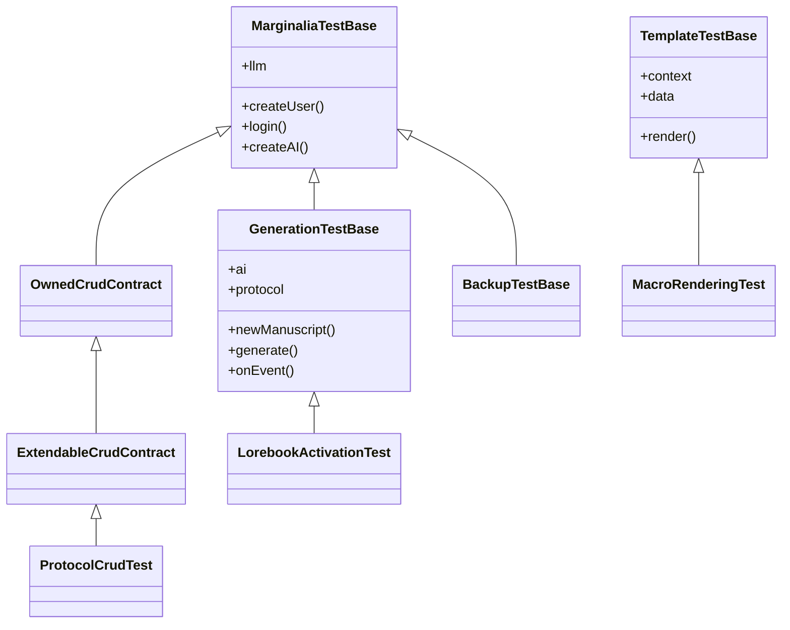

# Testing

Marginalia's tests are integration tests first: most of them start the real Spring XML configuration against a
throwaway SQLite database and talk to a fake OpenAI-compatible server. They need no network, no model and no API key,
and they run in CI on every push and pull request. This page explains the test infrastructure and how to add tests.

All test code is in `marginalia/src/test/java/com/github/enerccio/marginalia/`; paths below are relative to it.

## Running the tests

From `marginalia/`:

```sh
mvn test                                     # all tests
mvn test -Dtest=LorebookActivationTest       # one class
mvn test -Dtest='Backup*Test'                # a pattern
mvn test -Dtest='MacroRenderingTest#name'    # one method
```

Surefire is configured in `pom.xml` with:

| Setting | Why |
|---|---|
| `-XX:+EnableDynamicAgentLoading -Djdk.attach.allowAttachSelf=true` | `RuntimeInstrumentationTest` installs the ByteBuddy agent into the test JVM. |
| `marginalia.test.home=target/test-home` | Folder for the test databases (see [The application folder](#the-application-folder)). |

Reports are written to `target/surefire-reports/`; the CI job uploads them as an artifact when a test fails.

### In the IDE

Tests run from IntelliJ IDEA like any JUnit test, with two conditions:

- the classes must be compiled with AspectJ (see [Building from source](building.md#aspectj-weaving)), otherwise
  UI classes and `@Configurable` beans miss their dependencies;
- add `-XX:+EnableDynamicAgentLoading -Djdk.attach.allowAttachSelf=true` to the VM options of the JUnit run
  configuration template if you run `RuntimeInstrumentationTest`.

Without `marginalia.test.home` the tests fall back to `target/test-home` relative to the working directory, so run
them with `marginalia/` as the working directory (IntelliJ's default for the module).

## Libraries

| Library | Used for |
|---|---|
| JUnit Jupiter 6 | Test engine, `@Test`, `@BeforeEach`, `@TempDir`... |
| AssertJ | All assertions (`assertThat(...)`) - use it instead of JUnit's `Assertions`. |
| Spring Test | `@SpringJUnitWebConfig`, context caching, `@DirtiesContext`. |
| JDK `HttpServer` | The fake LLM server (`test/llm/MockLLMServer`). |

There is no mocking library. Services are tested through the real Spring beans and the real database; the only
fake is the model server.

## What is covered

| Package | Tests | What they check |
|---|---|---|
| `test` | `TestBaseSmokeTest` | The test infrastructure itself: isolated folder, session user, mock LLM wiring. |
| `test/llm` | `MockLLMServerTest` | The fake OpenAI server against the real `openai-java` client. |
| `crud` | `*CrudTest`, `OwnedCrudContract`, `ExtendableCrudContract` | Create, update, soft and hard delete, owner isolation and extended attributes of every entity. |
| `db` | `FlywayMigrationTest`, `FulltextMigrationTest`, `DatabaseRestoreCheckTest` | Migrations on an empty, a V1 and a pre-Flyway database, followed by Hibernate schema validation (`FlywayMigrationTest` also checks that V9 keeps `manuscripts.description` in `extendedContent`); `FulltextMigrationTest` runs the app migration that fills `_fulltext` of existing rows on the Spring context; the check of a database before a restore and the fall back to the previous database when a restore fails on start (no Spring context). |
| `domain` | `ExtendableEntityListenerTest`, `TokenLimitsTest`, `CronScheduleTest`, `SillyTavernEntryConverterTest`, `TemplateHelpersTest`, `OsgiServiceImplTest` | Smaller units: extended attribute serialization, token limits, cron parsing, SillyTavern conversion. `OsgiServiceImplTest` loads, replaces and unloads extensions on a real OSGi framework with test bundles built on the fly (`TestExtensionActivator`), including the verification reports that allow or refuse starting them; it has no Spring context. |
| `generation` | `GenerationRequestTest`, `LorebookActivationTest`, `BuiltPromptHistoryTest`, `ReservedTokensTest`, `FailedGenerationTest`, `ImageAttachmentGenerationTest`, `MetaSummaryTest` | Full generations: what is sent to the model, which lore is activated and where it goes, the story history in the prompt (new part, swipe, regenerate), tokens reserved by extensions, a failed request leaving the story unchanged, images staying with a part and never reaching the model, meta summaries and the summary chain. |
| `templates` | `TemplateServiceTest`, `MacroRenderingTest`, `MacroLorebookFixtureTest`, `DefaultTemplatesTest` | Handlebars rendering and SillyTavern macros; the built-in templates. |
| `lorebook` | `LorebookImportExportTest` | Marginalia and SillyTavern lorebook import and export. |
| `backup` | `ManuscriptRestoreTest`, `ManuscriptBackupCopyTest`, `BackupLorebookTest`, `BackupAiProtocolLinkTest`, `BackupImagesTest`, `DatabaseBackupScheduleTest` | Book backups, restore and copy, lorebook and provider linking, the images of parts in backups (the archive made on export, own resources for restored and cloned books), scheduled database backups. |
| `export` | `ExporterTest`, `ExporterImagesTest` | The story exporters (TXT, Markdown, HTML, DOCX, PDF, EPUB): text and Unicode, linked contents and chapter navigation, splitting of long stories, embedded images. |
| `security` | `ApiKeyEncryptionTest` | API keys stored encrypted with the installation key; the app migration encrypting plain ones. |
| `utils` | `ClientAddressResolverTest` | The client address: the header is ignored without trusted proxies and from any other peer, chains of proxies, CIDR ranges, no host name lookups (no Spring context). |
| `ui` | `ResourcesPartTest` | The Resources tab grid: lazy paging, only the user's files, deleting the selection. The only test that builds a Vaadin component. |
| `cleanup` | `CleanupServiceTest`, `TrashServiceTest` | Purging soft-deleted data, owned data, strong and weak references; the trash: own objects only, administrator sees all, restore refused while a deleted parent is not restored with it, extended content. |
| `instruct` | `ExtendableMethodVisitorTest`, `RuntimeInstrumentationTest`, `ExtensionVerifierTest` | The bytecode instrumentation of `@Extendable` methods and the runtime agent; the verification of extensions against the application. |

Not covered by automated tests: the Vaadin UI (apart from `ResourcesPartTest`), the bundled plugins, and the desktop launcher
(the [CI smoke test](packaging.md#continuous-integration) only checks that the packaged app starts).

## Test bases



`TemplateTestBase` doesn't start Spring. Pick the lightest base that works:

| Base | Spring | Use for |
|---|---|---|
| none | no | Pure units (`CronScheduleTest`, `SillyTavernEntryConverterTest`, `FlywayMigrationTest`). |
| `TemplateTestBase` | no | Anything rendered by `TemplateServiceImpl`. |
| `MarginaliaTestBase` | yes | Services, repositories, backups, cleanup. |
| `GenerationTestBase` | yes | Anything that needs a real generation. |
| `OwnedCrudContract` / `ExtendableCrudContract` | yes | The CRUD contract of a new entity. |

### MarginaliaTestBase

`test/MarginaliaTestBase` starts the application context from
`src/test/resources/META-INF/spring/test-application-config.xml`. That file imports the production
`application-config.xml` and adds `TestContextPostProcessor`, which

- removes the OSGi framework (`OsgiServiceImpl`) and the instrumentation agent (`RuntimeInstrumentationInitializer`),
- points `Configuration` to a new folder `target/test-home/ctx-<random>/` instead of `~/.marginalia`.

Everything else is the production wiring: the services, Hibernate, Flyway migrations, the session-scoped current
user. The base class gives you:

| Member | |
|---|---|
| `userService`, `aiService`, `inferenceServices` | Autowired services; autowire any other bean in your test. |
| `currentUser` | The session-scoped `User` bean - the "logged in" user of the test. |
| `llm` | A [mock LLM scenario](#the-fake-llm-server) for this test method. |
| `uniqueName(prefix)` | `prefix-1a2b3c4d`, for names that must not collide with other tests. |
| `createUser()`, `createUser(login, password, admin)` | Saves a user. |
| `loginAs(user)`, `login()`, `loginAdmin()` | Makes a user the current user, like a login in the UI (`login()` and `loginAdmin()` create one first). The services that only administrators can use (cleanup, database backups, user delete / unlock / clear password, extension install) need `loginAdmin()`. |
| `createAI()` | Saves an OpenAI-compatible inference provider pointing to `llm`. |

Each test method runs in its own mock HTTP request and session (`@SpringJUnitWebConfig`), so session-scoped beans
start empty: call `login()` before using a service that needs the current user.

#### The shared database

Spring caches the application context, and with it the database, for the whole test run. All test classes that use
`MarginaliaTestBase` share **one** SQLite database. Write tests so that they don't depend on what else is in it:

- create the data a test needs in the test, with `uniqueName(...)` for anything looked up by name;
- assert on the entities you created (`contains`, `doesNotContain`), not on totals (`hasSize`);
- operations that work on the whole database (cleanup, database backups) must only assert on their own data - see
  `CleanupServiceTest`.

When a test really needs an empty database or changes global state, mark it with `@DirtiesContext`. The next test
then gets a new context with a new folder and database:

```java
@Test
@DirtiesContext(methodMode = DirtiesContext.MethodMode.BEFORE_METHOD)   // starts on an empty database
void lastAdminIsProtected() throws Exception { ... }

@DirtiesContext(classMode = DirtiesContext.ClassMode.AFTER_CLASS)        // changes the shared backup schedule
class DatabaseBackupScheduleTest extends MarginaliaTestBase { ... }
```

A new context costs a few seconds (Spring, Hibernate, Flyway), so use it sparingly.

#### The application folder

Each context gets its own folder under `target/test-home/` with the database, data, backup and extension folders.
They are not deleted after the run, so you can open a test database with any SQLite tool after a failure. `mvn clean`
or deleting `target/test-home` removes them.

### GenerationTestBase

`test/GenerationTestBase` runs real generations through every pipeline step (see
[Generation pipeline](generation-pipeline.md)). Before each test it logs in a new user, creates an AI pointing to
`llm`, saves a chat-completion protocol and sets the mock's fallback answer to `"generated"`.

| Member | |
|---|---|
| `ai`, `protocol` | The saved provider and protocol. |
| `newManuscript()` | An unsaved book with `ai`, `protocol` and minimal templates: user prompt `{{instructions}}`, master template `{{backgroundLore}}`. Save it with `manuscriptService.save(...)`. |
| `generate(manuscript, instructions)`, `generate(manuscript, turnInput)` | Generates a new part and waits up to 30 s for the end. Returns a `GenerationRun`. |
| `onEvent(event, manuscript, action)` | Runs `action` when this book's generation reaches a pipeline `Events` value; removed after the test. |

`test/GenerationRun` is the `GenerationListener` that stands in for the story editor. It records the streamed
response and reasoning, errors (`getErrors()`) and simple errors (`getSimpleErrors()`, the messages the UI shows in a
notification), warnings (`getWarnings()`), the created part (`getMessage()`), and the outcome (`COMPLETED` or `CANCELLED`). Questions the
pipeline asks the user (`askQuestion`) are answered *yes*.

```java
class MyGenerationTest extends GenerationTestBase {

    @Test
    void instructionsReachTheModel() throws Exception {
        Manuscript book = manuscriptService.save(newManuscript());
        llm.reply("The lighthouse was dark.");

        GenerationRun run = generate(book, "The keeper climbs the stairs.");

        assertThat(run.await(TIMEOUT)).isEqualTo(GenerationRun.Outcome.COMPLETED);
        assertThat(run.getErrors()).isEmpty();
        assertThat(run.getResponse()).isEqualTo("The lighthouse was dark.");
        assertThat(llm.lastCompletionRequest().getLastMessage().content())
                .contains("The keeper climbs the stairs.");
    }
}
```

To look at the pipeline state in the middle of a generation, capture it in an event listener. `LorebookActivationTest`
reads the activated entries this way:

```java
AtomicReference<List<LorebookEntry>> activated = new AtomicReference<>();
onEvent(Events.AFTER_PROCESS_LOREBOOK, book,
        e -> activated.set(e.getProperty(GenerationProperties.ACTIVATED_LOREBOOK_ENTRIES)));
generate(book, "...");
```

Listeners are global (`StoryGenerationService.addEventListener`); `onEvent` filters by book and always calls
`chain.next()`, so a failing assertion inside the action doesn't stop the generation. Assert after `generate` returns,
not inside the listener - an exception in the listener only ends up in the log.

### CRUD contracts

Every entity that belongs to a user has a CRUD test built from `crud/OwnedCrudContract`. The contract contains the
tests; a subclass only says how to make and change an entity:

| Method | |
|---|---|
| `service()` | The entity's `OwnedService`. |
| `newEntity()` | A new, unsaved, valid entity (referenced entities may be saved). |
| `assertCreated(loaded)` | Checks the fields set by `newEntity()` after a reload. |
| `modify(entity)` | Changes some fields. |
| `assertModified(loaded)` | Checks the changes after a reload. |

The inherited tests check identity and owner on create, find by id / uuid / for user, update (creation date kept,
modification date moved), soft delete (hidden from all `find*ForUser` and `findAll*` methods), hard delete, isolation
between users, and that saving as another user keeps the owner.

Entities extending `ExtendableEntity` use `crud/ExtendableCrudContract`, which adds the persistence of plugin
attributes (`getAttributes()`): nested JSON, changes and removals, unrelated updates, and `saveWithoutEvent`
(used by restore). Put at least one `@ExtendedAttribute` field into `newEntity()` and `modify()`, so the inherited
tests also cover the extended fields. `crud/ProtocolCrudTest` is a short, complete example.

When you add an entity (see [Database & migrations](database.md)), add its `<Entity>CrudTest`.

### TemplateTestBase

`templates/TemplateTestBase` creates a `TemplateServiceImpl` directly, without Spring, with a deterministic context:
the clock is fixed at Sunday, 15 March 2026, 14:30:45 UTC, random macros use a seeded `Random`, and the template data
describes a scene in the middle of a story (POV *Alice*, characters *Alice, Bob, Carol*...). One `data` object is
shared by all `render(...)` calls of a test, the way lorebook entries of one generation share their variables.

`MacroLorebookFixtureTest` renders `src/test/resources/macro-test.json`, a SillyTavern lorebook whose entries
document their expected output. When you change macro behaviour, update the fixture and the expectations together.

## The fake LLM server

`test/llm/MockLLMServer` is a small OpenAI-compatible server on `127.0.0.1` with a random port, built on the JDK's
`HttpServer`. One shared server lives for the whole test JVM (`MockLLMServer.shared()`); each test gets its own
**scenario** with its own base URL, `http://127.0.0.1:<port>/<scenario-id>/v1`. A provider created with
`createAI()` points to the test's scenario, so tests never see each other's requests or answers.

It answers:

| Endpoint | |
|---|---|
| `GET /models` | The scenario's model list (default `mock-model`; change with `llm.models(...)`). |
| `POST /chat/completions` | Streaming (server-sent events) and non-streaming chat completions. |

### Programming answers

Chat completions are answered in this order:

1. queued responses - `llm.enqueue(...)` or `llm.reply("text")`, one per request;
2. the responder function - `llm.respondWith(request -> ...)`, if set and it returns a response;
3. the fallback - `llm.fallback(...)`;
4. otherwise HTTP 500 *no response programmed*.

`MockLLMResponse` builds one answer:

```java
MockLLMResponse.text("Hello world")                        // one content chunk
MockLLMResponse.chunks("Hel", "lo").chunkDelay(ofMillis(50))
MockLLMResponse.split(longText, 20)                        // chunks of 20 characters
MockLLMResponse.text("answer").withReasoning("thinking")   // reasoning chunks first
MockLLMResponse.text("answer").withReasoning("...").reasoningField("reasoning")  // instead of reasoning_content
MockLLMResponse.text("cut").finishReason("length")
MockLLMResponse.error(429, "slow down")                    // OpenAI-style error body
MockLLMResponse.chunks("a", "b", "c").disconnectAfter(2)   // stream ends abruptly
MockLLMResponse.text("late").waitFor(latch)                // held until the latch is released
```

`waitFor(latch)` is the tool for "while generating" states: the request is received, the pipeline waits for the
stream, and the test can stop the generation or inspect the state before releasing the latch.

!!!warning Retries
The `openai-java` client retries 408, 409, 429 and 5xx responses. A queued error response is consumed once per
attempt, so enqueue it several times (or use `fallback`) when a test expects the error to reach Marginalia.
!!!

### Inspecting requests

Every request, including model listing, is recorded:

| Method | |
|---|---|
| `llm.getRequests()`, `llm.getCompletionRequests()` | All requests / chat completions, in order. |
| `llm.lastCompletionRequest()` | The last chat completion; fails the test if there was none. |
| `llm.awaitCompletionRequests(n, timeout)` | Waits for `n` completions - for asynchronous callers. |
| `request.getMessages()`, `getMessages("system")`, `getLastMessage()` | The chat messages (`role`, `content`). |
| `request.getPromptText()` | All messages as `[role]\ncontent` - handy for `contains` assertions. |
| `request.getBody()`, `getRawBody()`, `getModel()`, `isStream()`, `getApiKey()` | The raw payload. |

For code that calls an `InferenceService` directly (without the pipeline), `test/InferenceCollector` is a callback
that pulls the whole stream and waits for the end.

## Expected errors in the log

Tests of failure paths make the code log errors on purpose. To keep them out of the test output (where they look like
real failures) and to assert on them, capture the logger with `test/ExpectedLog`:

```java
try (ExpectedLog log = ExpectedLog.capture(ExtensionServiceImpl.class)) {
    ...
    assertThat(log.errors()).anyMatch(m -> m.contains("broken"));
}
```

While the capture is open, the logger's events are recorded and not passed to the console; `errors()`, `warnings()`
and `atLeast(level)` return the messages, `entries()` the full events with their exceptions.

## Instrumentation tests

The `instruct` tests check the bytecode that makes `@Extendable` methods extensible (see
[Plugin development](plugins/extendable.md)):

- `ExtendableMethodVisitorTest` transforms fixture classes from `instruct/fixture/` with `instruct/Instrumenter` -
  the same transformation the agent applies, without an agent - and checks that the result verifies, keeps the class
  schema, behaves like the original and exposes arguments and locals to decorators.
- `RuntimeInstrumentationTest` installs the real agent into the test JVM and checks classes loaded both before and
  after the installation (`fixture/agent/`).
- `ExtensionVerifierTest` runs the [extension verification](plugins/extendable.md#verification-before-loading) on
  the extensions of `fixture/verify/VerifyFixtures` (decorators that are valid, ask for things that don't exist, or
  can't be followed) against the decorated `VerifyTarget`. Their class files are packed into a JAR on the fly and
  served by a stand-in `Bundle`. Decorators must be anonymous classes with the context calls inside them, as in a real
  extension - a decorator that delegates to a helper class would not be checked.

The fixtures are compiled with the same `-parameters` and `preserveAllLocals` options as the application; if you
change the compiler settings in `pom.xml`, these tests tell you whether extensions still see names of arguments and
locals.

## Checklist for a new test

- Name it `<Subject>Test` and put it in the package of the area it tests; Surefire runs every `*Test` class.
- Extend the lightest base that works ([Test bases](#test-bases)).
- Create your own data with unique names; don't depend on what other tests left in the shared database.
- Don't call real models or other network services - program `llm` instead.
- Assert with AssertJ, with `.as("...")` where the failure message would otherwise be unclear.
- Capture expected error logs with `ExpectedLog`.
- A new entity gets a CRUD contract test; a new migration is covered by `FlywayMigrationTest` automatically (it runs
  all migrations and validates the schema against the entities).
- A bug fix comes with a test that fails without the fix, where the area is testable without the UI.
- Run `mvn test` before opening a pull request - CI runs the same command.
