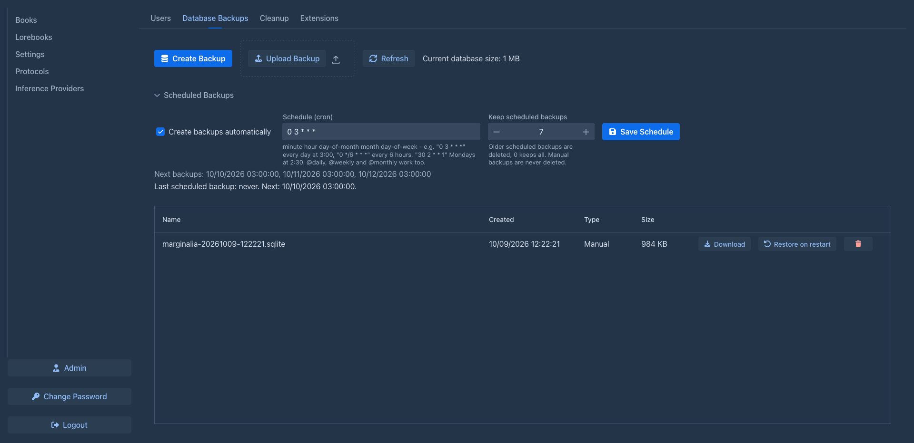

# Database backups

A database backup is a complete copy of the Marginalia database: all users with all their books, lorebooks, settings
and extension data. Use it to protect the installation against mistakes and failures, and to move it to another
computer. To back up a single book, users have [book backups](../books/backups.md).

## Creating a backup

Click **Create Backup** on the **Database Backups** tab. The copy is made while Marginalia runs, consistent even when
people are writing. It appears in the list with its **Name**, **Created** date, **Type** (*Manual* or *Scheduled*) and
**Size**. The toolbar shows the current size of the database.

Each backup has:

| Button | |
|---|---|
| **Download** | Downloads the backup file (`.sqlite`) - keep a copy outside the server. |
| **Restore on restart** | Restores the backup, see [below](#restoring). |
| trash | Deletes the backup. |

**Upload Backup** adds a backup file (`.sqlite` or `.db`) to the list, for example one downloaded from another
installation. The file is checked first and refused with *The database can't be restored: ...* and the reason when it
is not a SQLite database, is damaged, is not a Marginalia database (another application's database), or comes from a
newer Marginalia version than the one running.

!!!warning Backups contain secrets
A database backup contains everything, including the password hashes of all users and their API keys. The API keys
are encrypted with the `secret.key` file in the [data folder](index.md#the-data-folder), which is not part of the
backup - but anyone with both the backup and `secret.key` can read them. Keep downloaded backups as safe as the server
itself.
!!!

The files are stored in the `db-backups` folder of the [data folder](index.md#the-data-folder). Book backups and
extension JARs are separate files and are not part of a database backup.

When you restore a backup on **another installation**, copy `secret.key` from the original installation as well
(with Marginalia stopped), otherwise the saved API keys can't be decrypted and every user has to enter them again.

## Scheduled backups

The **Scheduled Backups** section creates backups automatically:

| Field | |
|---|---|
| **Create backups automatically** | Turns scheduled backups on. |
| **Schedule (cron)** | When to create them, see [below](#schedule-syntax). The next three times are shown under the field. |
| **Keep scheduled backups** | How many scheduled backups to keep; older ones are deleted. `0` keeps all. Manual and uploaded backups are never deleted. |

Click **Save Schedule** to apply it. The status line shows when the last scheduled backup was made and when the next
one is due.

When Marginalia wasn't running at a scheduled time - typical for the desktop app, which runs only while you write - it
makes the missed backup about 30 seconds after the next start.

### Schedule syntax

The schedule is a cron expression with five fields, `minute hour day-of-month month day-of-week`:

| Expression | Runs |
|---|---|
| `0 3 * * *` | every day at 3:00 |
| `0 */6 * * *` | every 6 hours |
| `30 2 * * 1` | Mondays at 2:30 (day of week: `0` or `7` is Sunday, `1` Monday...) |
| `0 12 1 * *` | on the 1st of every month at noon |
| `@daily`, `@weekly`, `@monthly` | once a day / week / month at midnight (`@hourly`, `@yearly` work too) |

Times are in the time zone of the server (in Docker, set it with the `TZ` environment variable).

!!!
To turn scheduled backups off, uncheck *Create backups automatically* and click *Save Schedule*. The expression is
kept, so you can turn the backups on again later. It is still checked - an invalid expression is never saved - but
while the backups are off, the field may also be empty.
!!!

## Restoring

A database can't be replaced while Marginalia uses it, so a restore happens on the **next start**:

1. Click **Restore on restart** next to the backup and confirm.
   The tab shows *Database restore is scheduled. Restart the application to apply it.* - **Cancel Restore** undoes it.
2. Restart Marginalia: quit and start the [desktop app](../getting-started/desktop-app.md), or
   `docker compose restart` on the [server](../getting-started/docker-server.md).

On the start, the current database is moved to `db-backups/pre-restore-<time>-marginalia.sqlite` - it appears in the
list, so a restore can be undone by restoring that file - and the backup takes its place. A backup from an older
Marginalia version is upgraded automatically.

The backup is checked again before it is swapped in (the same checks as for *Upload Backup*, also *Restore on restart*
refuses a backup that fails them). If it fails the check, or upgrading it fails, Marginalia keeps (or puts back) the
current database and starts normally; the refused file is moved to `db-backups/rejected-restore-<time>-marginalia.sqlite`
and the log says why.

Everything after the backup is lost: books, parts and settings created since. Users who are logged in have to log in
again if their account changed.

## Moving to another computer

1. Create a backup and **Download** it.
2. Install Marginalia on the new computer, create a temporary administrator on the first start.
3. **Upload Backup**, **Restore on restart**, restart.
4. Log in with the accounts from the backup.

Copy the `data` folder (book backups) and `extensions` folder from the old [data folder](index.md#the-data-folder) as
well. Or simply stop Marginalia and copy the whole `.marginalia` folder.
