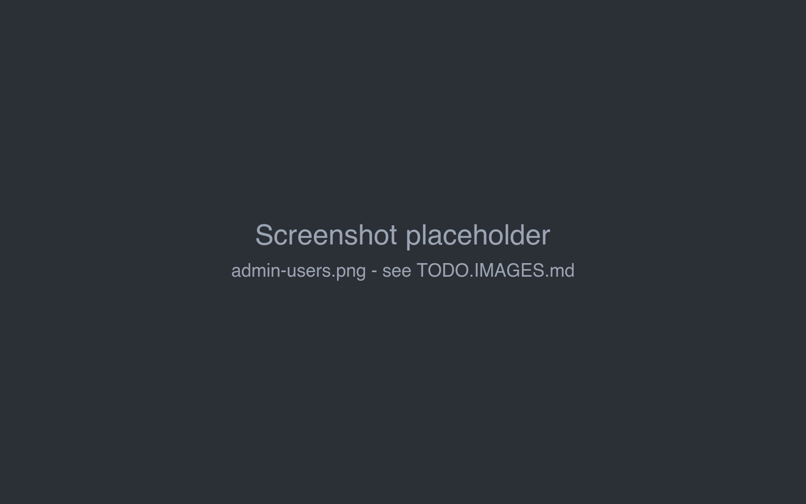

# Users

The **Users** tab of the admin page lists all accounts with their **Username**, **Full Name** and whether they are an
**Administrator**.

## Adding a user

1. Click **Add User**.
2. Fill in **Username**, **Full Name**, **Password** and **Repeat password**.
3. Check **Administrator** if the user should manage the installation.
4. Click **OK**.

Give the user name and password to the person; they can change the password later themselves (see
[Account & settings](../account.md#changing-the-password)).

!!!warning Always set a password
Marginalia accepts an account with an empty password - anyone can then log in with just the user name. Only do that
on the desktop app on your own computer.
!!!

The user name must be unique.

## Editing a user

The pen button opens the same dialog for an existing user:

- change the user name, full name and the administrator flag;
- to **reset a forgotten password**, enter a new one in both password fields; leave them empty to keep the current one.

Marginalia has no password reset by e-mail; an administrator sets a new password here and tells the user.

The last administrator can't lose the administrator flag: *The last administrator cannot be deleted or demoted.*

## Deleting a user

The trash button deletes the account after confirming. You can't delete your own account or the last administrator.

The user can no longer log in, saved logins on their devices stop working, and the user name becomes free for a new
account.

!!!warning The data stays
Deleting a user does **not** delete their books, lorebooks, inference providers (with their API keys), protocols and
settings. They stay in the database, invisible to everyone, and [Cleanup](cleanup.md) can't remove them. If the data
must go, the user should first delete their books, lorebooks, inference providers and protocols themselves; Cleanup
then removes them, and the account once nothing of it is left.
!!!
