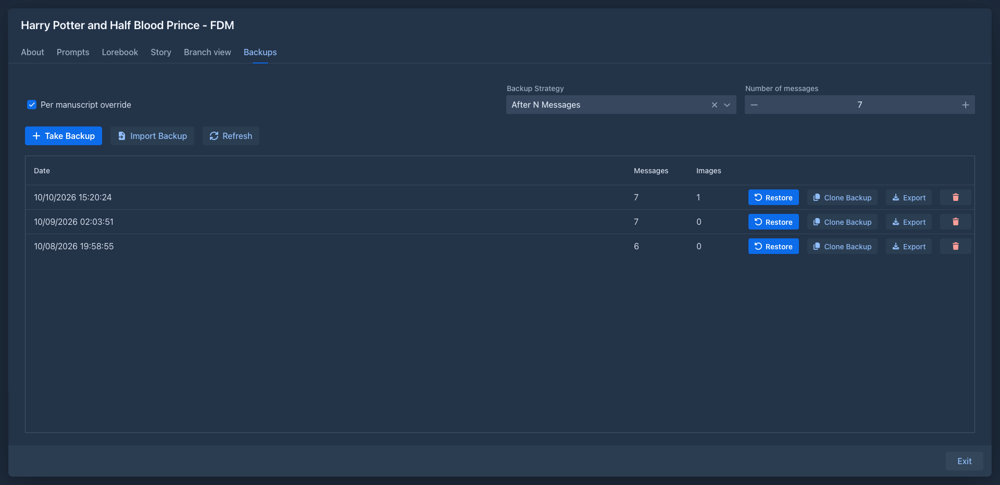
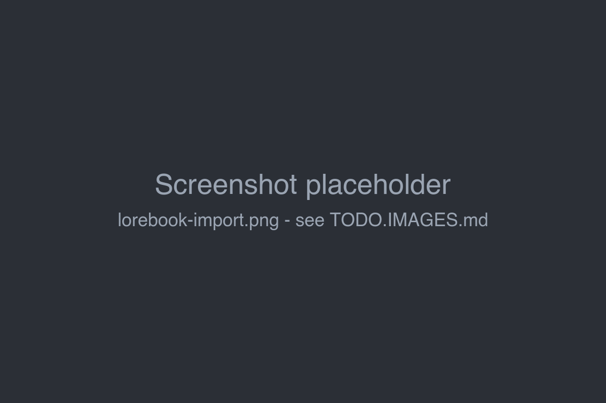

# Book backups

A book backup is a snapshot of one book: its settings and prompts, all parts in all branches, summaries, tags and the
lorebook. Use backups to go back to an earlier state of the story, to make a copy of a book, or to move a book to
another Marginalia installation or user.

Book backups are separate from the [database backups](../administration/database-backups.md) that administrators
make of the whole installation.



## Taking a backup

On the **Backups** tab of the book, click **Take Backup**. The backup appears at the top of the list with its **Date**
and the number of **Messages** (parts) it contains.

Backups can also be taken automatically, see [below](#automatic-backups).

## Restoring a backup

Click **Restore** next to the backup and choose:

| Option | What is restored |
|---|---|
| **Full Restore** | Everything: name, description, publishing, prompts and other book settings, tags, model, protocol, lorebook, and all parts. |
| **Messages Only Restore** | Only the parts (all branches) and summaries. The book's current settings, prompts and lorebook stay as they are. |

!!!warning
Restoring replaces **all parts** of the book with those from the backup. Parts written after the backup are gone.
Take a backup of the current state first if you might want it back.
!!!

The book window closes and opens again with the restored book.

**Model and protocol** are looked up among your inference providers and protocols: first the exact one from the
backup, then one with the same name. If neither exists, the book keeps its current model or protocol.

**Lorebooks** in the backup are compared with yours. When a lorebook with the same name but a different identity
exists, Marginalia asks for each one whether to **Link to existing** or **Create new** from the backup. Lorebooks that
you don't have at all can be imported (**Import**) or left out (**Don't import**).



## Copying a book

**Clone Backup** creates a new book from the backup, under a name you enter. The original book is not changed. Use it
to try something radical with a copy of the book, or to start a new book from the same opening.

## Exporting and importing

**Export** downloads the backup as a JSON file (`<book name>_backup.json`). Keep it as an extra copy, or take it to
another installation.

There are two ways to bring a backup file back:

- **Import Backup** on the *Backups* tab adds the file to the backup list of **this book**. Nothing changes until you
  *Restore* it.
- **Import Backup as New Book** in the *Settings* tab creates a **new book** from the file.

### Importing a backup as a new book

1. Open the **Settings** tab and click **Import Backup as New Book**.
2. Enter the **New Book Name** - the upload is enabled once the name is filled in.
3. Upload the backup file.
4. Decide about the lorebooks, if asked.

The new book appears in the *Books* tab.

## Deleting backups

The trash button removes a backup for good. Automatic backups are not rotated: they stay until you delete them.

## Automatic backups

Marginalia can take a backup on its own while you write. Set the default for all books in
**Settings → General Settings → Backup Strategy**:

| Strategy | |
|---|---|
| **No Backups** | No automatic backups. |
| **After N Messages** | A backup after every *N* generated parts. |
| **After N Minutes** | A backup after a generated part when at least *N* minutes have passed since the last automatic backup. |

To use a different strategy for one book, check **Per manuscript override** on its *Backups* tab and choose the
strategy and the number there. Unchecking it returns the book to the default from *Settings*.

Automatic backups are taken only after a part is generated, so a book you only read doesn't get new backups.

## Where backups are stored

Each backup is a JSON file in the Marginalia data folder:

```
~/.marginalia/data/<your login>/backups/manuscripts/<book id>/
```

With the [Docker version](../getting-started/docker-server.md) this is `./data/data/<login>/...` on the host. The files
are not in the database, so a [database backup](../administration/database-backups.md) doesn't contain them. Include
the whole `.marginalia` folder in your own backups.
