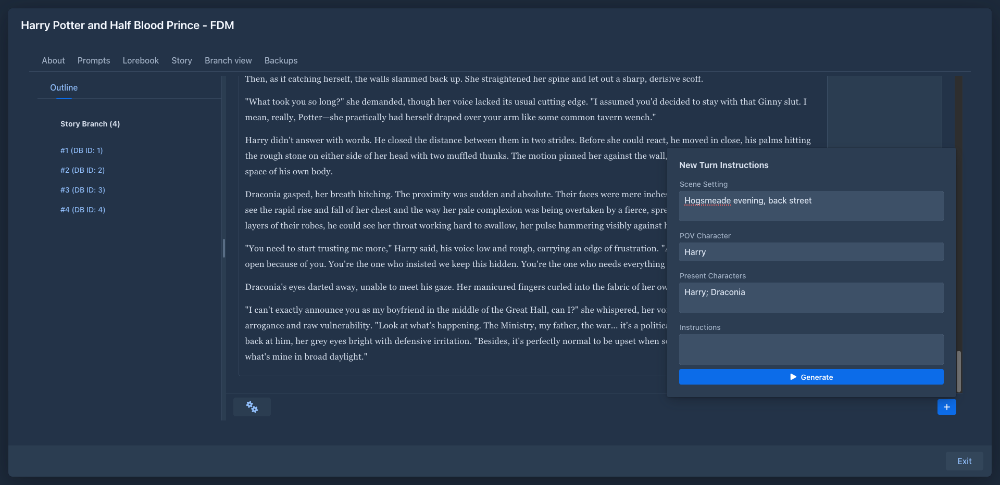

# Books

A book is one story. You give it instructions part by part, the model writes the text, and the book keeps everything
that goes with it: the story tree with all its branches, the prompts that shape the style, the lorebook with the world
and characters, summaries and backups.

## Parts and branches

A book is made of **parts**. Each part is one answer of the model, written from the instructions you gave for it
(scene, point of view character, characters present and what should happen).

Parts form a tree. Usually you just continue the story, but you can also write another version of the last part, or go
back and continue differently from any earlier part. Each path from the beginning to an end is a **branch**. The branch
you are working on is the **active branch**; the story editor shows it, and only its parts are sent to the model. See
[Branches & story tree](branches-and-story-tree.md).

## The book window

Opening a book shows its window with these tabs:

| Tab | |
|---|---|
| **About** | Name, tags, description, model, protocol, publishing and word counts. See [Managing books](managing-books.md). |
| **Prompts** | The templates and style settings of this book. See [Book prompts](prompts.md). |
| **Lorebook** | The lorebook of this book, and its entries. See [Lorebooks](../lorebooks/index.md). |
| **Story** | The story editor, where parts are written and generated. See [Story editor](story-editor.md). |
| **Branch view** | The story tree with all branches. See [Branches & story tree](branches-and-story-tree.md). |
| **Backups** | Backups of the book. See [Book backups](backups.md). |

A book without parts opens on *About*, a book with parts on *Story*. All changes are saved right away; there is no
*Save* button. **Exit** closes the book.

While a part is being generated, the other tabs and *Exit* are disabled until the generation finishes or you stop it.

## In this section

- [Managing books](managing-books.md) - the book list, creating, editing and deleting books
- [Story editor](story-editor.md) - writing instructions, generating and editing parts
- [Branches & story tree](branches-and-story-tree.md) - regenerate, swipe, branch, the tree view
- [Book prompts](prompts.md) - templates, point of view, tense and style
- [Summaries](summaries.md) - keeping long books within the model's context
- [Book backups](backups.md) - backups, restore, copies of a book
- [Publishing & viewer](publishing.md) - reading view and sharing a book
