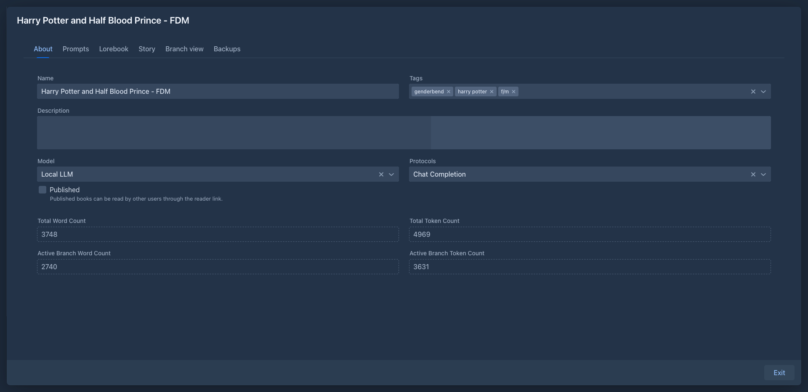

# Managing books

## The book list

The **Books** tab lists your books. Other users' books are not shown.

| Column | |
|---|---|
| **Name** | The name of the book. |
| **Tags** | The book's tags. |
| **Created** | When the book was created. |
| **Last Modified** | When the book was last changed. |

The list is sorted by *Last Modified*, newest first. Click a column header to sort by it; with several sorted columns
the list is sorted by all of them in order.

The row below the headers filters the list:

- **Name** - books whose name *starts* with the text. Use `*` as a wildcard: `*dragon` finds every book with
  "dragon" anywhere in the name.
- **Tags** - books that have *all* the selected tags.

The refresh button at the end of the filter row reloads the list.

Each row has two buttons: the pen opens the book, the trash button deletes it.

## Creating a book

1. Click **Add Book**.
2. Enter the name and confirm.

The new book opens right away. It starts with your **Default Model** and **Default Protocol** from the *Settings* tab
(see [Account & settings](../account.md)), if you have set them; otherwise select them on the *About* tab before
generating.

To start a book from a backup file, use **Import Backup as New Book** in the *Settings* tab, see
[Book backups](backups.md#importing-a-backup-as-a-new-book).

## The About tab

| Field | |
|---|---|
| **Name** | The name of the book. |
| **Tags** | Tags for sorting your books and for [lorebook](../lorebooks/entries.md) activation. Type to pick an existing tag or create a new one. |
| **Description** | What the book is about. Available to the prompt templates as the book description. |
| **Language** | The language the book is written in (English by default). Used for automatic hyphenation of the text in the book reading style and in the [viewer](publishing.md); it does not change what the model writes. |
| **Model** | The [inference provider](../inference-providers.md) that writes this book. |
| **Protocols** | The [protocol](../protocols.md) with the generation settings. |
| **Published** | Lets other users read the book, see [Publishing & viewer](publishing.md). Once checked, the reader link of the book (`<address of Marginalia>/view/<book ID>`) is shown under the checkbox; copy it and send it to the readers. |

Changes are saved as you type.

Below are read-only counts:

| | |
|---|---|
| **Total Word Count**, **Total Token Count** | All parts of the book, in all branches. |
| **Active Branch Word Count**, **Active Branch Token Count** | Only the parts of the [active branch](branches-and-story-tree.md). |

A book needs a model and a protocol to generate. Without them, generating stops with *Book is missing model.* or
*Book is missing protocol.*

## Deleting a book

Click the trash button in the book list and confirm. The book disappears from your list.

Deleted books are not removed from the database right away. Until an administrator removes them, with all their parts,
using [Cleanup](../administration/cleanup.md), you can bring the book back from the [Trash](../trash.md) tab. Until then the data is still in the
[database backups](../administration/database-backups.md). The book's own [backups](backups.md) are files and stay
where they are.
