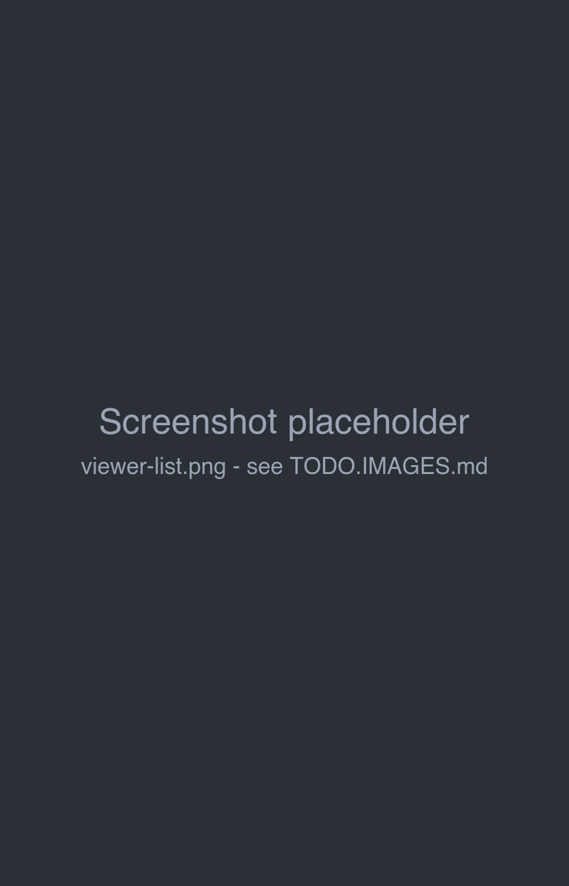

# Publishing & viewer

The **viewer** is a reading view of your books: just the text of the story, without the editor around it. It works
well on phones and tablets. **Publishing** a book lets other users of the same Marginalia installation read it in the
viewer.

## Opening the viewer

The viewer is at `/view` on your Marginalia address, for example:

- desktop app: `http://127.0.0.1:8765/view`
- server: `https://marginalia.example.com/view`

It uses the same login as Marginalia.

The list shows your books, with their tags and when you last opened them. Filter it by **Name** (books whose name
starts with the text) and **Tags** (books with all the selected tags). Sort it by **Last Opened** or **Name**; clicking
the active sort button again reverses the order.

Click a book to read it.

## Reading

The reading view shows the [active branch](branches-and-story-tree.md) of the book from the first to the last part,
in the book reading style (justified, with hyphenation for the book's [language](managing-books.md#the-about-tab)). Other branches, the turn instructions and the metadata are not shown. The arrow button in
the top left corner returns to the list.

What you read is the book as it is now: new parts appear the next time the page is opened.

## Publishing a book

By default only you can open your books in the viewer. To let other users read a book:

1. Open the book and check **Published** on its *About* tab.
2. Copy the reader link that appears under the checkbox on the *About* tab. The link is the address of your
   installation (including its context path, if Marginalia is not served from the root), followed by `/view/` and the
   book's ID: `<address of Marginalia>/view/<book ID>`. In Docker, where Marginalia runs as the root application, it
   looks like `https://marginalia.example.com/view/0b6f3c1e-...`; if it is deployed under a context path such as
   `/marginalia`, the link is `https://example.com/marginalia/view/0b6f3c1e-...`. (You can also copy the same address
   from the browser's address bar when the book is open in the viewer.)
3. Send the address to the other users.

Other users need an account on the same Marginalia installation; they log in and see the book. Published books don't
appear in their viewer list, only the address opens them. They can only read the book, not change it.

Uncheck **Published** to stop sharing: the address then shows *Book not found* to everyone but you. Deleted books
can't be opened at all.
