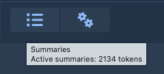
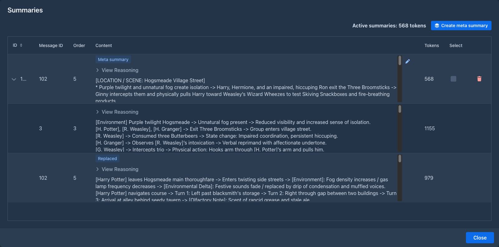
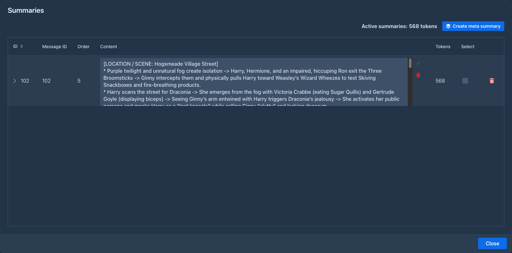
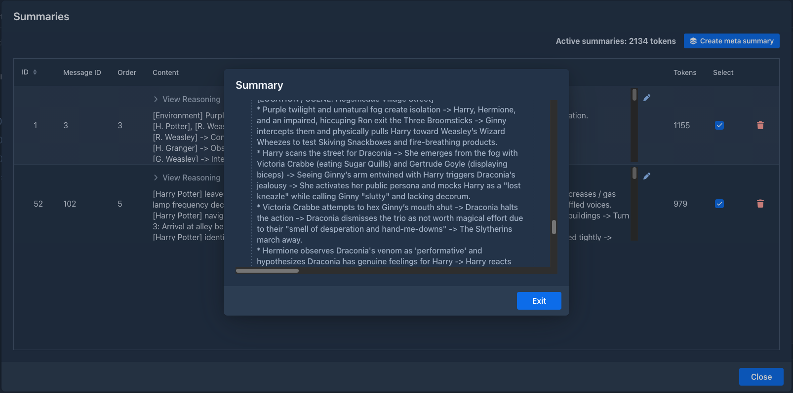
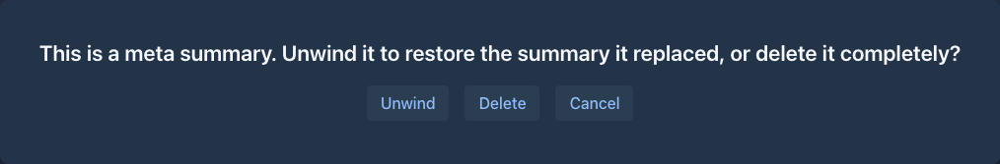

# Summaries

A model can only read a limited amount of text at once (its context). When a book grows beyond that, Marginalia
leaves out the oldest parts, and the model forgets what happened in them. **Summaries** keep that history in the
prompt in condensed form.

## How summaries work

A summary belongs to one part and covers **that part and all parts before it**, back to the previous part with a
summary:

```
#1  #2  #3  #4  #5  #6  #7  #8  #9  #10
            [S1]            [S2]
└──── S1 ────┘└──── S2 ──────┘ sent in full ...
```

Here *S1* (on part #4) covers parts #1-#4 and *S2* (on part #8) covers parts #5-#8.

When the next part is generated:

- all summaries of the active branch go into the master template, oldest first, in the
  `` block (*Summary of story so far* in the default template);
- the parts covered by summaries are **not** sent any more;
- the parts after the newest summary (#9 and #10 above) are sent in full, as many as fit.

Summaries are made only when you ask for them; Marginalia doesn't summarize on its own.

## Creating a summary

1. Pick the part that ends a stretch of the story you want to condense, for example the last part of a chapter.
2. In its menu (☰) choose **Generate summary**.
3. The summary dialog shows the summary as the model writes it (and its reasoning, for reasoning models). **Stop**
   interrupts it and discards the summary.
4. When it's done, close the dialog with **Exit**.


The part menu now has **View summary**, which opens the summary again, and **Delete summary**, which removes it. To
change a summary, edit it in the [Summaries overview](#the-summaries-overview), or delete it and generate it again,
possibly with a different [summary prompt](#the-summary-prompt).

The summary is written by the book's model, with the book's [protocol](../protocols.md), and must fit into the
[context limit](../protocols.md#limits) together with the text of the parts it covers. To summarize a long stretch
with a small model, summarize in smaller steps.

## The Summaries overview

The **Summaries** button (the list icon, left of the settings menu ⚙) in the bottom bar of the story editor opens the
overview of all summaries of the active branch. Hover the button to see how many tokens the summaries in use take
in the prompt.



The dialog lists the summaries the next generation will send, oldest first, and the sum of their tokens at the top.



| Column | |
|---|---|
| **ID** | Database ID of the summary. A `-` marks a summary that was [replaced](#meta-summaries) by a meta summary. |
| **Message ID** | Database ID of the part the summary belongs to (the same number the outline of the story editor shows as *DB ID*). |
| **Order** | Position of that part in the branch, `1` is the first part. |
| **Content** | The reasoning of the model (collapsed, if it was a reasoning model) and the text of the summary, in a scrolling area of the same height for every summary. |
| **Tokens** | Size of the summary text. |
| **Select** | Ticks the summary for a [meta summary](#creating-a-meta-summary). |
| trash icon | Deletes the summary. |

Summaries that are merged into a meta summary are shown under it, see [below](#meta-summaries). They have no
**Select** box, no trash icon and no pencil: only the summaries that are in use can be changed.

The empty menu bar above the grid is for [extensions](../extensions/index.md) that add tools to the overview.

### Editing a summary

Click the pencil to the right of the content of a summary. The text turns into a text area of the same size. Click
the green check to save the change, or the red trash icon to throw it away. The token count is counted again after
saving.



Editing a summary changes what the model gets, nothing else: the summary stays valid. Only the text can be edited,
not the reasoning.

### Deleting a summary

The trash icon of a summary does the same as **Delete summary** in the part menu. For a meta summary it asks what to
do, see [Unwinding a meta summary](#unwinding-a-meta-summary).

## Meta summaries

Summaries stay in the prompt for good, so a long book fills the context with them. A **meta summary** condenses
several summaries into one: it is a summary of summaries.

```
#1  #2  #3  #4  #5  #6  #7  #8  #9  #10
        [S1]        [S2]        [S3]
        └─────────── M ─────────────┘
```

Here *M* merges *S1*, *S2* and *S3*. It belongs to the part of the newest merged summary (#9 above, which had *S3*)
and replaces that summary on the part. From then on:

- only *M* goes into the `` block, instead of *S1*, *S2* and *S3*;
- *S1* and *S2* stay on their parts, but are not sent. They are shown under *M* in the overview;
- *S3*, the summary *M* replaced, is kept inside *M*, shown under it with a **Replaced** badge.

The parts covered by the merged summaries are still not sent in full; a meta summary doesn't change what the
summaries cover, only how long the text for it is.

### Creating a meta summary

1. Open the [Summaries overview](#the-summaries-overview).
2. Tick the **Select** box of the summaries to merge. At least two. You tick the summaries in use only (the ones on
   the top level of the grid).
3. Click **Create meta summary**.

Marginalia merges everything from the newest to the oldest ticked summary, including the summaries in between that
were not ticked. The meta summary dialog works like the summary dialog: it shows the text as the model writes it, and
**Stop** cancels it and changes nothing. When it ends, close the dialog with **Exit** and the overview shows the
result.



A meta summary can merge meta summaries too: tick them like any other summary. The merged ones are shown under the new
one, with their own merged summaries under them.

The summaries to merge and the request for the model must fit into the [context limit](../protocols.md#limits), so
with a small model merge a few summaries at a time.

### Unwinding a meta summary

Deleting a meta summary (the trash icon in the overview, or **Delete summary** in the part menu) asks:

| Button | |
|---|---|
| **Unwind** | Removes the meta summary and puts back the summary it replaced on the part. Summaries that were merged into a meta summary made of meta summaries come back one level at a time, the way they were made. |
| **Delete** | Removes the meta summary and leaves the part without a summary. The summaries it merged are in use again (but the one it replaced is gone). |
| **Cancel** | Does nothing. |

After unwinding, the summaries that were merged are in use again and the overview shows them on the top level.



### The meta summary prompt

The request for a meta summary is the **Default Meta Summary Prompt** of the book (on the [Prompts](prompts.md) tab, or
the default from *Settings → Templates*). It gets two variables:

| Variable | |
|---|---|
| `` | The summaries to merge, oldest first, separated by an empty line. |
| `` | The lorebook entries that were active when the part of the meta summary was written. |

The built-in prompt asks for the events to be chained into shorter entries - roughly half the size - without losing
names, items, agreements or unresolved plot threads, and without adding anything new.

## When summaries become outdated

A summary is only valid for the exact text it was made from. When you [edit](story-editor.md#editing-the-text) or
[delete](story-editor.md#deleting-a-part) a part covered by a summary, the summary no longer matches.

Marginalia checks this when it generates the next part. Outdated summaries are removed and you are asked
*Invalidated summaries for messages with IDs: [...]. Continue generation without those summaries?* Answer **Yes** to
generate without them, or **No** to stop and generate new summaries first. Either way the outdated summaries are gone;
the parts they covered are sent in full again (as far as they fit) until you summarize them again.

A meta summary is outdated when a part it covers is edited or deleted, but also when a summary it merged is deleted.
(That is why the merged summaries can't be edited: the change would make the meta summary outdated.) Removing an
outdated meta summary is the same as unwinding it: the summary it replaced comes back, and is checked as well. If it
is outdated too, it is removed in the same way.

When you [branch](branches-and-story-tree.md#branching-from-an-earlier-part) from a part with a summary, the new
branch gets a copy of the summary. A copied meta summary keeps what it replaced, so it can be unwound in the new
branch.

## The summary prompt

The request for a summary is the **Default Summary Prompt** of the book (on the [Prompts](prompts.md) tab, or the
default from *Settings → Templates*). It gets two variables:

| Variable | |
|---|---|
| `` | The text of the parts to summarize, oldest first. |
| `` | The lorebook entries that were active when the summarized part was written. |

The built-in prompt asks for a detailed, chronological ledger of events - every beat, action and change of state -
rather than a short retelling, because the summary is meant for the model, not for a reader. Replace it if you prefer
shorter summaries or a different format.

## Tips

- Summarize at natural breaks: the end of a chapter or a scene.
- When the summaries start to take too much of the context (the tooltip of the **Summaries** button shows how much),
  merge the oldest ones into a meta summary. Repeat it later with the meta summary and the summaries after it.
- Summaries stay in the prompt for good. With many of them, the prompt can fill the context by itself, and generating
  stops with *Contextual limit not sufficient.* Then shorten them (a more concise summary prompt), merge them into
  [meta summaries](#meta-summaries) or raise the context limit.
- Keep facts that must never be forgotten (names, relationships, rules of the world) in the
  [lorebook](../lorebooks/index.md) rather than relying on summaries.
- Check what the model got with **Show Prompt** on the next part.
