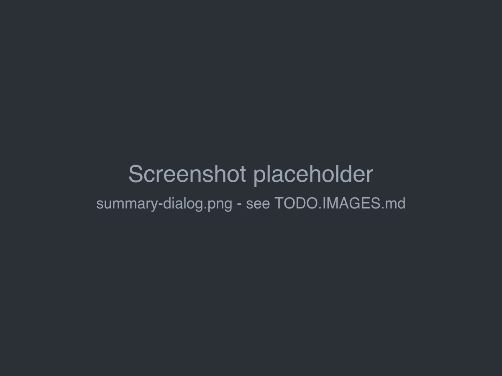

# Summaries

A model can only read a limited amount of text at once (its context). When a book grows beyond that, Marginalia
leaves out the oldest parts, and the model forgets what happened in them. **Summaries** keep that history in the
prompt in condensed form.

## How summaries work

A summary belongs to one part and covers **that part and all parts before it**, back to the previous part with a
summary:

```
#1  #2  #3  #4  #5  #6  #7  #8  #9  #10
            [S1]            [S2]
└──── S1 ────┘└──── S2 ──────┘ sent in full ...
```

Here *S1* (on part #4) covers parts #1-#4 and *S2* (on part #8) covers parts #5-#8.

When the next part is generated:

- all summaries of the active branch go into the master template, oldest first, in the
  `` block (*Summary of story so far* in the default template);
- the parts covered by summaries are **not** sent any more;
- the parts after the newest summary (#9 and #10 above) are sent in full, as many as fit.

Summaries are made only when you ask for them; Marginalia doesn't summarize on its own.

## Creating a summary

1. Pick the part that ends a stretch of the story you want to condense, for example the last part of a chapter.
2. In its menu (☰) choose **Generate summary**.
3. The summary dialog shows the summary as the model writes it (and its reasoning, for reasoning models). **Stop**
   interrupts it and discards the summary.
4. When it's done, close the dialog with **Exit**.



The part menu now has **View summary**, which opens the summary again, and **Delete summary**, which removes it.
Summaries can't be edited; to change one, delete it and generate it again, possibly with a different
[summary prompt](#the-summary-prompt).

The summary is written by the book's model, with the book's [protocol](../protocols.md), and must fit into the
[context limit](../protocols.md#limits) together with the text of the parts it covers. To summarize a long stretch
with a small model, summarize in smaller steps.

## When summaries become outdated

A summary is only valid for the exact text it was made from. When you [edit](story-editor.md#editing-the-text) or
[delete](story-editor.md#deleting-a-part) a part covered by a summary, the summary no longer matches.

Marginalia checks this when it generates the next part. Outdated summaries are removed and you are asked
*Invalidated summaries for messages with IDs: [...]. Continue generation without those summaries?* Answer **Yes** to
generate without them, or **No** to stop and generate new summaries first. Either way the outdated summaries are gone;
the parts they covered are sent in full again (as far as they fit) until you summarize them again.

When you [branch](branches-and-story-tree.md#branching-from-an-earlier-part) from a part with a summary, the new
branch gets a copy of the summary.

## The summary prompt

The request for a summary is the **Default Summary Prompt** of the book (on the [Prompts](prompts.md) tab, or the
default from *Settings → Templates*). It gets two variables:

| Variable | |
|---|---|
| `` | The text of the parts to summarize, oldest first. |
| `` | The lorebook entries that were active when the summarized part was written. |

The built-in prompt asks for a detailed, chronological ledger of events - every beat, action and change of state -
rather than a short retelling, because the summary is meant for the model, not for a reader. Replace it if you prefer
shorter summaries or a different format.

## Tips

- Summarize at natural breaks: the end of a chapter or a scene.
- Summaries stay in the prompt for good. With many of them, the prompt can fill the context by itself, and generating
  stops with *Contextual limit not sufficient.* Then shorten them (a more concise summary prompt) or raise the
  context limit.
- Keep facts that must never be forgotten (names, relationships, rules of the world) in the
  [lorebook](../lorebooks/index.md) rather than relying on summaries.
- Check what the model got with **Show Prompt** on the next part.
