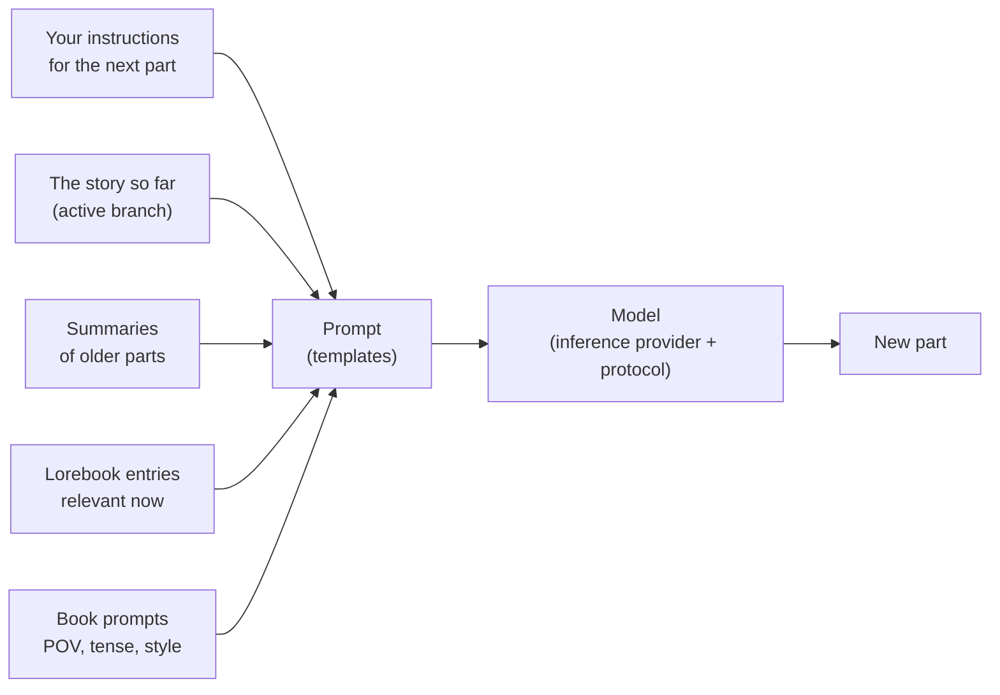
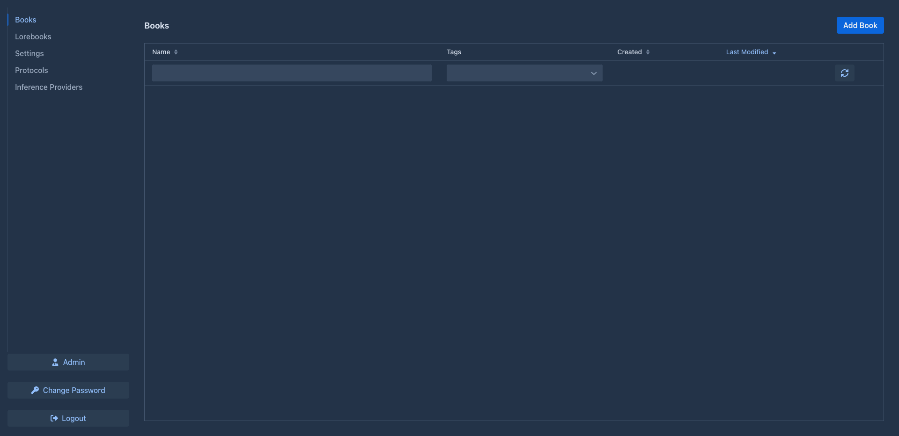

# User guide

This part of the manual is for people who write with Marginalia and for those who run it for others. It explains
every screen and setting, from installing Marginalia and connecting a model to branching a story, building a
lorebook and backing up the database. You don't need to know anything about programming; a few pages about templates
go deeper for those who want to fine-tune what is sent to the model.

If you are new, start with [Getting started](getting-started/index.md) – it takes you from installation to the first
generated part of a book in a few minutes.

## How Marginalia works

You write a story together with a large language model. For each **part** of the story you say what should happen -
the scene, whose point of view, who is present, a few sentences of instructions - and the model writes the prose.
Before every part Marginalia builds the prompt for the model from:

Everything in this picture can be adjusted, and the user guide is organized along it.

## Core concepts

| Concept                | What it is                                                                                                                                                             | Read more                                                 |
|------------------------|------------------------------------------------------------------------------------------------------------------------------------------------------------------------|-----------------------------------------------------------|
| **Book**               | One story with everything that belongs to it: parts, prompts, lorebook, summaries, backups.                                                                            | [Books](books/index.md)                                   |
| **Part**               | One piece of the story, normally one answer of the model. You can edit, regenerate or delete it.                                                                       | [Story editor](books/story-editor.md)                     |
| **Branch**             | Parts form a tree: you can write another version of a part or continue differently from any earlier one. The *active branch* is what you see and what the model reads. | [Branches & story tree](books/branches-and-story-tree.md) |
| **Lorebook**           | Notes about the world and characters. Each **entry** is put into the prompt only when it is relevant, e.g. when a character's name appears.                            | [Lorebooks](lorebooks/index.md)                           |
| **Summary**            | A condensed version of older parts, so a long book still fits into what the model can read at once.                                                                    | [Summaries](books/summaries.md)                           |
| **Meta summary**       | A summary of summaries: several summaries merged into one shorter text, to free up the context.                                                                        | [Summaries](books/summaries.md#meta-summaries)            |
| **Template**           | The text with placeholders and macros from which the prompt is built. Every book has its own prompts, with defaults in *Settings*.                                     | [Templates & macros](templates/index.md)                  |
| **Inference provider** | The connection to a model: API address, API key, model and its limits.                                                                                                 | [Inference providers](inference-providers.md)             |
| **Protocol**           | Generation settings: temperature, top P, penalties and optional limits. The provider says *which* model writes, the protocol *how*.                                    | [Protocols](protocols.md)                                 |
| **Tag**                | A label on books and lorebooks; tags also decide which lorebook entries a book uses.                                                                                   | [Managing books](books/managing-books.md)                 |
| **Extension**          | A plugin that adds features, such as chapter markers or AI reviews.                                                                                                    | [Extensions](extensions/index.md)                         |

Everything you create belongs to your account. Other users of the same Marginalia don't see your books, lorebooks,
providers or settings - only books you choose to [publish](books/publishing.md).

## The workspace

After logging in you see the workspace. The tabs on the left are the main areas of Marginalia:

| Tab                     |                                                                                                             |
|-------------------------|-------------------------------------------------------------------------------------------------------------|
| **Books**               | Your books. Open one to write. See [Books](books/index.md).                                                 |
| **Lorebooks**           | All your lorebooks and their entries. See [Lorebooks](lorebooks/index.md).                                  |
| **Settings**            | Your defaults: model, protocol and the default prompts for new books. See [Account & settings](account.md). |
| **Protocols**           | Generation settings. See [Protocols](protocols.md).                                                         |
| **Inference Providers** | Connections to models. See [Inference providers](inference-providers.md).                                   |

At the bottom are **Change Password**, **Logout** and, for administrators, **Admin**. Extensions may add more tabs
and buttons.

## Sections of this guide

| Section                                       | For                                                                                                                                                                                                                  |
|-----------------------------------------------|----------------------------------------------------------------------------------------------------------------------------------------------------------------------------------------------------------------------|
| [Getting started](getting-started/index.md)   | Installing the [desktop app](getting-started/desktop-app.md) or a [server](getting-started/docker-server.md), the [first start](getting-started/first-start.md) and a [quick start](getting-started/quick-start.md). |
| [Inference providers](inference-providers.md) | Connecting cloud and local models, context limits, reasoning models.                                                                                                                                                 |
| [Protocols](protocols.md)                     | Temperature, top P, penalties and per-protocol limits.                                                                                                                                                               |
| [Books](books/index.md)                       | Managing books, the story editor, branches, book prompts, summaries, backups and publishing.                                                                                                                         |
| [Lorebooks](lorebooks/index.md)               | Creating lorebooks, entries and how they are activated, import and export (including SillyTavern).                                                                                                                   |
| [Templates & macros](templates/index.md)      | What is sent to the model and how to change it; the macro reference.                                                                                                                                                 |
| [Extensions](extensions/index.md)             | The bundled extensions: Author's Note, Chapter Marker, Lorebook VCS, Reviewer, Side Query.                                                                                                                                          |
| [Account & settings](account.md)              | Your password, user name and default settings.                                                                                                                                                                       |
| [Administration](administration/index.md)     | For administrators: users, database backups, cleanup, installing extensions.                                                                                                                                         |
| [Troubleshooting & FAQ](troubleshooting.md)   | Logs, common problems and their solutions.                                                                                                                                                                           |

## Conventions

- Names of tabs, buttons and fields are in **bold** or *italics*, written as they appear in Marginalia, e.g.
  *Admin → Users*.
- `~/.marginalia` is the data folder in your home directory (`%USERPROFILE%\.marginalia` on Windows); on a Docker
  server it is the `./data` folder next to `docker-compose.yml`.
- Most changes are saved as soon as you make them. The exception is the *Settings* tab, which has a **Save** button.
