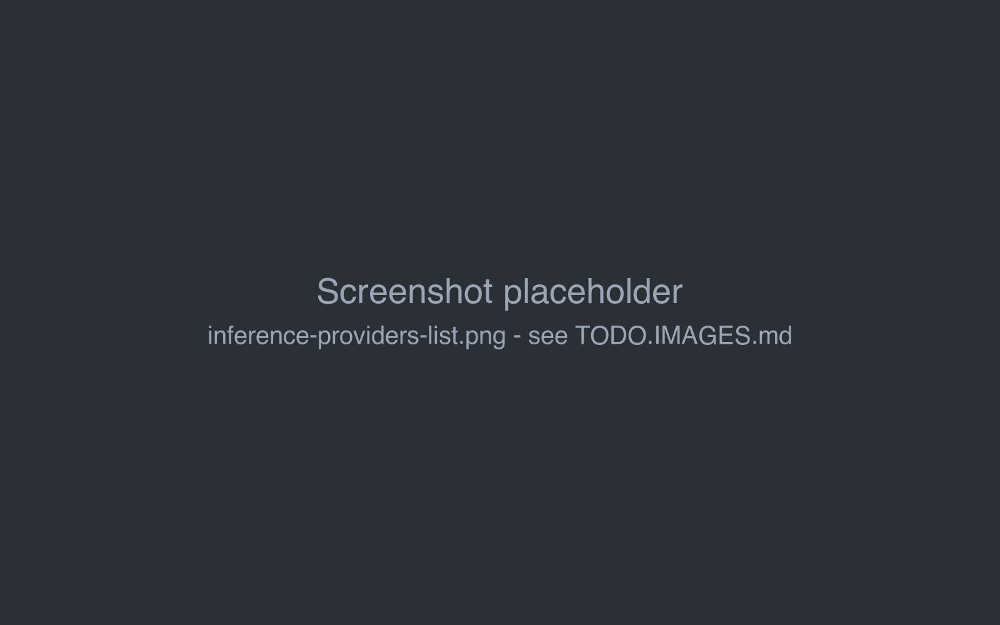
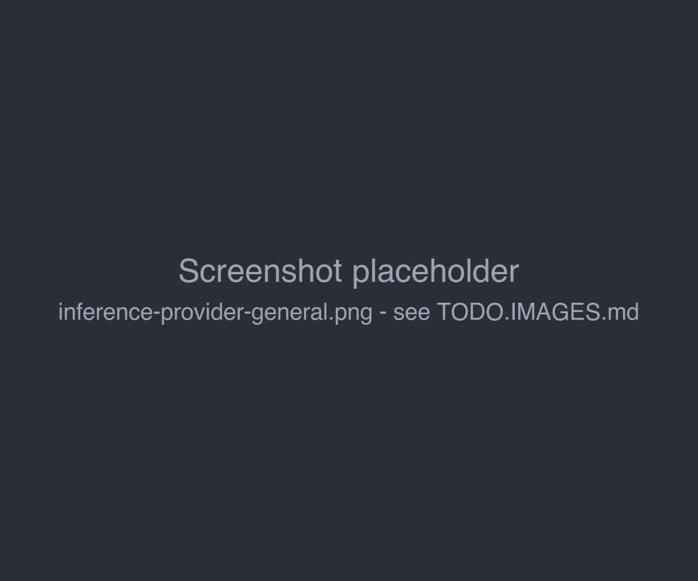
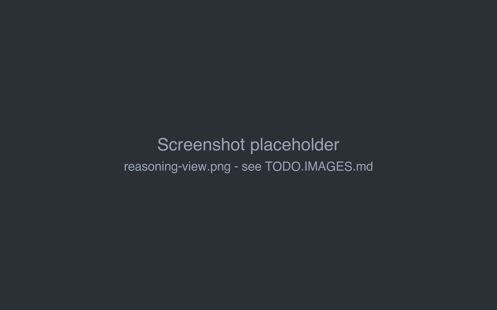

# Inference providers

An inference provider is a connection to a model: the API address, the API key, the model and its limits. Every
book uses one provider. You can have as many as you like, for example a large cloud model for the story and a small
local one for experiments, and switch a book between them at any time.

Providers belong to your account. Other users don't see them or their API keys.

## Supported APIs

Marginalia works with any API that implements the **OpenAI Chat Completions** interface (`/v1/chat/completions`,
with streaming). Most services and local servers do:

| Service | OpenAI URL |
|---|---|
| OpenAI | `https://api.openai.com/v1` |
| OpenRouter | `https://openrouter.ai/api/v1` |
| LiteLLM proxy | `http://localhost:4000/v1` |
| llama.cpp (`llama-server`) | `http://localhost:8080/v1` |
| LM Studio | `http://localhost:1234/v1` |
| Ollama | `http://localhost:11434/v1` |
| vLLM | `http://localhost:8000/v1` |

The ports are the defaults of each server; use the ones your server actually runs on.

!!!warning Port 8080
The Docker version of Marginalia uses port 8080 as well. If you run llama.cpp on the same machine, start it on another
port (`llama-server --port 8081`).
!!!

!!!
With the [Docker version](getting-started/docker-server.md), `localhost` means the Marginalia container. Use
`http://host.docker.internal:<port>/v1` for a model server on the same machine, see
[Models on the same machine](getting-started/docker-server.md#models-on-the-same-machine).
!!!

## Adding a provider

Open the **Inference Providers** tab and click **Add Inference Provider**. Existing providers are edited with the pen
button and deleted with the trash button.

At the top of the dialog:

| Field | |
|---|---|
| **Name** | Your name for the provider, shown when you pick a model for a book. Include the model, e.g. `OpenRouter - Claude Sonnet`. |
| **Type** | The kind of API. Currently only **OpenAI Compatible**. |

### Per Type Settings

| Field | |
|---|---|
| **OpenAI URL (ends with /v1)** | The base address of the API, see [the table above](#supported-apis). Without `/chat/completions`. |
| **Api Key** | The key of the service. Local servers usually don't need one; leave it empty. |
| **Model** | The model to use. Click **Refresh** to load the list of models from the API, or type the model ID yourself (e.g. `anthropic/claude-sonnet-4.5` on OpenRouter). |
| **Additional Parameters** | A JSON object with extra fields for every request to this provider, e.g. `{"top_k": 40, "min_p": 0.05}` for a local server, or `{"provider": {"order": ["anthropic"]}}` for OpenRouter. A field set here wins over the same setting from the [protocol](protocols.md) (e.g. `temperature`) or the response limit (`max_completion_tokens`). Must be a valid JSON object or empty. |

When you edit an existing provider, the API key is not shown again. It is kept as it is unless you click
**Reset Api Key** and enter a new one.

**Refresh** asks the API for its model list (`/v1/models`) with the URL and key from the form. If it fails with
*Failed to download model list*, check the URL (it must end with `/v1`), the key, and that the server is running.
Some services don't list models; type the model ID instead.

### General Settings

| Field | |
|---|---|
| **Max Context Size** | Required. How many tokens the model accepts in total, prompt and response together. |
| **Max Response Tokens** | Required. The longest response the model may write. Sent to the API as `max_completion_tokens`, and this much of the context is kept free for the response. Must be lower than *Max Context Size*. |
| **Needs Jailbreak**, **Jailbreak Prompt** | An extra prompt for models that refuse to write some content. When checked, the jailbreak prompt is put at the very beginning of the prompt. |
| **Enable Reasoning**, **Reasoning Effort** | For reasoning ("thinking") models, see [Reasoning models](#reasoning-models). |

Marginalia keeps **Max Response Tokens** of the context free for the response and fills the rest with the prompt:
templates, [lorebook](lorebooks/index.md) entries and [summaries](books/summaries.md) are counted in, and the oldest
parts of the story that don't fit are left out. With a context of 32 000 tokens and responses of up to 2 000 tokens,
the prompt gets 30 000 tokens.

Take **Max Context Size** from the documentation of the service, and set it a little lower: token counts are not
always exact, and a request that exceeds the real limit fails. A [protocol](protocols.md) can override both limits
for some books.

## Reasoning models

Reasoning models think before they answer. With **Enable Reasoning** checked, Marginalia sends the chosen
**Reasoning Effort** (*None*, *Low*, *Medium* or *High*) to the API as `reasoning_effort`. More effort usually means
better planned text, but slower and more expensive responses. Not every API supports the parameter; if requests
fail with reasoning enabled, turn it off.

When the model returns its reasoning (as `reasoning_content` or `reasoning`, depending on the server), it is shown
above the generated part under **View Reasoning**. The reasoning is not part of the story and is not sent back to the
model.

Reasoning counts toward the response: give reasoning models a larger **Max Response Tokens**, or the text may be cut
off after a long reasoning.

## Token counting

Marginalia counts tokens to decide how much of the story fits into the prompt. It asks the provider when it can,
and tries these methods in order:

1. the OpenAI token counting endpoint (`/v1/responses/input_tokens`),
2. the `/tokenize` endpoint of llama.cpp,
3. the `/tokenize` endpoint of LiteLLM,
4. the `/v1/messages/count_tokens` endpoint of LiteLLM (for Anthropic models),
5. a local estimate with the OpenAI tokenizer.

The first method that works is used from then on. The local estimate is close for most models but not exact, which
is another reason to keep **Max Context Size** a little below the real limit.

## Using a provider in a book

Each book has its model in the **Model** field of its **About** tab. To use a provider for all new books, select it
as **Default Model** in the **Settings** tab. Changing the provider of a book takes effect with the next generated
part; parts written before stay as they are.

## Troubleshooting

| Problem | What to check |
|---|---|
| *Failed to download model list* | URL ends with `/v1`, API key, the server is running and reachable from Marginalia. Type the model ID if the service has no model list. |
| *Book is missing model.* | The book has no provider. Select one in **About → Model**. |
| *Contextual limit not sufficient.* | The prompt without any story doesn't fit into the context minus the response tokens. Raise **Max Context Size** (or the protocol's **Max Context Tokens**), lower **Max Response Tokens**, or shorten the templates and lorebook entries. |
| Text stops in the middle | **Max Response Tokens** (or the protocol's **Max Reply Tokens**) is too low, especially for reasoning models. |
| Errors from the API with reasoning on | The API doesn't support `reasoning_effort`. Turn off **Enable Reasoning**. |
