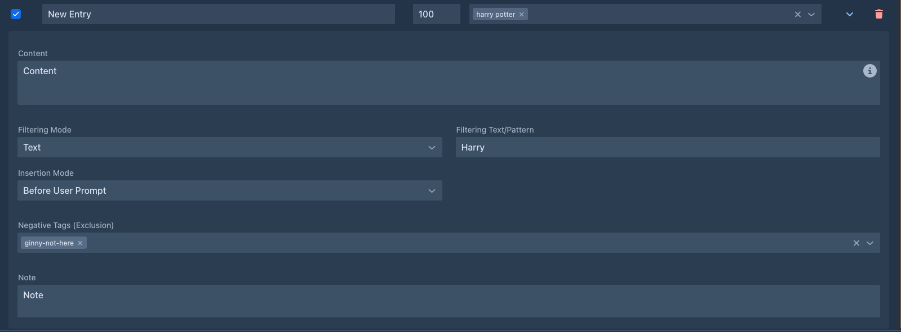

# Entries & activation

## The entry list

Each row of the lorebook editor is one entry:

| Column | |
|---|---|
| checkbox | **Enabled**. Disabled entries are never used. |
| **Entry Name** | Your name for the entry. Not sent to the model. |
| **Order** | Position of the entry in the prompt, see [Order and insertion](#order-and-insertion). New entries get `100`. |
| **Tags** | Tags that activate the entry, see [Tags](#tags). |
| ⌄ | Shows the details of the entry. |
| trash | Deletes the entry (after confirming). |

**Add Entry** in the toolbar adds an entry with order `100`. Changes are saved as you type.

## Entry details

The ⌄ button opens the details:



| Field | |
|---|---|
| **Content** | The text that goes into the prompt. A [template](#templates-in-entries): it can use variables and macros. |
| **Filtering Mode** | **Text** or **Regex**, how *Filtering Text/Pattern* is matched. |
| **Filtering Text/Pattern** | The filter, see [Filters](#filters). Empty means no filter. |
| **Insertion Mode** | **In Lore Block** or **Before User Prompt**, see [Order and insertion](#order-and-insertion). |
| **Negative Tags (Exclusion)** | Tags that switch the entry off, see [Tags](#tags). |
| **Note** | Your notes. Not sent to the model. Entries imported from SillyTavern list the settings that couldn't be imported here. |

Write the content as you want the model to read it - a short, factual description works best:

> **Captain Varro** - commander of the harbor watch of Ostra, fifties, scarred left hand. Loyal to the Duke, distrusts
> the mages' guild. Speaks in short, clipped sentences.

## Activation

Before each generated part, Marginalia goes through the entries of the book's lorebook and its
[sub lorebooks](lorebooks.md#sub-lorebooks). An entry is **activated** when:

1. the entry is enabled, and so is its lorebook;
2. none of its **negative tags** is a tag of the book;
3. it has no **tags**, or at least one of them is a tag of the book;
4. it has no **filter**, or the filter matches the instructions for the part.

All conditions must hold. An entry without tags and filter is always active.

### Tags

Tags connect entries with **book tags** (set on the book's [About](../books/managing-books.md#the-about-tab) tab).
Use them to share one lorebook between books that need different parts of it:

| Entry tags | Negative tags | Active in a book tagged... |
|---|---|---|
| - | - | always |
| `winter` | - | `winter` |
| `winter`, `book-2` | - | `winter` **or** `book-2` |
| - | `book-1` | anything but `book-1` |
| `winter` | `book-1` | `winter`, unless it is also `book-1` |

Tags must match exactly. A negative tag always wins over a tag.

Tags can also be given to a whole lorebook (the **Tags** field of the [lorebook](lorebooks.md); lorebooks imported
from files can carry them). They then count as tags of each of its entries.

### Filters

A filter activates the entry only when the **request for the part** mentions it. It is matched against the
[user prompt](../books/prompts.md#user-prompt) of the part as it is sent - the *Scene Setting*, *POV Character*,
*Present Characters* and *Instructions* you entered, inside the wording of the user prompt template.

| Mode | Matches when |
|---|---|
| **Text** | The text appears anywhere in the request, ignoring upper and lower case. `varro` matches *Captain Varro*. |
| **Regex** | The [regular expression](https://regex101.com/) matches anywhere in the request, ignoring case, across lines. |

For example, the regex `\b(varro|captain)\b` matches the whole word *Varro* or *Captain*, and
`varro.*(harbor|docks)` matches only when Varro and the harbor or the docks are both mentioned, in that order.

!!!warning The filter sees the request, not the story
Filters check the instructions for the new part only, not the text of earlier parts. An entry about Varro is
activated when Varro is mentioned in the scene, characters or instructions of the part you are writing - put him
into *Present Characters* when he is in the scene.

The request also contains the text of the user prompt template itself. A filter for a word the template uses
(the default one mentions *characters*, *plot*, *tone*...) is always active.
!!!

An invalid regular expression never matches; the entry stays inactive.

Combine tags and a filter when an entry should only be used in some books, and there only when it's relevant.

## Order and insertion

Activated entries are put into the prompt sorted by **Order**, lowest first. Entries with the same order keep the
order in which they were created. Entries from all included lorebooks are sorted together.

**Insertion Mode** decides where an entry goes:

| Mode | Where |
|---|---|
| **In Lore Block** | Into the `` block of the [master template](../books/prompts.md#master-template) - *World & lore context* in the default template, in the system message. Use it for background knowledge. |
| **Before User Prompt** | Right before the request for the part, at the end of the prompt. The model pays most attention to it. Use it sparingly, for what must influence this very part (a character's current state, a rule for the scene). |

Entries are separated by an empty line. Lore counts toward the [context limit](../protocols.md#limits); with many
long entries, less of the story fits into the prompt.

## Templates in entries

The content of an entry is a template like the [book prompts](../books/prompts.md#templates). It can use:

| Variable | |
|---|---|
| ``, ``, ``, `` | The instructions for the part. |
| ``, ``, `` | The book's narrative settings. |

and all [macros](../templates/macros.md). For example, an entry that adapts to the point of view character:



All activated entries of one part share their variables in activation order: an entry can `setvar` a value that
entries later in the order (and the master template) read with `getvar`.

A syntax error in the content is shown under the field. The entry is still saved; until it is fixed, its content is
used as plain text, without processing the template.

## Tips

- Keep entries short and factual; the model doesn't need prose, it needs facts.
- One entry per character, place or concept, so each can be activated on its own.
- Use always-active entries for the core of the world, filters for the cast and places, and tags to share a lorebook
  between books.
- Check what was activated with **Show Prompt** on a generated part.
