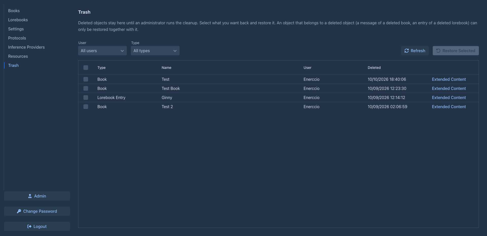
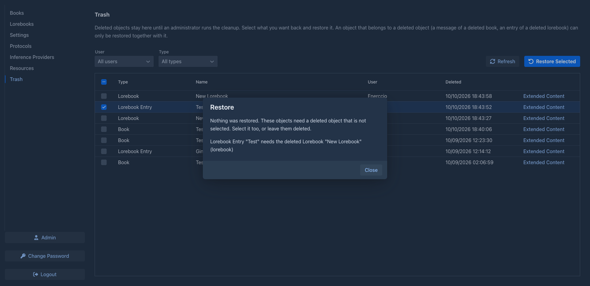

# Trash

Deleting in Marginalia does not destroy anything right away: a deleted book, lorebook, story part or inference provider
is only marked as deleted and hidden from your lists. The **Trash** tab lists these deleted objects and brings them
back.

Deleted objects stay in the trash until an administrator runs the [cleanup](administration/cleanup.md), which removes
them from the database for good. Whatever the cleanup has removed can no longer be restored (only a
[database backup](administration/database-backups.md) made before still has it).

The table loads as you scroll. The most recently deleted objects are first.

| Column | |
|---|---|
| (tick box) | Selects the object for restoring. The box in the header selects all objects. |
| **Type** | The kind of object: book, lorebook, lorebook entry, message (a story part), summary, model (inference provider), protocol, tag, resource... |
| **Name** | The name of the object. Story parts and tag links have no name and show their id; use *Extended Content* to read a story part. |
| **User** | Whose object it is. Only administrators see this column. |
| **Deleted** | When the object was deleted. |
| **Extended Content** | Opens the saved data of the object, see [below](#extended-content). |

Above the table, **Type** shows only one kind of object, **Refresh** loads the table again.

## Restoring

Tick the objects you want back and click **Restore Selected**. Marginalia asks before it restores them. The objects
are back in their lists, exactly as they were deleted, and the other tabs are refreshed.

### Objects that belong to other objects

Some objects can't live without another object:

- an entry needs its lorebook,
- a story part and a summary need their book,
- a book needs its model (inference provider), its protocol and its lorebook, as long as it uses them,
- a tag link needs its tag.

An object whose lorebook, book... is deleted **can only be restored together with it**: tick both. If you tick only
the entry, Marginalia restores **nothing** and tells you what is missing:

> Nothing was restored. These objects need a deleted object that is not selected. Select it too, or leave them deleted.
> Lorebook Entry "Dragon" needs the deleted Lorebook "Bestiary" (lorebook)

Tick the object it names and restore again. Objects that are not deleted any more (restored in the meantime, or an
object you didn't delete) are not a problem.

!!!info A restored story part
A story part that was deleted from the middle of a story had its following parts moved to its parent. Restoring it
brings the part back under its parent as a new branch, **without** the parts that followed it: they stay where they
were moved to. Restore a whole book instead of single parts when you want the story as it was.
!!!

### Extended content

Marginalia keeps much of an object's data (the text of a story part, the settings of a lorebook entry, notes that
[extensions](extensions/index.md) saved) as JSON next to it. **Extended Content** in a row shows it, so you can
check what an object contains before you restore it, for example to find the right story part. Objects without such
data (resources) have no link; an object that has none shows *This object has no extended content.*

## Administrators

Administrators see the deleted objects of **all users** and can restore any of them. The **User** filter above the
table shows the objects of one user; the **User** column tells whose they are. Restored objects go back to their
owner.

The same table is in *Admin → Cleanup* (**Trash**), so you can see what the next cleanup removes. Objects of a deleted
user can't be restored: they depend on the user.
