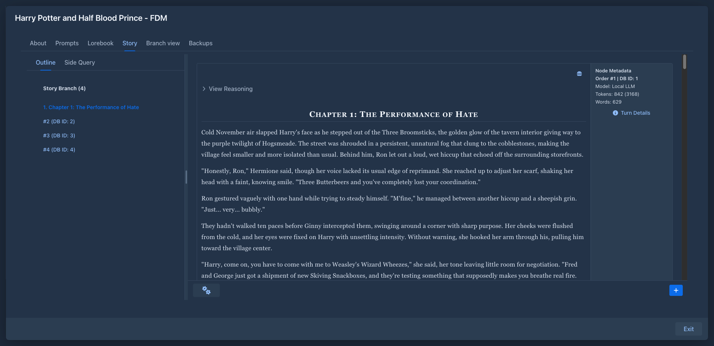

# Chapter Marker

Turns the story sidebar into a table of contents.

When the text of a story part contains a Markdown heading - a line starting with `#`, for example
`# Chapter 3: The Harbour` - the part's entry in the story sidebar shows the heading as `3. Chapter 3: The Harbour`,
highlighted. Parts without a heading keep their usual label.

The label is updated as soon as you edit a part: add a heading to start a chapter, remove it to merge the part back.
Only the first heading of a part is used.

## Usage

Nothing to configure. Install the plugin (see [Marginalia plugins](../README.md)) and write the heading into the
part, or ask the model for it in the instructions, e.g. *"Start a new chapter titled ..."*.

The headings are part of the story text, so they are also visible in published books and exports.
