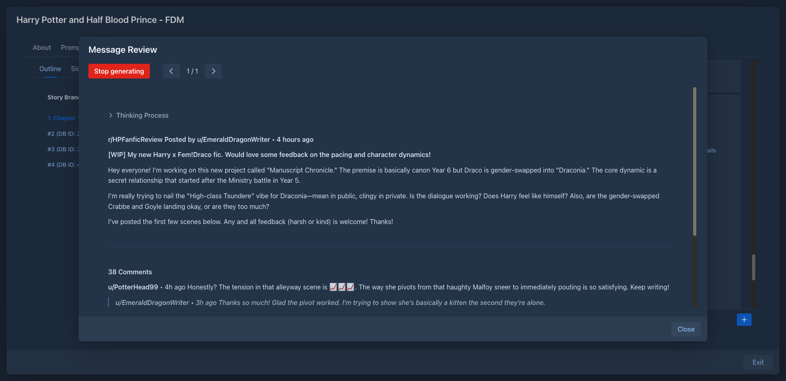

# Reviewer

Lets the model review what you've written - get reader reactions, critique or anything else you prompt it for, right
next to the story.

## Usage

Every story part gets a **Review** item in its menu:

- **View / Generate Review** opens the review dialog. *Generate* writes a new review of the part (it can be stopped
  while generating); a part can have several reviews and you can page through them.
- **Advanced Options** changes how this part is reviewed:
  - *Prompt Override* - a different review prompt for this part,
  - *Use standard prompt info* - review with the prompt the part was written from (system prompt, lore, earlier
    parts); when off, only the story parts and the options below are sent,
  - *Include Lorebook* - include the lore that was active for the part (with standard prompt info off),
  - *Token Limit* - how many tokens of the story (parts up to the reviewed one) are sent along.
- **Delete Review** removes the reviews of the part.

## Settings

Reviewer profiles are configured on the *Settings* page. A profile has:

- *Review Pre-Prompt (System)* - the system prompt,
- *Review Post-Prompt (User)* - what to ask for; the default simulates readers' comments on a story forum,
- the model and protocol to use - by default the book's own.

Create several profiles (a strict editor, enthusiastic readers...) and pick the default one.

## Storage

Reviews are stored with the story part, so they are included in book backups and copies. Profiles are stored in
your user settings (included in database backups).
