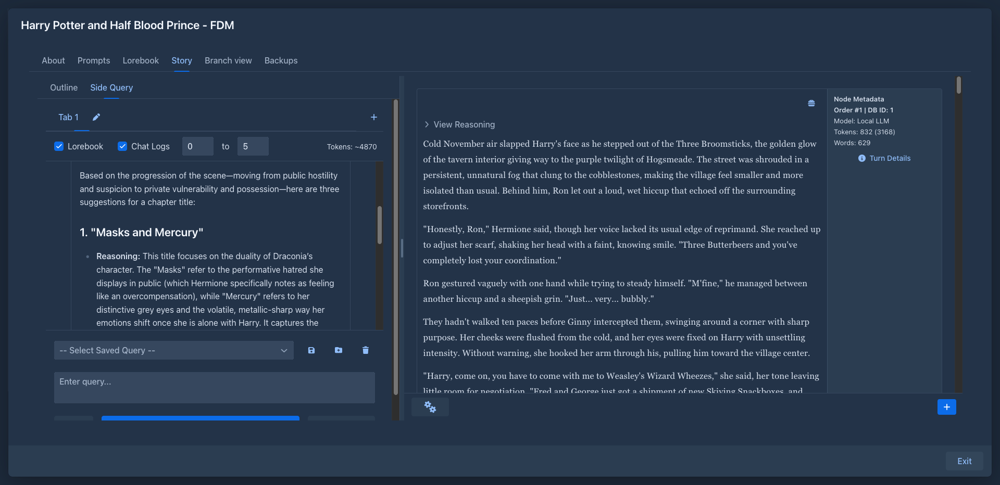

# Side Query

A chat with the model next to your story - ask about the plot, check continuity, brainstorm names or the next
chapter, without adding anything to the book.

## Usage

The story view gets a side panel with chat tabs. In each tab:

- type a question and **SEND**,
- **REGENERATE** drops the last answer and asks again,
- **UNDO** removes the last message - if it was your question, it goes back into the input box to edit,
- messages can be edited and copied,
- choose what the model gets to see:
  - *Lorebook* - the book's lore,
  - *Chat Logs* - story parts, from part N to part M,
- the token counter shows how big the request is,
- frequently used questions can be saved and picked from a list.

Open several tabs for separate conversations; tabs can be renamed, or named by the model.

## Settings

Side query profiles are configured on the *Settings* page:

- *Initial System Query* - the system prompt,
- *Instructions Before User Input* - text added in front of each question,
- the model and protocol to use - by default the book's own,
- *Enable AI Tab Naming* - let the model name new tabs.

## Storage

Conversations are stored with the book, so they are included in book backups and copies. Profiles and saved
queries are stored in your user settings (included in database backups).
